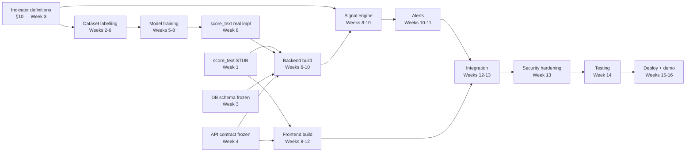

# POLIS — Product Requirements Document (PRD)

**Political Open Source Language Intelligence System**

---

## 1. Document Control

| Field | Value |
|---|---|
| Document ID | POLIS-PRD-001 |
| Version | 1.0 |
| Date | 11 August 2026 |
| Status | Draft for Review |
| Owner | POLIS FYP Team (6 members) |
| Authors | Team A (Data/Ingestion ×2), Team B (ML/NLP ×2), Team C (Backend/DB ×1), Team D (Frontend/UI ×1) |
| Reviewers | Project Supervisor, Team Leads |
| Classification | Academic project documentation — public sources only |
| Source of truth | This document is the **product** source of truth. TRD, App Flow, UI/UX, Backend Schema, and Implementation Plan derive from it. |

### 1.1 Change History

| Version | Date | Author | Change |
|---|---|---|---|
| 0.1 | 2026-08-09 | Team | Initial concept note (POLIS + SPM framing) |
| 0.2 | 2026-08-10 | Team | Phase flowcharts, free-tier stack selection |
| 1.0 | 2026-08-11 | Team | Full PRD: requirements, indicator framework, NFRs, security, traceability |

### 1.2 Decision Status Legend

Every statement in this document carries one of three labels. This legend applies to all six POLIS documents.

| Label | Meaning |
|---|---|
| **[CONFIRMED]** | Agreed team decision. Downstream documents must implement it as written. |
| **[PROPOSED]** | Recommended architecture, not yet ratified. Change requires updating all six documents. |
| **[FUTURE]** | Explicitly out of MVP scope. Documented so the design does not block it. |
| **[TBD]** | Genuinely undecided. Must be resolved by the week stated. Never silently assumed. |

---

## 2. Executive Summary

POLIS is an AI-assisted, multilingual, open-source political monitoring and early-warning **support** system. It reads publicly available text — news, RSS feeds, public social-media posts, public Telegram channels, government statements, and public fact-checking resources — on a fixed schedule, and applies multilingual NLP to classify sentiment, hostility, stance, and probable disinformation. POLIS is a **scheduled-batch, near-real-time** system, not an event-streaming one: its latency budget is measured in minutes (§11 NFR-1.5), not seconds. It aggregates those classifications into a small set of explicitly defined **early-warning indicators**, scores them against transparent thresholds, and raises tiered alerts for human analysts.

POLIS automates the **reading and correlation layer**, not the judgment layer. Every alert is a monitoring prompt requiring human assessment, is accompanied by the evidence that produced it, and is recorded together with the analyst's decision in an immutable audit trail.

The system is built entirely on open-source software and free-tier infrastructure, at zero recurring cost, by a six-person university team over 16 weeks.

**What POLIS is:** a decision-support tool that ensures relevant public signals reach an analyst quickly, with their evidence attached.

**What POLIS is not:** a predictor of violence, conflict, or human behaviour; an autonomous decision maker; a surveillance system; a source of ground truth about political events.

---

## 3. Product Vision

> Shift open-source political monitoring from reactive to anticipatory — without adding headcount, without claiming prediction, and without removing the human from the decision.

Three-year vision statement (aspirational, not MVP commitment):

A field officer or analyst supporting a UN Special Political Mission begins their day on a single screen that has already read every public source in their area of responsibility overnight, in every language those sources publish in, and has surfaced the six things that changed — each with the underlying articles, the reason it was flagged, and an honest statement of how confident the system is. The officer confirms, rejects, or defers each one. Their decisions become the record, and improve the system.

---

## 4. Problem Statement

Personnel working in or alongside UN Special Political Missions (SPMs) monitor political and ceasefire-related developments largely by hand: reading local newspapers, tracking social media, following government statements, and attending political meetings. This manual approach creates measurable operational problems.

| # | Problem | Consequence |
|---|---|---|
| P1 | **Information overload** — the volume of relevant public text far exceeds available reading capacity | Relevant items are never read at all |
| P2 | **Slow monitoring** — signals surface days after they first appear publicly | Awareness is retrospective, not anticipatory |
| P3 | **Limited source coverage** — one officer can follow a handful of outlets, not hundreds | Systematic blind spots by outlet and region |
| P4 | **Language bounded** — local-language sources go unread or wait on translation | The most locally relevant sources are the most delayed |
| P5 | **Manual analysis** — no consistent method for judging tone, hostility, or credibility | Assessments vary between officers and over time |
| P6 | **Inconsistent monitoring** — coverage depends on individual workload and rotation | Gaps appear precisely when workload is highest |
| P7 | **Pattern blindness** — trends spanning many small items across weeks are invisible item-by-item | Slow-building shifts are recognised late |
| P8 | **Non-persistent knowledge** — insight lives in individual officers' heads | Context is lost at rotation |

**Root problem:** the *reading, classifying, and correlating* layer of political monitoring is manual, and it does not scale with source volume, language count, or staff turnover.

**What POLIS addresses:** P1–P8 at the reading layer.
**What POLIS explicitly does not address:** political judgment, causal explanation, forecasting, or recommending action.

---

## 5. Project Motivation

| Driver | Detail |
|---|---|
| Real operational need | Open-source information monitoring is a documented, ongoing workload for political missions. The reading bottleneck is real and mechanical. |
| Technically tractable at FYP scale | Multilingual transformer models (XLM-RoBERTa) are freely available pretrained and fine-tunable on free Colab/Kaggle GPU. |
| Zero-budget feasible | Every layer — ingestion, ML, database, backend, frontend, hosting — has a credible free or open-source path. |
| Strong differentiator | Most public disinformation and sentiment tooling is English-only. Multilingual capability is the single decision that makes the concept non-trivial. |
| Six-person parallelism | The architecture decomposes cleanly into four workstreams with one narrow interface between ML and backend. |
| Academic rigour available | Public labelled datasets (LIAR, FakeNewsNet, Kaggle fake-news corpora) permit quantitative evaluation with precision/recall/F1, not just a demo. |
| Ethics substance | The project raises genuine, discussable questions about algorithmic bias, political neutrality, and human-in-the-loop design — strengthening the report. |

---

## 6. Target Users

| Role | In MVP? | Description | Primary need |
|---|---|---|---|
| **Analyst** | **[CONFIRMED] MVP** | Reviews flagged content and alerts, examines evidence, records confirm/reject/uncertain decisions with notes | "Show me what changed and why, with the evidence, fast" |
| **Supervisor** | **[CONFIRMED] MVP** | Oversees analyst decisions, views team-level alert statistics, adjusts indicator thresholds, cannot administer users | "Is the system calibrated, and is my team keeping up?" |
| **Administrator** | **[CONFIRMED] MVP** | Manages users, roles, sources, model deployment status; reads audit logs; no analytical duties | "Keep the system running, correctly permissioned, and auditable" |
| **SPM Monitoring Personnel (field)** | **[FUTURE]** | Field-deployed consumer of digest/summary output, likely low-bandwidth and mobile | Not implemented in MVP. The Analyst role covers this functionally for demonstration purposes. |
| **Read-only Observer / Auditor** | **[FUTURE]** | External reviewer with read-only access for evaluation | Deferred; RBAC design accommodates adding it without schema change |

> **Scope note.** POLIS is an FYP prototype. It is **not** deployed with, endorsed by, or connected to any real UN system. The SPM framing defines the *user problem being modelled*; all data is public and all users are project team members or evaluators. This statement must appear in the FYP report and the demo.

---

## 7. User Personas

### Persona 1 — Amara, Political Affairs Analyst

| Attribute | Detail |
|---|---|
| Role in POLIS | Analyst |
| Experience | 5 years political analysis; strong regional and linguistic knowledge; moderate technical skill |
| Daily context | Monitors ~6 countries; reads across 3 languages; ~40 relevant items/day surfaced from far more |
| Goals | Catch meaningful shifts early; never miss a significant item; justify every assessment to a supervisor |
| Frustrations | Volume; reading English-translated summaries days late; no way to show *why* something matters |
| Success looks like | Opens POLIS, sees 4 alerts, resolves each in under 3 minutes with evidence visible |
| Trust requirement | Will not act on a score without seeing the underlying text and the reason for the flag |
| Key POLIS features | Alert Center, Content Analysis with explainability, Analyst Review, Search |

### Persona 2 — Daniel, Senior Political Affairs Officer (Supervisor)

| Attribute | Detail |
|---|---|
| Role in POLIS | Supervisor |
| Experience | 12 years; manages 5 analysts; accountable for reporting quality |
| Goals | Know the system is calibrated; spot analyst backlog; tune thresholds when false positives rise |
| Frustrations | Tools that produce alert fatigue; unexplainable "AI scores"; no visibility into review throughput |
| Success looks like | A weekly view of alert precision by indicator, and the ability to raise a threshold that is firing too often |
| Key POLIS features | Dashboard trends, indicator threshold settings, review statistics, audit log read access |

### Persona 3 — Priya, System Administrator

| Attribute | Detail |
|---|---|
| Role in POLIS | Administrator |
| Experience | Systems/IT background; no political analysis role |
| Goals | Correct user permissions; healthy ingestion; auditable access; no secrets leakage |
| Frustrations | Silent scraper failures; unclear which model version produced a result; unauditable actions |
| Success looks like | Source health dashboard is green; every privileged action appears in the audit log |
| Key POLIS features | Administration page, Source Monitoring, Model Registry view, Audit Log |

---

## 8. User Stories

Stories are grouped by role. Each maps to functional requirements in §9 and is traced in §25.

### 8.1 Analyst

| ID | Story | Priority |
|---|---|---|
| US-A01 | As an Analyst, I want to log in securely so that only authorised people see monitoring data | MVP |
| US-A02 | As an Analyst, I want a dashboard of active alerts and trends so I can orient in under 30 seconds | MVP |
| US-A03 | As an Analyst, I want a live feed of newly ingested and classified content so I can monitor continuously | MVP |
| US-A04 | As an Analyst, I want to open any item and see original text, language, source, timestamp, and all NLP outputs | MVP |
| US-A05 | As an Analyst, I want to see *why* POLIS flagged an item — which indicators fired, with what score and confidence | MVP |
| US-A06 | As an Analyst, I want to see the supporting evidence items behind an alert, not just a number | MVP |
| US-A07 | As an Analyst, I want to confirm, reject, or mark uncertain, with free-text notes | MVP |
| US-A08 | As an Analyst, I want to search and filter by language, source, date, entity, topic, severity, and indicator | MVP |
| US-A09 | As an Analyst, I want to acknowledge an alert so my team knows it is being handled | MVP |
| US-A10 | As an Analyst, I want to resolve an alert with an outcome so it leaves the active queue | MVP |
| US-A11 | As an Analyst, I want an English translation shown alongside non-English originals | MVP |
| US-A12 | As an Analyst, I want to see related content clustered with an item so I can judge whether a narrative is spreading | MVP |
| US-A13 | As an Analyst, I want a source-credibility indicator so I can weight what I read | MVP |
| US-A14 | As an Analyst, I want to export an alert and its evidence as a report | [FUTURE] |

### 8.2 Supervisor

| ID | Story | Priority |
|---|---|---|
| US-S01 | As a Supervisor, I want to see all analysts' review decisions so I can assure quality | MVP |
| US-S02 | As a Supervisor, I want alert precision and false-alert rate per indicator so I can judge calibration | MVP |
| US-S03 | As a Supervisor, I want to adjust an indicator's threshold and have the change audited | MVP |
| US-S04 | As a Supervisor, I want to see review backlog and time-to-acknowledge | MVP |
| US-S05 | As a Supervisor, I want to reassign or reopen a resolved alert | [FUTURE] |

### 8.3 Administrator

| ID | Story | Priority |
|---|---|---|
| US-D01 | As an Administrator, I want to create, disable, and role-assign users | MVP |
| US-D02 | As an Administrator, I want to add, edit, enable, and disable ingestion sources | MVP |
| US-D03 | As an Administrator, I want a source-health view showing last successful fetch and error counts | MVP |
| US-D04 | As an Administrator, I want to see which model version is active and its evaluation metrics | MVP |
| US-D05 | As an Administrator, I want to read the audit log filtered by actor, action, and resource | MVP |
| US-D06 | As an Administrator, I want secrets to live only in environment configuration, never in the UI or repository | MVP |

### 8.4 System (non-interactive)

| ID | Story | Priority |
|---|---|---|
| US-X01 | As the system, I ingest configured sources on a schedule without manual triggering | MVP |
| US-X02 | As the system, I discard duplicates so analysts see each item once | MVP |
| US-X03 | As the system, I record the model version against every inference for reproducibility | MVP |
| US-X04 | As the system, I suppress an alert that duplicates an open alert for the same indicator and subject | MVP |
| US-X05 | As the system, I write an audit record for every privileged and every decision-recording action | MVP |

---

## 9. Functional Requirements

Requirement ID scheme: `FR-<group>.<n>`. Priority: **M** = MVP, **F** = Future.

### FR-1 — Source Ingestion

| ID | Requirement | Pri |
|---|---|---|
| FR-1.1 | The system shall ingest content from configured RSS/Atom feeds using `feedparser`, on a schedule. | M |
| FR-1.2 | The system shall support per-source polling intervals, defaulting to **10 minutes**. This value is derived from the §11.1 latency budget, not chosen independently — raising it above 10 minutes breaks NFR-1.5a. **[CONFIRMED]** | M |
| FR-1.3 | The system shall ingest full article text via HTTP fetch and HTML extraction where the feed provides only a summary and the source's `robots.txt` and terms permit it. | M |
| FR-1.4 | The system shall respect `robots.txt`, send a descriptive `User-Agent` identifying POLIS as an academic project, and rate-limit requests per domain. | M |
| FR-1.5 | The system shall ingest messages from **public** Telegram channels via Telethon, for channels explicitly configured by an Administrator. | M |
| FR-1.6 | The system shall ingest posts from **public** Reddit content via PRAW under Reddit's free research/personal-use terms. | M |
| FR-1.7 | The system shall ingest government/official statement pages published as RSS or stable HTML. | M |
| FR-1.8 | Public social-media ingestion beyond FR-1.6 (e.g. X/Twitter) shall be implemented **only** where a free, terms-compliant access path exists at build time. Scraping tools whose legal or technical availability is unstable shall not be a dependency of the MVP. **[TBD — Team A to confirm by Week 3; MVP does not depend on it]** | F |
| FR-1.9 | The system shall record for every fetch attempt: source, start time, end time, items retrieved, items new, and error detail if failed. | M |
| FR-1.10 | The system shall retry a failed fetch with exponential backoff, up to 3 attempts, then mark the source degraded. | M |
| FR-1.11 | The system shall mark a source `unhealthy` after 3 consecutive failed scheduled runs and surface this in the UI. | M |
| FR-1.12 | The system shall enforce a maximum download size per item (**[PROPOSED]** 2 MB) and reject larger responses. | M |
| FR-1.13 | The system shall validate every outbound fetch URL against an SSRF allowlist policy before the request is made (see SEC-12). | M |
| FR-1.14 | The system shall store the raw retrieved text unmodified alongside its processed form, for evidence and reproducibility. | M |
| FR-1.15 | The system shall support manual "fetch now" triggering of a single source by an Administrator. | M |

### FR-2 — Preprocessing

| ID | Requirement | Pri |
|---|---|---|
| FR-2.1 | The system shall strip HTML markup, scripts, boilerplate navigation, and advertising fragments from retrieved text. | M |
| FR-2.2 | The system shall normalise Unicode (NFKC), collapse whitespace, and preserve original casing and diacritics for ML input. | M |
| FR-2.3 | The system shall detect the language of each item, returning an ISO 639-1 code and a confidence value. **[PROPOSED]** `lingua-py` or `fasttext-langdetect` — both offline and free. | M |
| FR-2.4 | The system shall mark items whose language-detection confidence is below **[PROPOSED]** 0.60 as `language_uncertain` and still process them. | M |
| FR-2.5 | The system shall compute a SHA-256 hash of normalised text for exact-duplicate detection. | M |
| FR-2.6 | The system shall detect near-duplicates using MinHash/SimHash over token shingles with a similarity threshold of **[PROPOSED]** 0.85, grouping matches under a shared `cluster_id`. | M |
| FR-2.7 | The system shall retain the first-seen item of a duplicate cluster as canonical and link subsequent items to it rather than discarding them — near-duplicate *volume* is itself an indicator input (see IND-03). | M |
| FR-2.8 | The system shall provide English machine translation of non-English content for analyst display, using a self-hosted open model. **[PROPOSED]** Helsinki-NLP `opus-mt` models via Transformers, or NLLB-200-distilled-600M. Translation is **display-only** and is never the input to classification. | M |
| FR-2.9 | The system shall label every translation in the UI as machine-generated and unverified. | M |
| FR-2.10 | The system shall truncate text passed to the classifier at the model's maximum sequence length (512 tokens) using a documented head+tail strategy, and record that truncation occurred. | M |
| FR-2.11 | The system shall sanitise all ingested text before storage and before rendering, treating scraped content as untrusted input (see SEC-13). | M |

### FR-3 — NLP / ML Analysis

| ID | Requirement | Pri |
|---|---|---|
| FR-3.1 | The system shall classify **sentiment** of each processed item as `negative` / `neutral` / `positive` with a confidence score in [0,1]. | M |
| FR-3.2 | The system shall classify **hostility** as `none` / `hostile_rhetoric` / `threatening_language` with a confidence score. | M |
| FR-3.3 | The system shall classify **probable disinformation** as `likely_reliable` / `uncertain` / `likely_unreliable` with a confidence score. Output must be labelled in all interfaces as a probabilistic signal, never as a determination of truth. | M |
| FR-3.4 | The system shall classify **political stance** relative to the configured topic as `supportive` / `neutral` / `opposed` / `not_applicable`. **[PROPOSED]** — descoped to `not_applicable` if labelled stance data proves insufficient by Week 7. | M |
| FR-3.5 | All four classifiers shall be served through the single interface `ml/predict.py :: score_text()` defined in §9.1. | M |
| FR-3.6 | The system shall extract named entities of types `PERSON`, `ORG`, `GPE`/`LOC`, `EVENT`, with character offsets and a confidence score. **[PROPOSED]** multilingual NER head or spaCy multilingual model. | M |
| FR-3.7 | The system shall assign each item one or more topics from a fixed, documented taxonomy of **[PROPOSED]** 12–20 political monitoring topics defined in Week 3. | M |
| FR-3.8 | The system shall record the exact `model_version` identifier against every stored inference result. | M |
| FR-3.9 | The system shall store per-class confidence scores, not only the arg-max label. | M |
| FR-3.10 | The system shall process each item exactly once per model version, and shall support re-scoring a historical corpus when a new model version is deployed. | M |
| FR-3.11 | The system shall not use analyst review decisions as training data automatically. Feedback enters training only through an explicit, validated, human-approved export (see FR-7.6). | M |
| FR-3.12 | The system shall expose a documented per-class confidence threshold below which a classification is displayed as `low confidence` rather than as a firm label. **[PROPOSED]** 0.55. | M |
| FR-3.13 | Emotion, sarcasm, and irony detection. | F |

#### 9.1 ML/Backend Interface Contract **[CONFIRMED]**

This is the single interface between Team B and Team C. It is frozen in **Week 1** with a stub returning fixed values, so backend and frontend can build against it before any model is trained. Changing it after Week 4 requires agreement from Teams B and C and an update to the TRD and Backend Schema.

```python
# ml/predict.py
def score_text(text: str, lang: str | None = None) -> dict:
    """Classify one piece of text. Pure function, no I/O, no DB access.

    Args:
        text: cleaned, normalised text (not raw HTML). Truncated internally.
        lang: ISO 639-1 code if already known; None triggers internal detection.

    Returns: dict conforming exactly to the schema below.
    Raises:  ValueError on empty/whitespace-only text.
    """
```

Return schema — **every key is always present**; a disabled or descoped task returns `label: "not_applicable"` with `confidence: 0.0`:

```jsonc
{
  "schema_version": "1.0",
  "model_version": "polis-xlmr-v0.3.1",     // matches model_versions.version_tag
  "language": {"code": "ar", "confidence": 0.97},
  "truncated": false,
  "sentiment":  {"label": "negative", "confidence": 0.88,
                 "scores": {"negative": 0.88, "neutral": 0.09, "positive": 0.03}},
  "hostility":  {"label": "hostile_rhetoric", "confidence": 0.74,
                 "scores": {"none": 0.18, "hostile_rhetoric": 0.74, "threatening_language": 0.08}},
  "disinfo":    {"label": "uncertain", "confidence": 0.51,
                 "scores": {"likely_reliable": 0.30, "uncertain": 0.51, "likely_unreliable": 0.19}},
  "stance":     {"label": "not_applicable", "confidence": 0.0, "scores": {}},
  "entities":   [{"text": "Ministry of Interior", "type": "ORG",
                  "start": 42, "end": 62, "confidence": 0.93}],
  "topics":     [{"topic": "security_incident", "confidence": 0.81}],
  "meta":       {"inference_ms": 118, "device": "cpu", "chars_in": 1840}
}
```

Backend imports **only** `score_text`. It never imports PyTorch, Transformers, or training code directly.

### FR-4 — Signals, Trends, and Early-Warning Indicators

| ID | Requirement | Pri |
|---|---|---|
| FR-4.1 | The system shall compute each defined early-warning indicator as a **chained stage of every pipeline cycle** (stage D, §11.1), scoped to the subjects touched by newly scored items, over a rolling analysis window. It shall not run on an independent timer — an independent 30-minute timer would breach NFR-1.5c. **[CONFIRMED]** | M |
| FR-4.2 | Each indicator shall be scoped to an **analysis subject** — a (region, topic) pair, or a (region, entity) pair — so scores are comparable over time. | M |
| FR-4.3 | Each indicator computation shall persist: subject, window, raw value, normalised score, threshold applied, severity, confidence, contributing evidence item IDs, and computation timestamp. | M |
| FR-4.4 | The system shall require a documented minimum sample size per window before an indicator may fire, to suppress small-number noise (per-indicator, §10). | M |
| FR-4.5 | The system shall compute a rolling baseline per subject over a **[PROPOSED]** 14-day trailing window, excluding the current window. | M |
| FR-4.6 | The system shall display trends of each indicator over time in the dashboard. | M |
| FR-4.7 | Indicator thresholds shall be stored in the database and editable by Supervisors and Administrators — never hard-coded. | M |
| FR-4.8 | The system shall record every threshold change in the audit log with old value, new value, actor, and timestamp. | M |
| FR-4.9 | Indicator scores shall be presented as monitoring signals. The UI and API shall not use predictive language ("will", "predicts", "forecast", "imminent") about political events. | M |
| FR-4.10 | The system shall compute a source-reliability indicator per source from declared type, historical analyst-confirmation rate, and disinformation-classification rate. Displayed as a 3-band qualitative indicator, not a precise score. | M |
| FR-4.11 | Geographic clustering of indicators on a map. | F |

### FR-5 — Alerts

| ID | Requirement | Pri |
|---|---|---|
| FR-5.1 | The system shall create an **alert candidate** when an indicator score crosses its configured threshold and the minimum sample size is met. | M |
| FR-5.2 | The system shall suppress a candidate that duplicates an alert already open for the same (indicator, subject) within the deduplication window (**[PROPOSED]** 6 hours), instead incrementing an occurrence counter and appending evidence to the existing alert. | M |
| FR-5.3 | The system shall assign a severity of `informational`, `low`, `medium`, `high`, or `critical` per §10 severity mapping. | M |
| FR-5.4 | Every alert shall link to at least one and at most **[PROPOSED]** 50 evidence content items. | M |
| FR-5.5 | Every alert shall carry a human-readable machine-generated explanation naming the indicator, the observed value, the baseline, and the threshold. | M |
| FR-5.6 | Alerts shall progress through statuses: `new` → `acknowledged` → `under_review` → `resolved` (`confirmed` | `rejected` | `inconclusive`). | M |
| FR-5.7 | Alert status transitions shall be restricted by role (Analyst and Supervisor may transition; Administrator may not). | M |
| FR-5.8 | The system shall present alerts in the UI. In-app presentation is the **only** MVP delivery channel. | M |
| FR-5.9 | Email and webhook alert delivery. | F |
| FR-5.10 | The system shall never auto-resolve, auto-escalate, or take any external action on an alert. | M |
| FR-5.11 | The system shall record time-to-acknowledge and time-to-resolve per alert. | M |

### FR-6 — Dashboard, Search, and Presentation

| ID | Requirement | Pri |
|---|---|---|
| FR-6.1 | The system shall provide a dashboard showing active alerts by severity, indicator trends, topic trends, recent flagged content, source activity, and ingestion health. | M |
| FR-6.2 | The system shall provide a live monitoring feed of recently ingested and classified content with filters. | M |
| FR-6.3 | The system shall provide a content detail view showing original text, translation, source metadata, all NLP outputs with confidence, entities, topics, contributing indicators, and related clustered content. | M |
| FR-6.4 | The system shall provide full-text search across original and translated text. **[PROPOSED]** PostgreSQL full-text search — no external search engine. | M |
| FR-6.5 | The system shall support filtering by date range, language, source, source type, region, topic, entity, severity, indicator, NLP label, and review status. | M |
| FR-6.6 | The system shall paginate all list endpoints, default page size 25, maximum 100. | M |
| FR-6.7 | The system shall provide an alert center listing alerts with severity, status, age, indicator, subject, and assigned reviewer. | M |
| FR-6.8 | The system shall provide a source monitoring page showing per-source health, last fetch, item counts, and reliability band. | M |
| FR-6.9 | Every displayed model output shall be accompanied by its confidence and its model version. | M |
| FR-6.10 | The UI shall never present a model output as established fact. Labelling language is specified in the UI/UX document. | M |
| FR-6.11 | PDF/CSV report export. | F |

### FR-7 — Analyst Review and Feedback

| ID | Requirement | Pri |
|---|---|---|
| FR-7.1 | An Analyst or Supervisor shall be able to record a decision of `confirmed`, `rejected`, or `uncertain` on an alert or on an individual content item. | M |
| FR-7.2 | A decision shall support optional free-text notes up to **[PROPOSED]** 2000 characters. | M |
| FR-7.3 | A decision shall be immutable once saved; corrections are recorded as a new decision superseding the previous one, both retained. | M |
| FR-7.4 | The system shall display the full decision history of any alert or item. | M |
| FR-7.5 | The system shall compute alert precision per indicator as `confirmed / (confirmed + rejected)` over a selectable period. | M |
| FR-7.6 | Review decisions shall be usable as ML training or evaluation data **only** via an explicit export action performed by a Supervisor or Administrator, producing a versioned, reviewed dataset artefact. No automatic online learning. | M |
| FR-7.7 | The system shall record the reviewing user, timestamp, and the model version that produced the flag against every decision. | M |

### FR-8 — Users, Access Control, and Audit

| ID | Requirement | Pri |
|---|---|---|
| FR-8.1 | The system shall authenticate users with email and password. | M |
| FR-8.2 | The system shall implement role-based access control with roles `analyst`, `supervisor`, `admin`. | M |
| FR-8.3 | Permissions shall be checked server-side on every request. UI-side hiding is presentation only and is never the access control mechanism. | M |
| FR-8.4 | The system shall support disabling a user without deleting their historical decisions or audit records. | M |
| FR-8.5 | The system shall write an audit record for: login success, login failure, logout, permission denial, user create/modify/disable, role change, source create/modify/disable, threshold change, alert status change, review decision, model activation, and data export. | M |
| FR-8.6 | Audit records shall be append-only and shall not be modifiable or deletable through the application. | M |
| FR-8.7 | Administrators shall be able to read and filter audit logs; Supervisors may read audit records relating to alerts and reviews only; Analysts have no audit log access. | M |
| FR-8.8 | The system shall expire sessions after **[PROPOSED]** 30 minutes of inactivity and require re-authentication. | M |
| FR-8.9 | Multi-factor authentication. | F |
| FR-8.10 | Single sign-on / external identity provider. | F |

---

## 10. Early-Warning Indicator Framework

This section is the **specification the ML work is evaluated against**. It is finalised in **Week 3 (Phase 0)**, before fine-tuning begins. Defining indicators after model training is a documented project failure mode — the model would be optimised for the wrong target.

### 10.1 Shared Definitions

| Term | Definition |
|---|---|
| **Analysis subject** | The scope over which an indicator is computed: `(region, topic)` or `(region, entity)`. Written `subject_type` + `subject_key`. |
| **Current window** | The most recent completed 24-hour period, unless the indicator states otherwise. |
| **Baseline window** | The 14 days preceding the current window, excluding it. |
| **Baseline mean (μ)** | Mean of the indicator's raw value across the baseline window's daily buckets. |
| **Baseline std (σ)** | Sample standard deviation across the same buckets. Floor of σ ≥ 0.05 applied to avoid division blow-up on flat baselines. |
| **z-score** | `(current − μ) / σ`. The common normalisation across indicators, making thresholds comparable. |
| **Minimum sample (n_min)** | The indicator will not fire unless the current window contains at least this many items. Prevents 2-articles-in-a-quiet-region false alarms. |
| **Confidence** | A 0–1 value combining sample size sufficiency, mean model confidence of contributing classifications, and source diversity. Formula in §10.3. **This expresses confidence in the measurement, not in any prediction about future events.** |

### 10.2 Severity Mapping **[CONFIRMED]**

Severity derives from the z-score band and the indicator's own weight. It is uniform across indicators.

| z-score | Severity | Meaning to analyst | Alert created? |
|---|---|---|---|
| z < 1.5 | `normal` | Within expected variation | No |
| 1.5 ≤ z < 2.0 | `informational` | Noted, visible on dashboard trend | No |
| 2.0 ≤ z < 2.5 | `low` | Worth a look when convenient | Yes |
| 2.5 ≤ z < 3.0 | `medium` | Review within the working day | Yes |
| 3.0 ≤ z < 4.0 | `high` | Review promptly | Yes |
| z ≥ 4.0 | `critical` | Review immediately | Yes |

Additional rule: any indicator whose `confidence < 0.40` is capped at severity `low` regardless of z-score, and is labelled *low-confidence measurement* in the UI.

### 10.3 Indicator Confidence Formula **[PROPOSED]**

```
confidence = 0.4 * sample_factor + 0.4 * model_factor + 0.2 * diversity_factor

sample_factor    = min(1.0, n_current / (2 * n_min))
model_factor     = mean(confidence of each contributing classification)
diversity_factor = min(1.0, distinct_sources_in_window / 3)
```

Rationale: a spike measured from many items, classified confidently, across several independent sources is a more trustworthy *measurement* than one measured from few items, weakly classified, from a single outlet.

### 10.4 MVP Indicators **[CONFIRMED — 6 indicators]**

---

#### IND-01 — Hostile Rhetoric Surge (HRS)

| Field | Specification |
|---|---|
| **Name** | Hostile Rhetoric Surge |
| **Purpose** | Detect an unusual increase in hostile or threatening language about a subject, relative to that subject's own normal level |
| **Definition** | The proportion of items in the current window classified `hostile_rhetoric` or `threatening_language`, expressed as a z-score against the subject's 14-day baseline proportion |
| **Data source** | `nlp_results.hostility_label`, `nlp_results.hostility_confidence`, joined to processed content within the subject |
| **Input** | All processed items for the subject in the current 24h window with `hostility_confidence ≥ 0.55` |
| **Processing** | Bucket items daily for baseline; compute proportion per bucket; compute μ, σ; compute current proportion |
| **Formula** | `p_cur = hostile_items / total_items` (current window)<br>`z = (p_cur − μ_p) / max(σ_p, 0.05)` |
| **Threshold** | Fires at `z ≥ 2.0`, subject to `n_min` |
| **n_min** | 15 items in current window |
| **Severity** | Per §10.2 mapping on z |
| **Confidence** | Per §10.3 |
| **Example** | Subject `(region=NORTH, topic=border_security)`. Baseline hostile proportion μ=0.12, σ=0.05. Current window: 38 items, 11 hostile → p_cur=0.29. z = (0.29−0.12)/0.05 = **3.4** → severity `high`, n=38 ≥ 15 → alert created. |
| **False-positive risk** | **High.** Major drivers: (a) a single quoted hostile statement republished by many outlets inflates the proportion — mitigated by counting duplicate clusters once for this indicator; (b) sports, entertainment, or crime reporting using violent vocabulary — mitigated by topic scoping; (c) model bias toward flagging certain languages or dialects as hostile — must be measured in per-language evaluation (Phase 3) and documented. |
| **Human review** | **Required.** Analyst must read at least the top-3 evidence items before confirming. Alert text states "elevated hostile-language classification rate", never "rising hostility". |

---

#### IND-02 — Negative Sentiment Shift (NSS)

| Field | Specification |
|---|---|
| **Name** | Negative Sentiment Shift |
| **Purpose** | Detect a sustained move in the tone of public reporting about a subject |
| **Definition** | Change in mean sentiment polarity for the subject in the current window versus baseline, z-normalised |
| **Data source** | `nlp_results.sentiment_scores` |
| **Input** | All processed items for the subject in the current 24h window; polarity per item computed as `P(positive) − P(negative)`, range [−1, +1] |
| **Processing** | Daily mean polarity for baseline buckets; μ, σ; current-window mean |
| **Formula** | `polarity_i = p_pos(i) − p_neg(i)`<br>`s_cur = mean(polarity_i)`<br>`z = (μ_s − s_cur) / max(σ_s, 0.05)` — sign inverted so a **drop** in polarity yields a positive z |
| **Threshold** | Fires at `z ≥ 2.0` |
| **n_min** | 20 items in current window |
| **Severity** | Per §10.2 |
| **Confidence** | Per §10.3 |
| **Example** | Subject `(region=SOUTH, topic=elections)`. Baseline μ_s = −0.05, σ_s = 0.08. Current window 46 items, s_cur = −0.31. z = (−0.05 − (−0.31))/0.08 = **3.25** → `high`. |
| **False-positive risk** | **Medium-high.** Sentiment models trained largely on product/social-media review data transfer imperfectly to political reporting, where neutral factual reporting of a negative event reads as "negative sentiment". A bombing reported neutrally scores negative. This indicator measures *tone of coverage*, and the UI must say exactly that. Per-language sentiment quality varies and must be reported in evaluation. |
| **Human review** | **Required.** UI label: "coverage tone has shifted negative relative to this subject's baseline" — not "public sentiment has turned". |

---

#### IND-03 — Narrative Amplification / Coordination (NAC)

| Field | Specification |
|---|---|
| **Name** | Narrative Amplification and Coordination Pattern |
| **Purpose** | Detect near-identical content spreading rapidly across multiple sources — a structural characteristic of both organic virality and coordinated distribution |
| **Definition** | Size and source-diversity of the largest near-duplicate cluster formed within the current window for the subject, z-normalised against baseline cluster sizes |
| **Data source** | `processed_content.cluster_id`, `raw_content.source_id`, `raw_content.published_at` |
| **Input** | Near-duplicate clusters (SimHash similarity ≥ 0.85) whose first member appeared within the current 24h window |
| **Processing** | For each cluster: `size` = member count, `sources` = distinct source count, `span_hours` = last − first member time. Compute `amplification = size × distinct_sources / max(span_hours, 1)`; take the max over clusters in the window; z-normalise against the subject's baseline daily maxima |
| **Formula** | `A = max over clusters of (size × distinct_sources / max(span_hours, 1))`<br>`z = (A − μ_A) / max(σ_A, 0.05)` |
| **Threshold** | Fires at `z ≥ 2.0` **and** `size ≥ 5` **and** `distinct_sources ≥ 3` — all three required |
| **n_min** | 5 cluster members, 3 distinct sources (encoded in the threshold above) |
| **Severity** | Per §10.2 |
| **Confidence** | Per §10.3, with `diversity_factor` computed from the cluster's distinct sources |
| **Example** | 14 near-identical items about a claimed ceasefire violation appear across 7 sources within 3 hours. `A = 14 × 7 / 3 = 32.7`. Baseline μ_A = 6.1, σ_A = 4.0 → z = **6.6** → `critical`. |
| **False-positive risk** | **Very high, and this is the most misinterpretable indicator in POLIS.** Wire-service redistribution (Reuters/AP syndication) produces exactly this pattern legitimately and constantly. Mitigations: (a) maintain a configured list of syndication-source relationships and collapse them to one effective source; (b) require ≥3 *distinct, non-syndicated* sources; (c) the UI must state "near-identical content spreading across sources — this is common for wire copy" directly in the alert body. **This indicator never asserts coordination or inauthenticity.** It reports a text-similarity and timing pattern. Attribution of intent is outside POLIS's capability and outside its claims. |
| **Human review** | **Mandatory and emphasised.** Alert cannot be resolved `confirmed` without notes. |

---

#### IND-04 — Disinformation Signal Density (DSD)

| Field | Specification |
|---|---|
| **Name** | Disinformation Signal Density |
| **Purpose** | Detect an elevated rate of content the classifier assesses as likely unreliable, around a subject |
| **Definition** | Proportion of current-window items classified `likely_unreliable` with confidence ≥ 0.60, z-normalised against baseline |
| **Data source** | `nlp_results.disinfo_label`, `nlp_results.disinfo_confidence` |
| **Input** | Processed items for the subject in the current 24h window |
| **Processing** | As IND-01, over the disinformation label |
| **Formula** | `p_cur = unreliable_items / total_items`<br>`z = (p_cur − μ_p) / max(σ_p, 0.05)` |
| **Threshold** | Fires at `z ≥ 2.0` |
| **n_min** | 15 items in current window |
| **Severity** | Per §10.2, **capped at `high`** — POLIS does not raise `critical` on a disinformation-classifier signal alone, because the classifier's transfer from training corpora to live multilingual political text is the weakest link in the system |
| **Confidence** | Per §10.3 |
| **Example** | Subject `(region=EAST, topic=humanitarian_access)`. μ_p = 0.08, σ_p = 0.06, current 31 items with 8 unreliable → p_cur = 0.26. z = 3.0 → capped `high`. |
| **False-positive risk** | **Very high.** The classifier is trained largely on English datasets (LIAR, FakeNewsNet) whose domain is US political fact-checking. Transfer to other languages and political contexts is unproven and must be measured per-language, with results published in the FYP report. Opinion columns, satire, and strongly-worded advocacy are systematic false positives. **POLIS does not determine truth.** The label means "text exhibits statistical features associated with unreliable content in the training data", and the UI must express it that way. |
| **Human review** | **Required.** UI displays the phrase "assessed as likely unreliable by model *version*" with a link to that model's evaluation metrics. |

---

#### IND-05 — Entity Attention Spike (EAS)

| Field | Specification |
|---|---|
| **Name** | Entity Attention Spike |
| **Purpose** | Detect a sudden rise in public mentions of a specific political actor, organisation, or location |
| **Definition** | Mention count of a tracked entity in the current window, z-normalised against its own 14-day baseline |
| **Data source** | `content_entities`, `entities`, joined to items in the region |
| **Input** | Entities on the configured watchlist, or any entity exceeding **[PROPOSED]** 10 baseline mentions/day (auto-tracked) |
| **Processing** | Daily mention counts for baseline; μ, σ; current count |
| **Formula** | `z = (c_cur − μ_c) / max(σ_c, 1.0)` — σ floor of 1.0 mention, since counts are integers |
| **Threshold** | Fires at `z ≥ 2.5` — deliberately stricter than other indicators, because mention counts are naturally spiky |
| **n_min** | 10 mentions in current window **and** baseline μ_c ≥ 3 (entity must have an established normal level) |
| **Severity** | Per §10.2, **capped at `medium`** on its own — attention alone is weak evidence. It reaches higher severity only through IND-06. |
| **Confidence** | Per §10.3; `model_factor` uses NER confidence |
| **Example** | Entity `Ministry of Interior`, region NORTH. Baseline μ_c = 6/day, σ_c = 3. Current window 27 mentions → z = **7.0** → capped `medium`, flagged for convergence check. |
| **False-positive risk** | **Medium.** Scheduled events (elections, summits, anniversaries, budget announcements) produce large, entirely expected spikes. Mitigation: **[PROPOSED]** maintain a configurable "known events calendar" that suppresses or annotates spikes on known dates. NER errors merge or split entities (e.g. same person under different transliterations) — entity normalisation across scripts is a known limitation to document. |
| **Human review** | **Required**, but this indicator is designed primarily as an *input to IND-06* rather than as a standalone alert driver. |

---

#### IND-06 — Multi-Signal Convergence (MSC)

| Field | Specification |
|---|---|
| **Name** | Multi-Signal Convergence |
| **Purpose** | Identify subjects where several independent indicators are simultaneously elevated — the situation most worth an analyst's limited attention |
| **Definition** | A weighted composite of the other five indicators' z-scores for the same subject in the same window, firing only when at least two independent indicators are individually elevated |
| **Data source** | `indicator_scores` rows for IND-01…IND-05 for the same `(subject_type, subject_key, window_end)` |
| **Input** | The five component z-scores, clamped to [0, 6] to prevent one extreme value dominating |
| **Processing** | Weighted sum; gate on component count |
| **Formula** | `z_i' = min(max(z_i, 0), 6)`<br>`MSC = 0.30·z_HRS + 0.25·z_NSS + 0.20·z_NAC + 0.15·z_DSD + 0.10·z_EAS`<br>**Gate:** fires only if at least **2** components have `z_i ≥ 2.0`, and those components come from at least 2 different analytical families (tone: NSS; language: HRS; structure: NAC; reliability: DSD; volume: EAS) |
| **Threshold** | Fires at `MSC ≥ 2.5` **and** the gate above is satisfied |
| **n_min** | Inherited — every contributing component must independently satisfy its own `n_min` |
| **Severity** | Per §10.2 applied to the MSC value. This is the only indicator permitted to reach `critical`. |
| **Confidence** | `min()` of the contributing components' confidences — the composite is only as trustworthy as its weakest input |
| **Example** | Subject `(region=NORTH, topic=border_security)`: z_HRS = 3.4, z_NSS = 2.6, z_NAC = 1.1, z_DSD = 0.4, z_EAS = 2.9. Two components ≥ 2.0 from different families (language + tone) → gate passes. MSC = 0.30(3.4) + 0.25(2.6) + 0.20(1.1) + 0.15(0.4) + 0.10(2.9) = 1.02+0.65+0.22+0.06+0.29 = **2.24** → below 2.5, **no alert**. Correctly conservative: the individual HRS alert already fired. |
| **False-positive risk** | **Medium.** The components are not statistically independent — a major event drives hostility, sentiment, and mentions together, which is precisely the intended behaviour, but it means MSC does **not** provide independent corroboration in the statistical sense. Document this honestly: MSC is a prioritisation heuristic, not evidence multiplication. Weights are **[PROPOSED]** and must be tuned against analyst review outcomes in Phase 4/9, with the tuning method documented. |
| **Human review** | **Required.** MSC alerts display all contributing component scores, each with its own evidence links. |

### 10.5 Indicator Summary

| ID | Indicator | Family | Fires at | n_min | Max severity | FP risk |
|---|---|---|---|---|---|---|
| IND-01 | Hostile Rhetoric Surge | Language | z ≥ 2.0 | 15 | critical | High |
| IND-02 | Negative Sentiment Shift | Tone | z ≥ 2.0 | 20 | critical | Med-High |
| IND-03 | Narrative Amplification | Structure | z ≥ 2.0 + size/source gates | 5 / 3 src | critical | Very High |
| IND-04 | Disinformation Density | Reliability | z ≥ 2.0 | 15 | **high (capped)** | Very High |
| IND-05 | Entity Attention Spike | Volume | z ≥ 2.5 | 10 + μ≥3 | **medium (capped)** | Medium |
| IND-06 | Multi-Signal Convergence | Composite | MSC ≥ 2.5 + 2-family gate | inherited | critical | Medium |

### 10.6 Prohibited Interpretations **[CONFIRMED]**

No POLIS interface, API response, document, or demo may state or imply that an indicator:

- predicts violence, conflict, protest, or any future event;
- establishes that content is false, or that a source is untrustworthy as fact;
- proves coordination, inauthenticity, or intent behind a posting pattern;
- justifies any operational, security, or political action.

Permitted framing: *"POLIS measured X, which is N standard deviations above this subject's 14-day baseline. Here is the evidence. An analyst should assess it."*

---

## 11. Non-Functional Requirements

| ID | Category | Requirement | Target | Verification |
|---|---|---|---|---|
| NFR-1.1 | Performance | Dashboard initial render (p95) | ≤ 2.5 s on free-tier hosting | Browser timing, Phase 9 |
| NFR-1.2 | Performance | API list-endpoint response (p95) | ≤ 500 ms for 25-item page | Load test, Phase 9 |
| NFR-1.3 | Performance | Single-item ML inference on CPU (p95) | ≤ 1.5 s | Benchmark, Phase 3 |
| NFR-1.4 | Performance | Batch scoring throughput on free-tier CPU | ≥ 300 items/hour (conservative floor; **§11.1's latency budget needs ~2,400/hr — see the disclosed tension there**) | Benchmark, Phase 3 |
| NFR-1.5a | Performance | Publication → visible in monitoring feed (p95) | ≤ 20 min | E2E test, Phase 7 |
| NFR-1.5b | Performance | Publication → classification visible (p95) | ≤ 20 min | E2E test, Phase 7 |
| NFR-1.5c | Performance | Publication → alert raised and visible (p95) | ≤ 20 min | E2E test, Phase 7 |
| NFR-1.6 | Performance | Indicator computation over 14-day window | ≤ 60 s per full pass | Benchmark, Phase 4 |
| NFR-2.1 | Reliability | Scheduled ingestion job success rate | ≥ 95% over demo period | Ingestion run logs |
| NFR-2.2 | Reliability | A single failing source must not halt the ingestion cycle | Isolation verified | Fault injection test |
| NFR-2.3 | Reliability | No data loss on backend restart; all state in PostgreSQL | Zero in-memory durable state | Design review |
| NFR-3.1 | Scalability | Demo corpus size supported | ≥ 50,000 content items | Load test with synthetic corpus |
| NFR-3.2 | Scalability | Configured sources supported | ≥ 50 sources | Configuration test |
| NFR-3.3 | Scalability | Architecture must not require a message broker at MVP scale | APScheduler only | Design review |
| NFR-4.1 | Availability | Demo/staging uptime during evaluation window | Best-effort on free tier; documented cold-start behaviour | Manual check |
| NFR-4.2 | Availability | Free-tier backend cold start must not break the demo | Warm-up documented in demo script | Demo rehearsal |
| NFR-5.1 | Maintainability | Test coverage on backend and ingestion business logic | ≥ 70% line coverage | `pytest --cov` in CI |
| NFR-5.2 | Maintainability | All code passes Ruff lint and Black/Ruff format in CI | Zero violations on `main` | CI gate |
| NFR-5.3 | Maintainability | Every module has a docstring stating purpose and owner team | Manual review | PR checklist |
| NFR-6.1 | Explainability | Every alert states which indicator, observed value, baseline, threshold, and links to evidence | 100% of alerts | E2E test |
| NFR-6.2 | Explainability | Every displayed classification shows confidence and model version | 100% of displays | UI review |
| NFR-6.3 | Explainability | Indicator formulas are documented in-product, not only in the report | Settings page shows formula | UI review |
| NFR-7.1 | Observability | Structured JSON logs with correlation ID per request | All endpoints | Log inspection |
| NFR-7.2 | Observability | `/health` and `/health/detail` endpoints reporting DB, model, and scheduler status | Implemented | API test |
| NFR-7.3 | Observability | Ingestion, ML, alert, and security events logged to separate logical streams | Implemented | Log inspection |
| NFR-8.1 | Security | Conformance target: OWASP ASVS Level 1, with selected Level 2 controls | Checklist completed Phase 8 | ASVS checklist |
| NFR-8.2 | Security | Zero secrets in Git history | Secret scan clean | `gitleaks` in CI |
| NFR-8.3 | Security | Zero known high/critical dependency vulnerabilities at submission | `pip-audit` / `npm audit` clean | CI gate |
| NFR-9.1 | Privacy | Only public sources ingested; no authenticated, private, or restricted content | Source register reviewed | Design + code review |
| NFR-9.2 | Privacy | No collection of personal data beyond public author handles already present in public posts | Schema review | Schema review |
| NFR-10.1 | Accessibility | WCAG 2.2 Level AA for colour contrast, keyboard navigation, focus visibility, and non-colour severity encoding | Audited | axe-core + manual keyboard pass |
| NFR-10.2 | Accessibility | All charts have an accessible text or table alternative | 100% of charts | Manual review |
| NFR-11.1 | Usability | An analyst can go from dashboard to a specific alert's evidence in ≤ 3 clicks | Verified | Task walkthrough |
| NFR-11.2 | Usability | New analyst completes a review task unaided after reading a 1-page guide | 4/5 testers succeed | Usability test, Phase 9 |
| NFR-12.1 | Multilingual | Classification supported for the demo language set without per-language retraining | Single XLM-R model | Evaluation report |
| NFR-12.2 | Multilingual | Per-language precision/recall/F1 reported separately, never only as a pooled average | Published in report | Evaluation report |
| NFR-12.3 | Multilingual | MVP demo languages **[TBD — Team B to fix by Week 3]**; **[PROPOSED]** English, Arabic, French, plus one additional based on data availability | Documented | Dataset documentation |
| NFR-13.1 | Portability | Full stack runs locally via documented setup on Linux, macOS, and Windows | Verified by all 6 members | Phase 1 checklist |

### 11.1 Latency Budget — Derivation of NFR-1.5a/b/c **[CONFIRMED]**

NFR-1.5 was originally a single "ingest → visible ≤ 20 min" target. It is split into three because the three events are separately observable by a user and have materially different cost. The budget below is the **binding constraint on the scheduler design** (TRD §6.2) — the intervals in FR-1.2 and FR-4.1 are derived from it, not chosen independently.

**Execution model:** the four pipeline stages run as one **chained sequential job** (`pipeline_cycle`), not as four independent timers. Each stage passes its output directly to the next within the same scheduler tick. This is what makes the budget additive-once rather than additive-per-interval.

| # | Stage | Worst case | Basis |
|---|---|---:|---|
| A | Wait for next poll cycle | 10.0 min | Poll interval, FR-1.2 |
| B | Fetch + parse + clean + language + dedupe + store | 2.0 min | **[PROPOSED]** target; verify Phase 7 |
| | **→ NFR-1.5a: visible in monitoring feed** | **12.0 min** | ≤ 20 ✔ margin 8.0 |
| C | Score pending batch (≤ 100 items × 1.5 s) | 2.5 min | NFR-1.3 per-item p95 × batch cap |
| | **→ NFR-1.5b: classification visible** | **14.5 min** | ≤ 20 ✔ margin 5.5 |
| D | Indicator computation, affected subjects only | 1.0 min | NFR-1.6 (≤ 60 s full pass) |
| E | Alert candidate → dedup → persist | 0.5 min | **[PROPOSED]**; verify Phase 7 |
| | **→ NFR-1.5c: alert raised and visible** | **16.0 min** | ≤ 20 ✔ margin 4.0 |

**Worst case: A + B + C + D + E = 10.0 + 2.0 + 2.5 + 1.0 + 0.5 = 16.0 minutes ≤ 20 minutes required.**

**Precondition (must hold, or the budget does not):** new items arriving per 10-minute cycle must not exceed the 100-item scoring batch cap. Above that, a backlog forms and stage C spans multiple cycles, breaking NFR-1.5b/c. With the MVP's ~8–15 configured sources this is expected to hold with wide margin, but it is **[TBD-16]** — measured, not assumed, in Phase 7. Backlog depth is exposed on `/health/detail` precisely so this precondition is observable rather than silently violated.

**Consequence if the precondition fails:** NFR-1.5a (feed visibility) still holds, because stage B does not depend on scoring. Only 1.5b and 1.5c degrade. This is why the metric was split — a scoring backlog must not be reported as a total ingestion failure.

**Known tension between NFR-1.3 and NFR-1.4 — disclosed, not resolved by assumption.** Stage C's 2.5-minute bound is derived from NFR-1.3 (≤ 1.5 s per item, p95), which implies an effective throughput of ~2,400 items/hour. NFR-1.4 states a *floor* of ≥ 300 items/hour — deliberately conservative, and 8× lower. **The two are consistent only if actual measured throughput lands near NFR-1.3 rather than near the NFR-1.4 floor.** If Phase 3 benchmarking shows throughput closer to 300/hour, the 100-item batch cap must fall to ~25 to preserve the stage-C bound, and the §11.1 budget must be re-derived. This is a measurement dependency, not a contradiction — but it must be checked in Phase 3, before Phase 7's end-to-end timing test, and is folded into **[TBD-16]**.

**Baseline staleness is not on the critical path.** Indicator computation reads a materialised 14-day baseline refreshed hourly (TRD §6.2). This does not affect the budget: the baseline window *excludes* the current window by definition (§10.1), so it only aggregates completed days, which change once per day. The current window is queried live during stage D. An hourly refresh is therefore ample, and refreshing it more often would buy nothing.

---

## 12. Security Requirements

Aligned to OWASP ASVS v4/v5 Level 1 (with selected L2 controls) and NIST SSDF practices. Every requirement here has a corresponding task in the Implementation Plan Phase 8, and an implementation in the TRD.

| ID | Area | Requirement | ASVS ref (indicative) |
|---|---|---|---|
| SEC-1 | Authentication | Passwords hashed with Argon2id (**[PROPOSED]**, fallback bcrypt cost ≥ 12). Never stored or logged in plaintext or reversibly encrypted. | V2.4 |
| SEC-2 | Authentication | Minimum password length 12 characters; check against a common-password list; no composition rules that force predictable patterns. | V2.1 |
| SEC-3 | Authentication | Generic failure message ("invalid credentials") for both unknown user and wrong password. No user enumeration via message, status code, or timing. | V2.2 |
| SEC-4 | Authentication | Login rate limiting: max 5 failed attempts per account per 15 minutes, then temporary lockout with audit entry. | V2.2 |
| SEC-5 | Session | JWT access token, short-lived (**[PROPOSED]** 15 min), plus refresh token (**[PROPOSED]** 8 h) stored in an `HttpOnly`, `Secure`, `SameSite=Strict` cookie. Access token never placed in `localStorage`. | V3.2, V3.4 |
| SEC-6 | Session | Server-side refresh-token revocation on logout, password change, and role change. Token `jti` tracked for revocation. | V3.3 |
| SEC-7 | Authorization | RBAC enforced in a FastAPI dependency applied to every protected route. Default deny. No route relies on the frontend to hide it. | V4.1 |
| SEC-8 | Authorization | Object-level checks: a user may only modify review records they own, unless their role explicitly grants broader scope. | V4.2 |
| SEC-9 | Authorization | Least privilege on the database: the application role has DML on application tables only, no DDL, no superuser, and `INSERT`-only on `audit_logs`. | V1.2 |
| SEC-10 | Input validation | All request bodies, query parameters, and path parameters validated by Pydantic models with explicit types, bounds, and allowed values. Reject-by-default on unknown fields. | V5.1 |
| SEC-11 | Injection | All database access through SQLAlchemy parameterised queries or the ORM. String-concatenated SQL is prohibited and blocked in code review. Raw SQL, where unavoidable, uses bound parameters only. | V5.3 |
| SEC-12 | SSRF | Every outbound fetch URL validated before request: scheme in `{http, https}`; hostname resolved and rejected if it maps to loopback, link-local (169.254.0.0/16), private ranges (10/8, 172.16/12, 192.168/16), or metadata endpoints (169.254.169.254); redirects re-validated at every hop, max 3 hops; per-request timeout 10 s; response size cap 2 MB. | V12.6 |
| SEC-13 | Malicious scraped content | Ingested text treated as untrusted: HTML sanitised on ingest (allowlist-based, `bleach` or equivalent); stored as text, never as renderable HTML; rendered in React as text nodes only; `dangerouslySetInnerHTML` prohibited repository-wide and enforced by an ESLint rule. Content-length and depth limits on parsing to resist decompression/nesting attacks. | V5.2, V14.4 |
| SEC-14 | XSS | React default escaping relied upon; strict Content-Security-Policy header with no `unsafe-inline` for scripts; `X-Content-Type-Options: nosniff`. | V14.4 |
| SEC-15 | CORS | `Access-Control-Allow-Origin` restricted to an explicit allowlist of the deployed frontend origins. Wildcard origin prohibited. Credentials allowed only for allowlisted origins. | V14.5 |
| SEC-16 | Rate limiting | Per-IP and per-user limits on all endpoints (**[PROPOSED]** 100 req/min general, 5/15min on login, 20/min on search). Implemented with `slowapi` or equivalent middleware. `429` returned with `Retry-After`. | V13.1 |
| SEC-17 | Secrets | All secrets from environment variables loaded via `pydantic-settings`. `.env` git-ignored; `.env.example` committed with empty values. Secrets never in source, frontend bundles, logs, error messages, documentation, screenshots, or the FYP report. | V6.4 |
| SEC-18 | Secret scanning | `gitleaks` (or `detect-secrets`) runs in CI on every push and blocks the merge on any finding. Pre-commit hook runs the same check locally. | SSDF PW.7 |
| SEC-19 | Error handling | Generic error responses to clients (`{"detail": "...", "request_id": "..."}`); stack traces, SQL, file paths, and dependency versions never returned to the client; full detail logged server-side against the request ID. FastAPI `debug=False` in all non-local environments. | V7.4 |
| SEC-20 | Logging | Structured JSON logs; every log line carries request ID, actor ID (not email), and action. Passwords, tokens, cookies, `Authorization` headers, and full request bodies of auth endpoints are never logged. Log redaction filter applied centrally. | V7.1 |
| SEC-21 | Audit | Append-only `audit_logs` table; application DB role has `INSERT` and `SELECT` only, no `UPDATE`/`DELETE`. Records actor, action, resource type and ID, result, timestamp, request ID, and source IP. | V7.2 |
| SEC-22 | Transport | HTTPS enforced on all hosted environments (provided by Vercel/Render); `Strict-Transport-Security` header set; HTTP redirected to HTTPS. | V9.1 |
| SEC-23 | Encryption | Database encryption at rest as provided by the hosting platform. Application-level encryption is not required for MVP as no sensitive personal data is stored — this justification is documented. | V6.2 |
| SEC-24 | Dependencies | Pinned versions in `requirements.txt` and `package-lock.json`. `pip-audit` and `npm audit` run in CI. High/critical findings block merge. Dependency review before adding any new package. | SSDF PW.4 |
| SEC-25 | File handling | No user file upload in MVP. If added, files are validated by type and size, stored outside the web root, and never executed. **[FUTURE]** | V12.1 |
| SEC-26 | Headers | Security headers set on all responses: CSP, `X-Content-Type-Options`, `Referrer-Policy: strict-origin-when-cross-origin`, `Permissions-Policy` minimal. | V14.4 |
| SEC-27 | Account lifecycle | Disabling a user immediately revokes active refresh tokens and denies subsequent access-token use. | V3.3 |
| SEC-28 | Secure SDLC | Branch protection on `main`; at least one reviewing approver; CI must pass (lint, tests, secret scan, dependency audit) before merge; no direct pushes. | SSDF PS.1, PW.7 |

---

## 13. Privacy and Ethical Requirements

| ID | Requirement |
|---|---|
| PRIV-1 | **Public sources only.** POLIS ingests only content that is publicly accessible without authentication, without circumventing access controls, and without accepting terms that prohibit automated collection. Private messages, closed groups, authenticated feeds, and paywalled content are out of scope and technically excluded. |
| PRIV-2 | **Data minimisation.** Only fields required for the monitoring function are stored: text, language, source, timestamps, URL, and derived NLP outputs. Author names or handles are stored **only** where they are an intrinsic part of the public item and are needed for source attribution — never enriched, cross-referenced, or profiled. |
| PRIV-3 | **No individual profiling.** POLIS does not build per-person behavioural profiles, does not link identities across platforms, and does not score individuals. Entity extraction identifies public actors mentioned in text for topical aggregation only. |
| PRIV-4 | **Retention limits.** Raw content is retained **[PROPOSED]** 180 days; derived NLP results and indicator scores 365 days; audit logs 365 days; review decisions retained for the project duration as academic evidence. All values are project decisions, not claims about any legal requirement. Automated purge job documented and implemented in Phase 5. |
| PRIV-5 | **Human in the loop, always.** No POLIS output triggers any automated action beyond displaying information to a human. This is an architectural constraint, not a configuration setting. |
| PRIV-6 | **False positives are expected and must be visible.** Alert precision per indicator is displayed in the product itself, not buried in the report. A system that hides its error rate cannot be trusted. |
| PRIV-7 | **Algorithmic bias must be measured, not assumed absent.** Per-language and per-source performance is evaluated separately and published. Known bias risks — English-centric training data, dialect misclassification, uneven NER quality across scripts — are documented as limitations in the product and the report. |
| PRIV-8 | **Political neutrality.** POLIS classifies linguistic properties (tone, hostility, reliability signals), never political positions as correct or incorrect. The topic taxonomy and source register are reviewed for one-sided coverage before the demo. Stance classification, where implemented, is relative to a stated topic and is explicitly not an evaluation of legitimacy. |
| PRIV-9 | **Explainability is a requirement, not a feature.** Any output an analyst cannot trace to specific evidence and a stated computation is a defect. |
| PRIV-10 | **Source credibility is expressed as uncertainty.** Reliability is shown as a three-band qualitative indicator with the reasoning visible. POLIS never asserts a source is untrustworthy. |
| PRIV-11 | **No surveillance function.** POLIS must not be extended to monitor individuals, track private communications, or support targeting of any kind. This constraint is stated in the README, the report, and the demo. |
| PRIV-12 | **Academic status disclosed.** Every interface and document states that POLIS is a university prototype, not connected to or endorsed by the United Nations or any mission. |
| PRIV-13 | **Right of correction in the record.** An analyst can always override a model output, and the override — not the model — is the authoritative record. |

---

## 14. MVP Scope **[CONFIRMED]**

Included:

1. Scheduled ingestion from RSS/Atom feeds, public Telegram channels, and public Reddit, with source health tracking
2. Cleaning, Unicode normalisation, language detection, exact and near-duplicate clustering
3. Display-only English machine translation of non-English items
4. Multilingual classification via one fine-tuned XLM-RoBERTa model: sentiment, hostility, disinformation signal (stance if data permits)
5. Named-entity extraction and fixed-taxonomy topic assignment
6. Six early-warning indicators per §10, computed on schedule with database-stored thresholds
7. Alert generation with severity, deduplication, evidence linkage, and machine-generated explanation
8. React dashboard: overview, live feed, content detail with explainability, alert center, source monitoring, search/filter, analyst review, administration
9. Analyst review workflow with confirm/reject/uncertain and immutable decision history
10. Authentication, three-role RBAC, session management
11. Append-only audit logging of all privileged and decision actions
12. PostgreSQL persistence with Alembic migrations
13. Model registry recording version, metrics, and deployment status
14. Deployed demo environment plus a fully documented local deployment
15. Test suite: unit, integration, API, ML, ingestion, frontend, E2E, security

## 15. Out of Scope **[CONFIRMED]**

| Excluded | Reason |
|---|---|
| Prediction or forecasting of political events, violence, or conflict | Not achievable, not claimed, ethically unsound |
| Any autonomous or automated action based on an alert | Violates the core architectural principle |
| Monitoring of private, closed, encrypted, or authenticated content | Privacy and legal boundary (PRIV-1) |
| Individual-level profiling, tracking, or targeting | PRIV-3, PRIV-11 |
| Image, audio, or video analysis | Scope and compute budget |
| Paid APIs, commercial intelligence feeds, proprietary databases | ₹0 budget constraint |
| Real-time / event-streaming ingestion (sub-minute latency) | Free-tier infrastructure cannot support it; 10-minute scheduled polling meets the §11.1 latency budget for the problem. POLIS is **near-real-time scheduled batch**, and no document may describe it otherwise. |
| Mobile-native applications | Team capacity |
| Multi-tenant organisation isolation | Single-deployment FYP scope |
| Federated or cross-instance data sharing | Out of scope |
| Automated online learning from analyst feedback | FR-3.11; unsafe without validation |
| Formal legal, regulatory, or compliance certification | Academic project |

## 16. Future Scope **[FUTURE]**

| ID | Item | Prerequisite |
|---|---|---|
| FUT-1 | Email and webhook alert delivery | Alert engine stable, delivery rate limits designed |
| FUT-2 | PDF/CSV report export with evidence appendix | Reporting templates defined |
| FUT-3 | Geographic map view of indicator activity | Reliable region tagging of sources and content |
| FUT-4 | Field-personnel low-bandwidth digest view | Field role defined and validated with real users |
| FUT-5 | Additional languages beyond the demo set | Labelled data or validated zero-shot performance per language |
| FUT-6 | Human-validated feedback loop into scheduled retraining | Dataset governance process defined |
| FUT-7 | Model drift monitoring with automatic degradation alerts | Baseline metrics collected over a longer period |
| FUT-8 | Multi-factor authentication and SSO | Identity provider available |
| FUT-9 | Read-only external auditor role | RBAC already supports adding it |
| FUT-10 | Emotion, sarcasm, and irony detection | Labelled multilingual data |
| FUT-11 | Cross-source claim matching against fact-check databases | Stable public fact-check API |
| FUT-12 | Analyst-configurable custom indicators | Indicator definition engine generalised |

---

## 17. Success Metrics

### 17.1 Model Quality (measured in Phase 3, reported per language and pooled)

| ID | Metric | MVP target | Stretch | Notes |
|---|---|---|---|---|
| SM-1 | Sentiment macro-F1 | ≥ 0.70 | ≥ 0.78 | Per-language reported separately |
| SM-2 | Hostility macro-F1 | ≥ 0.65 | ≥ 0.75 | Minority class recall reported explicitly |
| SM-3 | Disinformation macro-F1 | ≥ 0.65 | ≥ 0.72 | Expected to be the weakest; honest reporting required |
| SM-4 | Precision on the `threatening_language` class | ≥ 0.70 | ≥ 0.80 | High-consequence class; precision prioritised over recall |
| SM-5 | Recall on the `threatening_language` class | ≥ 0.60 | ≥ 0.70 | Reported alongside precision, never alone |
| SM-6 | Worst-language macro-F1 not below pooled macro-F1 by more than | 0.15 | 0.10 | Bias/equity check across languages |
| SM-7 | NER F1 for PERSON/ORG/GPE | ≥ 0.70 | ≥ 0.80 | On a manually annotated sample of ≥ 200 items |

### 17.2 Alert Quality (measured in Phase 7–9 against analyst reviews)

| ID | Metric | MVP target | Definition |
|---|---|---|---|
| SM-8 | Alert precision (overall) | ≥ 0.60 | `confirmed / (confirmed + rejected)` over reviewed alerts |
| SM-9 | Alert precision per indicator | Reported for all 6 | Same formula, grouped by indicator |
| SM-10 | False-alert rate | ≤ 0.40 | `rejected / total reviewed` |
| SM-11 | Alert volume | 5–25 per demo day | Too few = untestable; too many = alert fatigue |
| SM-12 | Duplicate alert rate | ≤ 0.10 | Alerts an analyst marks as duplicating another open alert |
| SM-13 | Alerts with complete evidence chain | 100% | Every alert resolves to ≥ 1 viewable source item |

### 17.3 System Performance

| ID | Metric | Target |
|---|---|---|
| SM-14 | Publication → visible in feed (p95) / → classification (p95) / → alert (p95) | ≤ 20 min each (NFR-1.5a/b/c) |
| SM-15 | ML inference per item on CPU (p95) | ≤ 1.5 s |
| SM-16 | Dashboard first render (p95) | ≤ 2.5 s |
| SM-17 | API list endpoint (p95) | ≤ 500 ms |
| SM-18 | Scheduled ingestion success rate | ≥ 95% |
| SM-19 | Deduplication accuracy on a labelled duplicate set | ≥ 0.90 F1 |

### 17.4 Project and Process

| ID | Metric | Target |
|---|---|---|
| SM-20 | Backend + ingestion test line coverage | ≥ 70% |
| SM-21 | Secrets found by scanner in Git history at submission | 0 |
| SM-22 | Known high/critical dependency vulnerabilities at submission | 0 |
| SM-23 | OWASP ASVS L1 checklist items passed | ≥ 90% |
| SM-24 | PRD requirements with an implementation and a test (traceability closure) | 100% of MVP-priority requirements |
| SM-25 | End-to-end demo runs without manual database intervention | Pass |

---

## 18. Assumptions

| ID | Assumption | Impact if false | Validate by |
|---|---|---|---|
| A-1 | Selected RSS feeds remain publicly available and stable in format for the project duration | Source loss; ingestion rework | Week 3 — Team A verifies each feed for 7 consecutive days |
| A-2 | Free public datasets (LIAR, FakeNewsNet, Kaggle corpora) remain downloadable and licence-permit academic use | Training data gap | Week 2 — Team B downloads and archives copies immediately |
| A-3 | Free Colab/Kaggle GPU quota is sufficient to fine-tune XLM-RoBERTa-base | Training time overrun; fall back to a smaller model or fewer epochs | Week 5 — one full training run completed |
| A-4 | Free-tier Render/Supabase/Vercel limits accommodate demo load | Deployment constraints | Week 12 — deploy early, not at the end |
| A-5 | The team can manually label ≥ 800 multilingual items for evaluation | Weak evaluation; fall back to a smaller annotated set with wider confidence intervals | Week 4 — labelling velocity measured |
| A-6 | Public Telegram channels relevant to the demo topic exist and permit Telethon read access | Source type dropped; RSS-only demo remains viable | Week 3 |
| A-7 | XLM-RoBERTa zero-shot/fine-tuned transfer to non-English is adequate for demonstration | Reduce demo language set; document as a finding | Week 7 — per-language evaluation |
| A-8 | All six team members can run the full stack locally | Integration friction | Week 2 — verified checklist |
| A-9 | Machine translation quality is adequate for analyst display purposes | Show original only, label translation unavailable | Week 6 |
| A-10 | The demo region/topic scope produces enough daily volume to exceed indicator `n_min` values | Indicators never fire; widen scope or lower `n_min` with documented justification | Week 9 — volume measured against n_min |

## 19. Constraints

| ID | Constraint | Consequence |
|---|---|---|
| C-1 | ₹0 budget for paid services | Free tiers and open source only; no paid LLM APIs |
| C-2 | 16-week schedule, part-time alongside coursework | Aggressive scope discipline; MVP is fixed, extras are not |
| C-3 | Six people, four workstreams, mixed skill levels | Narrow, frozen interfaces required (§9.1); parallel work assumed |
| C-4 | Free-tier CPU-only inference in production | Batch scoring on a schedule; no per-request GPU inference |
| C-5 | Free-tier hosting sleeps when idle | Cold-start latency; demo warm-up procedure required |
| C-6 | Public sources only | No ground-truth political data; evaluation limited to public labelled corpora |
| C-7 | No real SPM users available for validation | Personas are researched constructs; usability testing uses proxy users |
| C-8 | Model weights exceed GitHub's 100 MB file limit | Weights hosted on Hugging Face Hub or Google Drive, loaded by reference |
| C-9 | Telegram/Reddit free-tier rate limits | Conservative polling intervals; ingestion designed to degrade gracefully |
| C-10 | No production security operations capability | Security is design-time and test-time; no runtime monitoring or incident response claimed |

## 20. Risks and Mitigations

| ID | Risk | Prob | Impact | Mitigation | Contingency | Owner |
|---|---|---|---|---|---|---|
| R-1 | Indicator definitions slip past Week 3 and ML trains against the wrong target | Med | **Critical** | Phase 0 gate: no fine-tuning begins until §10 is signed off | Freeze indicators at whatever state they are in at end of Week 3 | Team B lead |
| R-2 | Labelled multilingual data insufficient; classifier underperforms | High | High | Start labelling Week 1 in parallel with ingestion; use public datasets as the base; measure per-language early | Reduce to 2 languages; report the shortfall as a finding | Team B |
| R-3 | Disinformation classifier transfers poorly outside English | High | Med | Evaluate per-language by Week 7; cap IND-04 severity at `high` by design | Present IND-04 as English-only, document explicitly | Team B |
| R-4 | Alert false-positive rate makes the demo unconvincing | Med | High | Conservative thresholds, `n_min` gates, MSC two-family gate, precision displayed in-product | Raise thresholds before the demo; show the tuning as evidence of method | Team B + C |
| R-5 | A source changes format or blocks the scraper mid-project | High | Med | Adapter-per-source design; source health monitoring; ≥ 3 sources per source type | Disable the source; the pipeline continues | Team A |
| R-6 | Free-tier rate limits throttle ingestion | Med | Med | Conservative polling; per-domain rate limiting; backoff | Reduce source count for the demo | Team A |
| R-7 | Colab/Kaggle GPU quota exhausted near a deadline | Med | High | Train early (Weeks 5–7), checkpoint every epoch to Drive, never train the week before a demo | Fall back to `xlm-roberta-base` with fewer epochs, or a distilled model | Team B |
| R-8 | Free-tier hosting cold start breaks the live demo | Med | Med | Deploy in Week 12, not Week 16; warm-up step in the demo script | Local deployment as the primary demo path, cloud as backup | Team C |
| R-9 | ML↔backend interface changes late, blocking two teams | Med | High | Freeze `score_text()` in Week 1 with a stub; any change needs both leads' sign-off | Adapter shim in the backend rather than a schema change | Teams B + C |
| R-10 | Integration left to the final weeks; nothing fits together | Med | **Critical** | Weekly integration on `develop` from Week 6; stub-first development | Cut a frontend feature, never cut integration time | All |
| R-11 | Model bias produces systematically worse results for one language | Med | High | Per-language evaluation is a requirement (NFR-12.2, SM-6), reported not hidden | Document as a limitation and a finding — this is a valid academic result | Team B |
| R-12 | Duplicate content inflates indicators and creates phantom spikes | High | Med | Cluster-aware counting; duplicates counted once for proportion indicators | Tighten similarity threshold; manual review of top clusters | Team A |
| R-13 | Scope creep — new features proposed mid-project | High | High | MVP list in §14 is frozen; changes require a documented PRD revision and a removal of equal size | Supervisor arbitrates; default answer is defer to §16 | PM/all |
| R-14 | Security vulnerability found late in Phase 8 with no time to fix | Med | High | Security requirements written into Phase 1 (linting, secret scanning, dependency audit in CI from day one) | Document, mitigate, and disclose in the report | Team C |
| R-15 | Two members edit the same module and conflict repeatedly | Med | Med | Directory ownership per team; branch protection; PR review | Pair on the conflicted module for one sprint | All |
| R-16 | Team member unavailable (illness, exams) at a critical week | Med | Med | Two-person teams for the highest-risk workstreams; documented handover notes weekly | Redistribute; cut a Future-scope item | PM |
| R-17 | Demo corpus too quiet — no indicator ever fires | Med | High | Measure volume against `n_min` in Week 9; pick an active region/topic | Replay a recorded historical corpus with time-shifted timestamps, clearly labelled as a replay | Team A |
| R-18 | Ethical criticism at evaluation that POLIS resembles surveillance tooling | Med | Med | §13 written first, constraints architectural not cosmetic, prohibited-interpretation list enforced in UI copy | Point to §10.6, PRIV-11, and the human-in-the-loop architecture | All |

## 21. Dependencies

### 21.1 External

| Dependency | Type | Free? | Risk | Fallback |
|---|---|---|---|---|
| RSS/Atom feeds (Reuters, AP, BBC, Al Jazeera, government press pages) | Data source | Yes | Format change | Multiple feeds per category |
| Telegram public channels (Telethon) | Data source | Yes | API terms / channel removal | Drop source type; RSS-only demo |
| Reddit public API (PRAW) | Data source | Yes, rate-limited | Terms change | Drop source type |
| LIAR dataset | Training data | Yes | Availability | FakeNewsNet, Kaggle corpora |
| FakeNewsNet | Training data | Yes | Availability | LIAR + manual labels |
| Hugging Face Hub (`xlm-roberta-base`, `opus-mt`) | Model weights | Yes | Availability | Local archived copies from Week 2 |
| Google Colab / Kaggle | Training compute | Yes, quota-limited | Quota exhaustion | Local CPU training on a smaller model |
| Supabase (PostgreSQL) | Database | Free tier | Tier limits | Local PostgreSQL / Docker |
| Render | Backend hosting | Free tier | Cold starts | Local deployment |
| Vercel | Frontend hosting | Free tier | Tier limits | Netlify / local static serve |
| GitHub + Actions | VCS + CI | Free | Minutes quota | Local pre-commit hooks |

### 21.2 Internal (critical path)



**The three interfaces that must freeze early, because two or more teams depend on each:**

1. `score_text()` return schema — **Week 1** (stub first)
2. Database schema — **Week 3**
3. REST API contract — **Week 4**

---

## 22. Acceptance Criteria

Feature-level criteria. A feature is not accepted until every criterion listed for it passes.

| ID | Feature | Acceptance criteria |
|---|---|---|
| AC-1 | Ingestion | Given a configured RSS source, when the scheduled job runs, then new items are stored with source, original text, language, publication and collection timestamps, content hash, and URL; an `ingestion_runs` record is written; and a repeat run stores zero duplicates. |
| AC-2 | Source failure isolation | Given one source returns HTTP 500, when the ingestion cycle runs, then that source is retried 3× with backoff, marked degraded, and every other source completes normally. |
| AC-3 | SSRF defence | Given a source URL resolving to `127.0.0.1` or `169.254.169.254`, when ingestion attempts a fetch, then the request is blocked before transmission, an error is logged, and no connection is made. |
| AC-4 | Deduplication | Given 10 items with ≥ 0.85 similarity, when processed, then they share one `cluster_id`, one is canonical, and the analyst feed shows the canonical item with a "+9 similar" affordance. |
| AC-5 | Language detection | Given items in each demo language, when processed, then ≥ 95% receive the correct ISO 639-1 code; items below 0.60 confidence are flagged `language_uncertain` and still processed. |
| AC-6 | Classification | Given a processed item, when scored, then an `nlp_results` row exists containing all labels, all per-class scores, and the `model_version`, conforming exactly to the §9.1 schema. |
| AC-7 | Indicator computation | Given a subject with ≥ `n_min` items and a synthetic spike, when the indicator job runs, then an `indicator_scores` row is written with raw value, z-score, threshold, severity, confidence, and evidence item IDs. |
| AC-8 | n_min suppression | Given a subject with fewer than `n_min` items, when the indicator job runs, then no alert is created regardless of z-score, and the reason is recorded. |
| AC-9 | Alert creation | Given an indicator crossing threshold with `n ≥ n_min`, when the alert engine runs, then an alert is created with severity, explanation text naming indicator/value/baseline/threshold, and ≥ 1 linked evidence item. |
| AC-10 | Alert deduplication | Given an open alert for (indicator, subject) and a second crossing within 6 hours, when the engine runs, then no second alert is created; the occurrence counter increments and new evidence is appended. |
| AC-11 | Explainability | Given any alert in the UI, when an analyst opens it, then they can reach the original source text of every evidence item in ≤ 2 clicks, and see the indicator formula, observed value, baseline, threshold, confidence, and model version. |
| AC-12 | Review | Given an alert, when an analyst records confirm/reject/uncertain with notes, then the decision is persisted immutably, the alert status updates, an audit record is written, and the decision appears in history with reviewer and timestamp. |
| AC-13 | Review immutability | Given a saved decision, when the analyst submits a corrected decision, then both records persist, the newer supersedes the older, and the history shows both. |
| AC-14 | RBAC — analyst | Given an Analyst session, when they call an admin endpoint (e.g. `POST /users`), then `403` is returned, an audit record of the denial is written, and no state changes. |
| AC-15 | RBAC — supervisor | Given a Supervisor session, when they change an indicator threshold, then the change succeeds and the audit log records old value, new value, actor, and timestamp. |
| AC-16 | Authentication | Given valid credentials, when a user logs in, then an access token and an `HttpOnly` refresh cookie are issued and the login is audited. Given invalid credentials, then a generic error is returned, no user existence is revealed, and the failure is audited. |
| AC-17 | Session expiry | Given an idle session beyond the timeout, when any protected request is made, then `401` is returned and the UI routes to login with a clear explanation and return-path preservation. |
| AC-18 | Rate limiting | Given 6 failed logins for one account within 15 minutes, when a 7th is attempted, then `429` with `Retry-After` is returned and the event is audited. |
| AC-19 | Audit immutability | Given an audit record, when any application code path attempts `UPDATE` or `DELETE` on it, then the database rejects the operation by role permission. |
| AC-20 | XSS resistance | Given an ingested item whose text contains `<script>alert(1)</script>`, when displayed in the UI, then the text renders literally, no script executes, and CSP reports no violation. |
| AC-21 | Secrets hygiene | Given the repository at any commit, when the secret scanner runs, then zero findings are reported. |
| AC-22 | Accessibility | Given the dashboard and alert pages, when audited with axe-core and navigated by keyboard only, then there are zero critical violations, all interactive elements are reachable and visibly focused, and severity is conveyed by icon and text as well as colour. |
| AC-23 | Multilingual display | Given a non-English item, when opened, then the original text and a machine translation are both shown, the translation is labelled machine-generated and unverified, and classification is stated as having been performed on the original. |
| AC-24 | Model registry | Given a deployed model, when an analyst views any classification, then the exact `model_version` is displayed and links to that version's evaluation metrics. |
| AC-25 | Health | Given the backend is running, when `/health/detail` is called, then database connectivity, model load status, scheduler status, and last successful ingestion time are reported. |

## 23. MVP Release Criteria

POLIS is releasable for final demonstration only when **all** of the following hold:

| # | Criterion | Evidence |
|---|---|---|
| 1 | All MVP-priority functional requirements implemented | Traceability matrix §25 shows no MVP gaps |
| 2 | All 25 acceptance criteria in §22 pass | Signed-off test report |
| 3 | End-to-end pipeline runs unattended for ≥ 72 continuous hours | Ingestion run log + alert log |
| 4 | Model evaluation complete with per-language metrics published | Evaluation report, model registry entries |
| 5 | SM-1 to SM-3 targets met, or shortfall documented with analysis | Evaluation report |
| 6 | ≥ 20 alerts generated and reviewed by team members acting as analysts | Review records, precision computed |
| 7 | Alert precision (SM-8) measured and reported, whatever the value | Dashboard + report |
| 8 | Backend + ingestion test coverage ≥ 70% | CI coverage report |
| 9 | OWASP ASVS L1 checklist ≥ 90% passed; every gap documented | Security checklist |
| 10 | Zero secrets in Git history; zero high/critical dependency CVEs | CI scan output |
| 11 | Zero critical accessibility violations on primary screens | axe-core report |
| 12 | Demo environment deployed and reachable, **and** local deployment verified by all 6 members | Deployment log, checklist |
| 13 | All 6 documents complete, mutually consistent, version 1.0+ | Document review |
| 14 | User guide, API docs, ML/dataset docs, security doc, deployment guide complete | Docs directory |
| 15 | Demo script rehearsed end to end with no manual database intervention | Rehearsal sign-off |
| 16 | No open `[TBD]` items remain in any of the six documents | Document review |

## 24. Future Enhancements

Consolidated in §16. Any addition to that list requires a PRD version increment and must not alter MVP scope.

---

## 25. Requirement Traceability Matrix

Maps every MVP functional requirement through to its implementation and test. Component IDs are defined in the TRD; table names in the Backend Schema; pages in the App Flow and UI/UX documents.

| Req | Feature | Backend component | ML component | Database | UI | Test |
|---|---|---|---|---|---|---|
| FR-1.1 | RSS ingestion | `ingestion/sources/rss.py`, `scheduler.py` | — | `sources`, `raw_content`, `ingestion_runs` | Source Monitoring | `test_rss_adapter`, AC-1 |
| FR-1.4 | Polite crawling | `ingestion/http_client.py` | — | `sources.robots_checked_at` | — | `test_robots_respect` |
| FR-1.5 | Telegram ingestion | `ingestion/sources/telegram.py` | — | `sources`, `raw_content` | Source Monitoring | `test_telegram_adapter` |
| FR-1.6 | Reddit ingestion | `ingestion/sources/reddit.py` | — | `sources`, `raw_content` | Source Monitoring | `test_reddit_adapter` |
| FR-1.9 | Fetch logging | `ingestion/run_ingest.py` | — | `ingestion_runs` | Source Monitoring | `test_run_logging` |
| FR-1.10/1.11 | Retry + health | `ingestion/scheduler.py` | — | `sources.health_status` | Source Monitoring badge | AC-2 |
| FR-1.13 | SSRF guard | `ingestion/url_guard.py` | — | — | — | AC-3, `test_ssrf_guard` |
| FR-2.1–2.2 | Clean + normalise | `ingestion/cleaners.py` | — | `processed_content` | — | `test_cleaners` |
| FR-2.3–2.4 | Language detection | `ingestion/language.py` | — | `processed_content.language` | Language badge/filter | AC-5 |
| FR-2.5–2.7 | Deduplication | `ingestion/dedupe.py` | — | `raw_content.content_hash`, `processed_content.cluster_id` | "+N similar" in feed | AC-4 |
| FR-2.8–2.9 | Translation | `ingestion/translate.py` | `opus-mt` / NLLB | `processed_content.translated_text` | Content Detail | AC-23 |
| FR-2.11 | Content sanitisation | `ingestion/sanitize.py` | — | — | React text rendering | AC-20 |
| FR-3.1–3.4 | Classification | `backend/services/analysis.py` | `ml/predict.py::score_text` | `nlp_results` | Content Detail | AC-6, `test_predict_schema` |
| FR-3.5 | ML interface | `backend/services/analysis.py` | `ml/predict.py` | — | — | `test_score_text_contract` |
| FR-3.6 | Entity extraction | `backend/services/analysis.py` | NER in `score_text` | `entities`, `content_entities` | Entity chips, filter | `test_ner_output` |
| FR-3.7 | Topic detection | `backend/services/analysis.py` | topics in `score_text` | `topics`, `content_topics` | Topic filter, trends | `test_topic_output` |
| FR-3.8 | Model versioning | `backend/services/analysis.py` | `ml/registry.py` | `model_versions`, `nlp_results.model_version_id` | Version shown on every output | AC-24 |
| FR-3.11 | No auto-learning | — | — | `analyst_reviews.exported_at` | Export action (Supervisor) | `test_no_autolearn` |
| FR-4.1–4.5 | Indicator computation | `alerts/indicators.py`, `backend/scheduler.py` | consumes `nlp_results` | `indicator_definitions`, `indicator_scores` | Dashboard trends | AC-7, AC-8 |
| FR-4.7–4.8 | Editable thresholds | `backend/routes/indicators.py` | — | `indicator_definitions.threshold` | Settings (Supervisor) | AC-15 |
| FR-4.9 | Non-predictive language | — | — | — | UI copy review | Copy review checklist |
| FR-4.10 | Source reliability | `backend/services/sources.py` | — | `sources.reliability_band` | Source Monitoring, badge | `test_reliability_calc` |
| FR-5.1–5.5 | Alert generation | `alerts/rules.py`, `backend/services/alerts.py` | — | `alerts`, `alert_evidence` | Alert Center | AC-9, AC-11 |
| FR-5.2 | Alert dedup | `alerts/rules.py` | — | `alerts.occurrence_count` | Occurrence badge | AC-10 |
| FR-5.6–5.7 | Alert lifecycle | `backend/routes/alerts.py` | — | `alerts.status` | Alert detail actions | AC-12 |
| FR-6.1 | Dashboard | `backend/routes/dashboard.py` | — | aggregate queries | Dashboard | `test_dashboard_api` |
| FR-6.2 | Live feed | `backend/routes/content.py` | — | `processed_content` | Live Monitoring | `test_feed_api` |
| FR-6.3 | Content detail | `backend/routes/content.py` | — | joins across NLP tables | Content Analysis | AC-11 |
| FR-6.4–6.6 | Search, filter, paginate | `backend/routes/search.py` | — | GIN full-text index | Search page | `test_search_api` |
| FR-6.9–6.10 | Confidence display | — | — | `nlp_results` confidences | All model outputs | Copy + UI review |
| FR-7.1–7.4 | Analyst review | `backend/routes/reviews.py` | — | `analyst_reviews` | Analyst Review | AC-12, AC-13 |
| FR-7.5 | Precision metric | `backend/services/metrics.py` | — | aggregate on reviews | Dashboard / Supervisor view | `test_precision_calc` |
| FR-8.1 | Authentication | `backend/routes/auth.py`, `security/passwords.py` | — | `users` | Login | AC-16 |
| FR-8.2–8.3 | RBAC | `backend/security/rbac.py` | — | `roles`, `permissions`, `role_permissions` | Nav gating (presentation only) | AC-14, AC-15 |
| FR-8.5–8.7 | Audit logging | `backend/services/audit.py`, middleware | — | `audit_logs` | Admin → Audit Log | AC-19 |
| FR-8.8 | Session expiry | `backend/security/tokens.py` | — | `refresh_tokens` | Session-expiry modal | AC-17 |
| SEC-16 | Rate limiting | `backend/middleware/ratelimit.py` | — | — | 429 handling | AC-18 |
| SEC-17/18 | Secrets | `backend/config.py` | — | — | — | AC-21, CI secret scan |
| NFR-10.1 | Accessibility | — | — | — | All pages | AC-22 |

---

## Appendix A — Glossary

| Term | Meaning |
|---|---|
| **SPM** | UN Special Political Mission — the operational context POLIS models |
| **Indicator** | A defined, computed measurement over a window and subject (§10) |
| **Subject** | The `(region, topic)` or `(region, entity)` scope an indicator is computed over |
| **Alert candidate** | An indicator crossing threshold, before deduplication and severity assignment |
| **Alert** | A persisted, reviewable candidate presented to an analyst |
| **Evidence** | The specific content items that contributed to an indicator score |
| **Cluster** | A group of near-duplicate content items sharing a `cluster_id` |
| **Model version** | An immutable identifier for a trained model artefact and its metrics |
| **z-score** | Standard deviations from a subject's own trailing baseline |
| **n_min** | Minimum items in a window before an indicator may fire |
| **Human in the loop** | The architectural constraint that no POLIS output causes action without human judgment |

## Appendix B — Open Items

| ID | Item | Owner | Due |
|---|---|---|---|
| TBD-1 | Final demo language set (NFR-12.3) | Team B | Week 3 |
| TBD-2 | Topic taxonomy — 12–20 topics (FR-3.7) | Teams A+B | Week 3 |
| TBD-3 | Region definitions and source→region mapping | Team A | Week 3 |
| TBD-4 | Whether stance classification survives data review (FR-3.4) | Team B | Week 7 |
| TBD-5 | Whether any X/Twitter access path is viable and compliant (FR-1.8) | Team A | Week 3 |
| TBD-6 | Syndication-relationship list for IND-03 source collapsing | Team A | Week 8 |
| TBD-7 | Final IND-06 component weights after tuning | Team B | Week 11 |
| TBD-8 | Known-events calendar source for IND-05 suppression | Team A | Week 9 |
| TBD-16 | Verify the §11.1 latency precondition (new items per cycle ≤ 100 scoring batch cap) against real measured source volume | Team A + C | Week 7 (Phase 7 timing verification) |

---

*End of Document 1 — PRD. Next: TRD (POLIS-TRD-002), which translates these requirements into technical architecture.*
