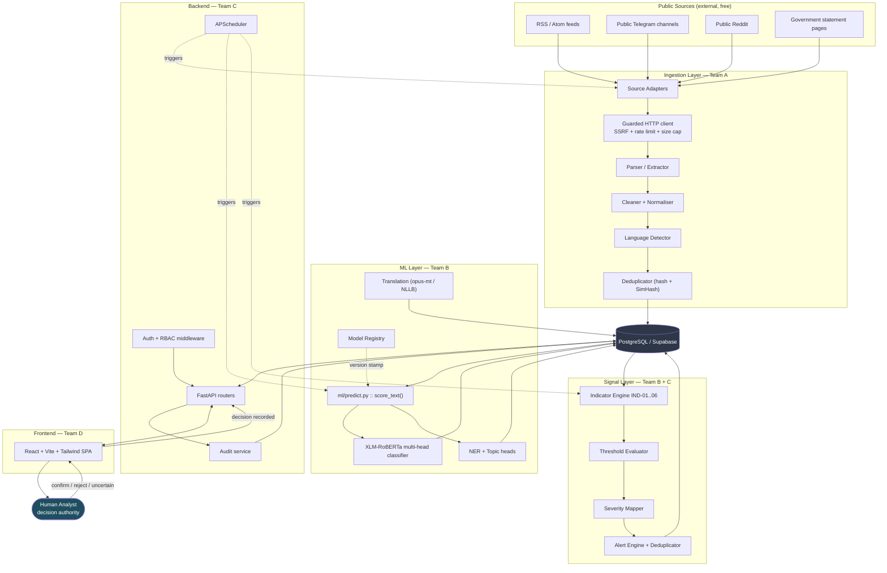
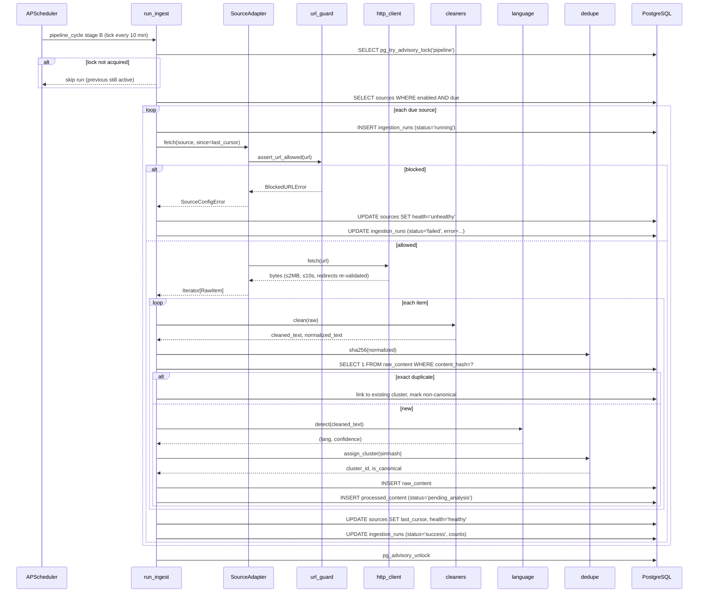
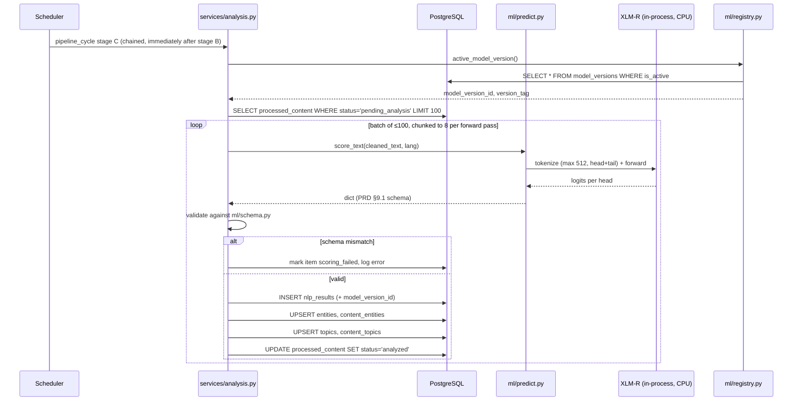
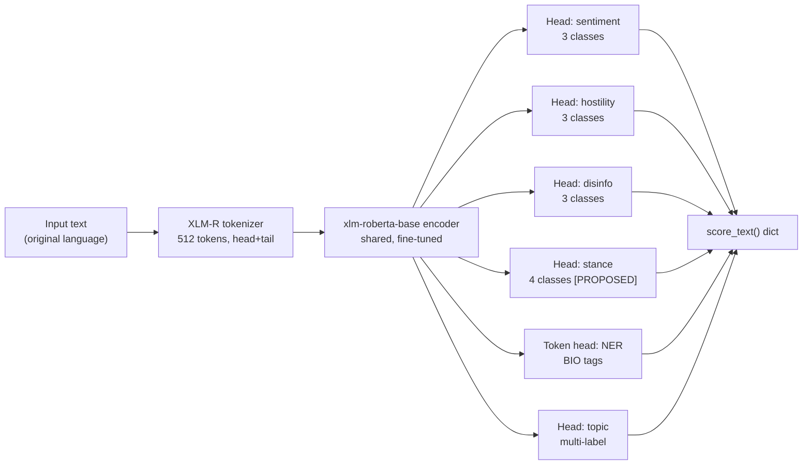
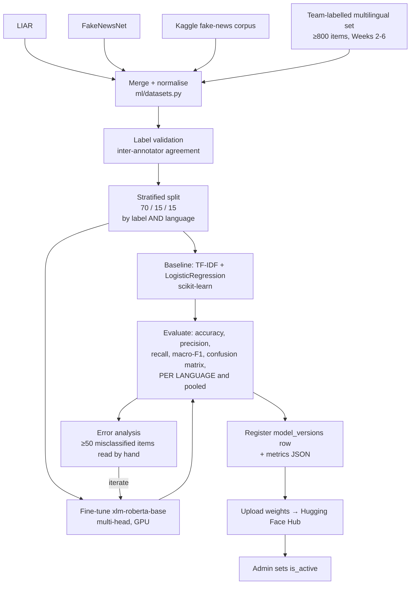
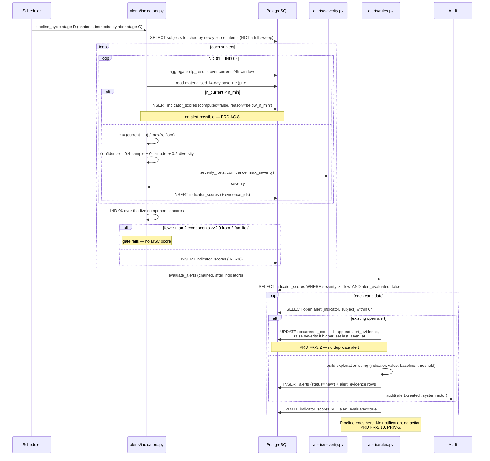
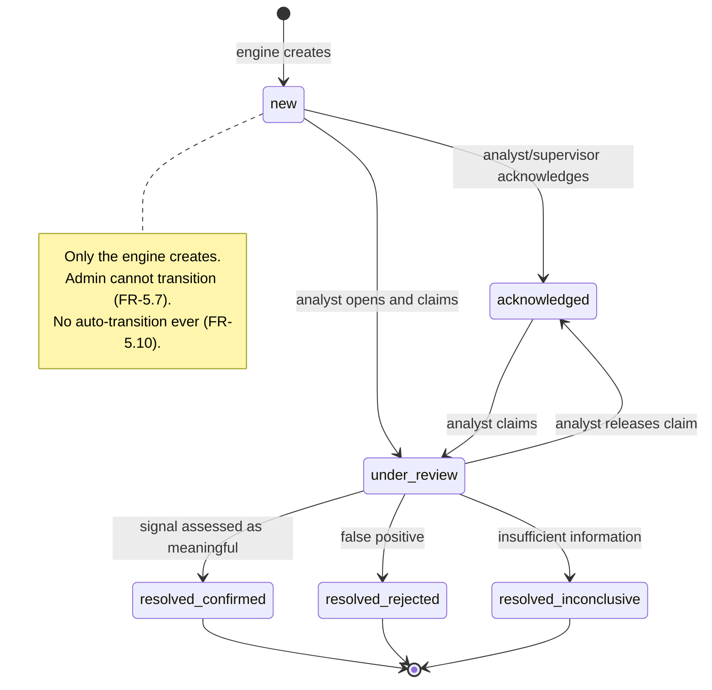
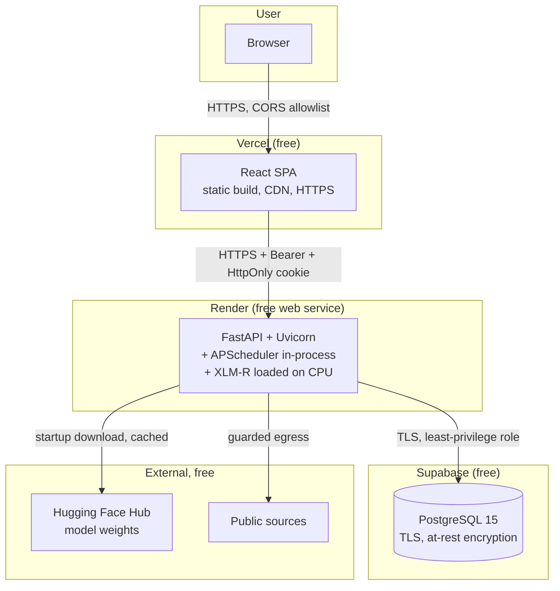

# POLIS — Technical Requirements Document (TRD)

**Political Open Source Language Intelligence System**

---

## 1. Document Control

| Field | Value |
|---|---|
| Document ID | POLIS-TRD-002 |
| Version | 1.0 |
| Date | 11 August 2026 |
| Status | Draft for Review |
| Derives from | POLIS-PRD-001 v1.0 (product source of truth) |
| Governs | POLIS-FLOW-003, POLIS-UX-004, POLIS-DB-005, POLIS-IMPL-006 |
| Owner | Team C (Backend/DB) with Team A (Ingestion) and Team B (ML) |
| Classification | Academic project documentation |

### 1.1 Change History

| Version | Date | Change |
|---|---|---|
| 1.0 | 2026-08-11 | Initial full technical specification derived from PRD v1.0 |

### 1.2 Traceability Rule

Every requirement in this document carries a `⟵ FR-x.y` / `⟵ SEC-n` / `⟵ NFR-n.m` reference to its PRD origin. A technical requirement with no PRD origin is a scope violation and must be removed or the PRD amended. Decision labels **[CONFIRMED] / [PROPOSED] / [FUTURE] / [TBD]** carry the same meaning as PRD §1.2.

---

## 2. System Overview

POLIS is a scheduled batch-processing pipeline with a synchronous read API and a single-page web client. It is deliberately **not** an event-streaming system: at the required latency (≤ 20 minutes publication-to-visible, PRD NFR-1.5a/b/c) and volume (≤ 50k items, NFR-3.1), a scheduler plus a relational database is sufficient and radically cheaper to operate on free-tier infrastructure than a broker-based architecture.

**Latency is met by chaining, not by shortening intervals.** The four latency-critical stages (ingest → score → indicators → alerts) execute sequentially inside a single 10-minute scheduler tick (§6.2), so the worst case is `poll interval + sum of stage durations = 16.0 min`, not the sum of four separate intervals. The full derivation and its precondition are in PRD §11.1, which is authoritative; §6.2 implements it.

### 2.1 Architectural Style **[CONFIRMED]**

| Property | Choice | Justification |
|---|---|---|
| Processing model | Scheduled batch (APScheduler), not streaming | ⟵ PRD C-1, NFR-3.3. No broker, no Celery, no Redis at MVP scale. |
| Deployment topology | Modular monolith — one FastAPI process hosting API + scheduler | Free tier permits one always-on service. Module boundaries enforced by directory ownership, not by network hops. |
| ML serving | In-process, CPU, batch-scored on schedule | ⟵ PRD C-4. No GPU in production, no separate inference service. |
| State | 100% in PostgreSQL. No durable in-memory state. | ⟵ PRD NFR-2.3. Process restart loses nothing. |
| Client | React SPA, REST over HTTPS, JSON | ⟵ PRD FR-6.x |
| Coupling between ML and backend | One function: `ml.predict.score_text()` | ⟵ PRD §9.1. The only interface that must not change. |

### 2.2 Explicit Non-Goals

| Non-goal | Why |
|---|---|
| Horizontal scaling / multi-instance | Single free-tier instance; APScheduler assumes a single scheduler process. Multi-instance would require leader election — out of scope. |
| Sub-minute latency | Not required by any PRD requirement; costs far exceed benefit. |
| Microservices | Six people, 16 weeks. Network boundaries would add failure modes without benefit. |
| Message broker | ⟵ PRD NFR-3.3 explicitly prohibits at MVP scale. |
| GPU inference in production | ⟵ PRD C-4. GPU is used for *training* only, on Colab/Kaggle. |

### 2.3 Concurrency Model **[CONFIRMED]**

Exactly **one** APScheduler instance runs, inside the FastAPI process, with `max_instances=1` per job and a `threadpool` executor. Jobs are idempotent and guarded by a PostgreSQL advisory lock so that an accidental second process cannot double-process.

```python
# backend/scheduler.py — lock pattern
# ponytail: one advisory lock per job name; sufficient for single-instance MVP.
# If the deployment ever scales to >1 instance, this is already the correct primitive.
LOCK_NAMESPACE = 0x504F4C49  # "POLI"

def with_job_lock(session, job_name: str) -> bool:
    """Try to take a non-blocking advisory lock. False = another run holds it."""
    return session.execute(
        text("SELECT pg_try_advisory_lock(:ns, hashtext(:job))"),
        {"ns": LOCK_NAMESPACE, "job": job_name},
    ).scalar()
```

---

## 3. High-Level Architecture



### 3.1 Layer Responsibilities

| Layer | Owner | Responsibility | Must NOT do |
|---|---|---|---|
| Ingestion | Team A | Fetch, parse, clean, detect language, deduplicate, persist raw + processed | Classify, score, alert |
| ML | Team B | Given text, return the §9.1 dict. Pure function. | Touch the database, know about alerts, perform I/O |
| Signal | Team B (logic) + C (integration) | Aggregate NLP results into indicator scores and alerts | Call the model directly, render anything |
| Backend | Team C | Auth, RBAC, REST API, scheduling, orchestration, audit | Contain ML logic or indicator formulas inline |
| Frontend | Team D | Present, filter, explain, capture decisions | Enforce authorisation, compute scores |

---

## 4. Detailed Architecture

### 4.1 Repository Structure **[CONFIRMED]**

```
polis/
├── README.md
├── requirements.txt              # pinned, backend + ingestion + ml
├── requirements-dev.txt          # pytest, ruff, black, pip-audit
├── .env.example                  # committed, empty values
├── .gitignore
├── pyproject.toml                # ruff + black + pytest config
├── alembic.ini
├── alembic/versions/
│
├── ingestion/                    # TEAM A
│   ├── __init__.py
│   ├── sources/
│   │   ├── base.py               # SourceAdapter ABC
│   │   ├── rss.py
│   │   ├── telegram.py
│   │   ├── reddit.py
│   │   └── html_page.py
│   ├── http_client.py            # guarded fetch: SSRF, timeout, size cap, UA
│   ├── url_guard.py              # SEC-12 implementation
│   ├── parsers.py
│   ├── cleaners.py
│   ├── sanitize.py               # SEC-13
│   ├── language.py
│   ├── dedupe.py                 # sha256 + simhash
│   ├── translate.py
│   └── run_ingest.py             # entrypoint, callable by scheduler and CLI
│
├── ml/                           # TEAM B
│   ├── __init__.py
│   ├── predict.py                # ⚠ score_text() — THE interface. Frozen Week 1.
│   ├── registry.py               # active model version resolution
│   ├── schema.py                 # pydantic model of the score_text return dict
│   ├── train.py
│   ├── evaluate.py
│   ├── datasets.py
│   ├── notebooks/                # Colab experiments
│   ├── artifacts/                # gitignored — weights live on HF Hub
│   └── data/                     # gitignored
│
├── alerts/                       # TEAM B logic, TEAM C wiring
│   ├── __init__.py
│   ├── indicators.py             # IND-01..IND-06 pure functions
│   ├── windows.py                # baseline/window math
│   ├── severity.py               # z → severity mapping (PRD §10.2)
│   └── rules.py                  # candidate → dedup → alert
│
├── backend/                      # TEAM C
│   ├── __init__.py
│   ├── main.py                   # FastAPI app factory
│   ├── config.py                 # pydantic-settings, single source of env
│   ├── db.py                     # engine, session
│   ├── models/                   # SQLAlchemy ORM
│   ├── schemas/                  # Pydantic request/response
│   ├── routes/
│   │   ├── auth.py  users.py  sources.py  content.py
│   │   ├── analysis.py  indicators.py  alerts.py
│   │   ├── reviews.py  models.py  audit.py  dashboard.py  health.py
│   ├── services/                 # business logic, no HTTP concerns
│   ├── security/
│   │   ├── passwords.py  tokens.py  rbac.py  headers.py
│   ├── middleware/
│   │   ├── ratelimit.py  request_id.py  errors.py  logging.py
│   └── scheduler.py
│
├── frontend/                     # TEAM D — own package.json
│   ├── index.html
│   ├── vite.config.ts
│   ├── tailwind.config.js
│   └── src/
│       ├── main.tsx  App.tsx
│       ├── api/        # axios client, typed endpoints
│       ├── pages/      # one per App Flow page
│       ├── components/ # design-system components
│       ├── hooks/
│       └── lib/
│
├── tests/
│   ├── unit/  integration/  api/  ml/  ingestion/  security/  e2e/
│   └── conftest.py
└── docs/                         # these six documents + generated API docs
```

**Directory ownership prevents merge conflicts** ⟵ PRD R-15. A PR touching another team's directory requires that team's review.

### 4.2 Technology Versions **[CONFIRMED — pinned in Week 1, except `transformers`]**

Pinned exactly in `requirements.txt` and verified by `pip-audit --strict` in CI. One row remains **[TBD]**: `transformers`, for the reason given below the table.

| Component | Package | Version constraint |
|---|---|---|
| API | `fastapi` | `==0.141.*` |
| ASGI toolkit | `starlette` | `==1.6.*` — pinned directly, see note |
| ASGI server | `uvicorn[standard]` | `==0.32.*` |
| Validation | `pydantic` | `==2.9.*` |
| Settings | `pydantic-settings` | `==2.6.*` |
| ORM | `sqlalchemy` | `==2.0.*` |
| Migrations | `alembic` | `==1.13.*` |
| Driver | `psycopg[binary]` | `==3.2.*` |
| Scheduling | `apscheduler` | `==3.10.*` |
| Passwords | `argon2-cffi` | `==23.1.*` |
| JWT | `pyjwt` | `==2.13.*` |
| Rate limit | `slowapi` | `==0.1.*` |
| Sanitisation | `bleach` | `==6.4.*` |
| Feeds | `feedparser` | `==6.0.*` |
| HTTP | `httpx` | `==0.27.*` |
| HTML | `beautifulsoup4` + `lxml` | `==4.12.*`, `==6.1.*` |
| Telegram | `telethon` | `==1.36.*` |
| Reddit | `praw` | `==7.7.*` |
| Language ID | `lingua-language-detector` | `==2.0.*` |
| ML | `torch` (CPU wheel in prod) | `==2.4.*` |
| ML | `transformers` | **unpinned until task 3.16** — see note |
| ML | `scikit-learn`, `pandas`, `numpy` | `==1.5.*`, `==2.2.*`, `==1.26.*` |
| Test | `pytest`, `pytest-cov`, `pytest-asyncio` | latest pinned |
| Lint | `ruff`, `black` | latest pinned |
| Security | `pip-audit`, `gitleaks` | latest pinned |
| Frontend | React 18, Vite 5, TypeScript 5, TailwindCSS 3, Recharts 2, Axios 1, React Router 6, TanStack Query 5 | pinned in `package-lock.json` |

> **Five pins moved in Week 1 for advisories, not preference.** `fastapi` 0.115 → 0.141, `pyjwt` 2.9 → 2.13, `bleach` 6.1 → 6.4, `lxml` 5.3 → 6.1. `starlette` is now pinned directly rather than inherited: FastAPI 0.115 capped it below 0.42, which left seven advisories unfixable without moving FastAPI itself. All 36 Week-1 tests pass on the new set and `pip-audit --strict` reports no known vulnerabilities.
>
> **`transformers` is deliberately not pinned yet.** The 4.44.2 figure above was proposed before any code existed; it now carries 29 advisories whose fixes span 4.48 through 5.5 — across a major version. Nothing imports the package (`ml/predict.py` is a stub), so pinning it now would only keep `pip-audit` permanently red or force an ignore-list that hides real findings. Team B pins it in task 3.16 against ADR-006 and ADR-007, and re-runs the audit then. ⟵ TBD, tracked with the Phase 3 gate.

> **CPU-only torch in production.** The deployed backend installs `torch` from the CPU index URL; the full CUDA wheel is ~2.5 GB and will exhaust free-tier build limits. Training environments (Colab/Kaggle) install the GPU build separately. ⟵ PRD C-4, C-5.

---

## 5. Component Architecture

Every component is specified with the same eight fields ⟵ PRD requirement.

### 5.1 `ingestion.sources.base.SourceAdapter`

| Field | Specification |
|---|---|
| **Purpose** | Uniform contract every source type implements, so adding a source type requires no change to the pipeline ⟵ FR-1.1, FR-1.5, FR-1.6, FR-1.7 |
| **Technology** | Python ABC |
| **Inputs** | `Source` ORM row (config, credentials reference, polling interval, last cursor) |
| **Outputs** | `Iterator[RawItem]` — a dataclass with `external_id, url, title, body, published_at, author_handle, raw_metadata` |
| **Dependencies** | `http_client`, source-specific library |
| **Interfaces** | `def fetch(self, source: Source, since: datetime \| None) -> Iterator[RawItem]` |
| **Failure modes** | Network timeout, HTTP 4xx/5xx, malformed feed, auth failure (Telegram/Reddit), rate limit 429, source layout change |
| **Security** | All fetches route through `http_client` (SSRF-guarded, size-capped). Credentials read from settings, never from the database in plaintext, never logged. |

**Failure handling contract:** an adapter raises `SourceFetchError` (recoverable — retry) or `SourceConfigError` (unrecoverable — mark source `unhealthy`, do not retry). It never raises a bare exception, and never swallows one silently.

### 5.2 `ingestion.http_client` + `ingestion.url_guard`

| Field | Specification |
|---|---|
| **Purpose** | Single guarded egress point ⟵ FR-1.4, FR-1.12, FR-1.13, SEC-12 |
| **Technology** | `httpx` |
| **Inputs** | URL, optional headers |
| **Outputs** | Response body (≤ 2 MB) or raises |
| **Dependencies** | `url_guard`, per-domain token bucket |
| **Interfaces** | `fetch(url: str, *, timeout: float = 10.0) -> bytes` |
| **Failure modes** | Blocked URL, timeout, oversize response, too many redirects, 429 |
| **Security** | **This component is a security control, not a utility.** See §14.5. |

```python
# ingestion/url_guard.py  ⟵ SEC-12
import ipaddress, socket
from urllib.parse import urlparse

BLOCKED_NETS = [
    ipaddress.ip_network(n) for n in (
        "127.0.0.0/8", "10.0.0.0/8", "172.16.0.0/12", "192.168.0.0/16",
        "169.254.0.0/16", "::1/128", "fc00::/7", "fe80::/10", "0.0.0.0/8",
    )
]

class BlockedURLError(ValueError):
    """Raised before any network call is made."""

def assert_url_allowed(url: str) -> None:
    p = urlparse(url)
    if p.scheme not in ("http", "https"):
        raise BlockedURLError(f"scheme not allowed: {p.scheme}")
    if not p.hostname:
        raise BlockedURLError("missing hostname")
    # Resolve every address the hostname maps to; block if ANY is internal.
    # Checking only the first result leaves a DNS-rebinding window.
    for family, _, _, _, sockaddr in socket.getaddrinfo(p.hostname, None):
        ip = ipaddress.ip_address(sockaddr[0])
        if any(ip in net for net in BLOCKED_NETS) or ip.is_reserved or ip.is_multicast:
            raise BlockedURLError(f"resolves to blocked address: {ip}")

# Redirects are re-validated at EVERY hop (httpx follow_redirects=False + manual loop),
# because the initial host may legitimately resolve public and then 302 to 169.254.169.254.
```

### 5.3 `ingestion.cleaners` + `ingestion.sanitize`

| Field | Specification |
|---|---|
| **Purpose** | Convert retrieved bytes into ML-ready, storage-safe text ⟵ FR-2.1, FR-2.2, FR-2.11, SEC-13 |
| **Technology** | BeautifulSoup + lxml, `bleach`, `unicodedata` |
| **Inputs** | Raw HTML/text bytes, declared charset |
| **Outputs** | `cleaned_text: str`, `normalized_text: str` (NFKC, whitespace-collapsed) |
| **Dependencies** | none beyond the above |
| **Interfaces** | `clean(raw: bytes, content_type: str) -> CleanResult` |
| **Failure modes** | Encoding detection failure, pathological nesting, boilerplate not removed |
| **Security** | Strips all tags to text — POLIS never stores or renders HTML. Parse depth and input size bounded to resist decompression/nesting attacks. |

> **Design note.** Casing and diacritics are **preserved** for ML input ⟵ FR-2.2. Lowercasing is a common preprocessing habit that destroys signal XLM-RoBERTa's tokenizer uses. `normalized_text` (aggressively folded) is used only for hashing and duplicate detection, never as model input.

### 5.4 `ingestion.dedupe`

| Field | Specification |
|---|---|
| **Purpose** | Exact and near-duplicate detection ⟵ FR-2.5, FR-2.6, FR-2.7 |
| **Technology** | `hashlib.sha256`, SimHash over 3-gram token shingles (64-bit) |
| **Inputs** | `normalized_text` |
| **Outputs** | `content_hash: str`, `simhash: int`, `cluster_id: UUID` |
| **Dependencies** | DB read of recent simhashes (rolling 7-day window) |
| **Interfaces** | `hash_exact(text) -> str`, `assign_cluster(session, simhash, subject_window) -> UUID` |
| **Failure modes** | Threshold too tight (misses paraphrase), too loose (merges distinct stories) |
| **Security** | None specific |

**Algorithm** ⟵ FR-2.6:
1. Exact: `sha256(normalized_text)`; a match on `raw_content.content_hash` → same cluster, mark non-canonical.
2. Near: SimHash 64-bit; candidates within Hamming distance ≤ 3 (≈ 0.95 similarity) from the last 7 days, retrieved via banded index on 16-bit chunks. Confirm with token Jaccard ≥ **0.85** ⟵ PRD FR-2.6 threshold.
3. First member of a cluster is canonical; later members link to it and are retained ⟵ FR-2.7, because cluster size feeds IND-03.

> **Why not discard duplicates.** Discarding them would destroy the input to IND-03 (Narrative Amplification). This is a case where the naive "dedupe = delete" instinct breaks a downstream requirement.

### 5.5 `ml.predict.score_text` **[CONFIRMED — frozen Week 1]**

| Field | Specification |
|---|---|
| **Purpose** | The single ML↔backend interface ⟵ PRD §9.1, FR-3.5 |
| **Technology** | PyTorch + Transformers, XLM-RoBERTa multi-head |
| **Inputs** | `text: str` (cleaned, not HTML), optional `lang: str` |
| **Outputs** | The dict in PRD §9.1, validated against `ml/schema.py` |
| **Dependencies** | Loaded model artefact, tokenizer, `ml.registry` for version tag |
| **Interfaces** | `score_text(text: str, lang: str \| None = None) -> dict` |
| **Failure modes** | Model not loaded, OOM, empty input, tokenizer failure, unexpectedly long input |
| **Security** | Pure function — no I/O, no DB, no network at call time. Input length bounded before tokenisation. |

**Contract obligations:**

| Obligation | Rule |
|---|---|
| Purity | No database access, no HTTP, no file writes at call time. Model load happens once at process start. |
| Total keys | Every key in the schema is always present. Descoped tasks return `label: "not_applicable"`, `confidence: 0.0`. |
| Determinism | Same input + same `model_version` → same output. `torch.set_grad_enabled(False)`, model in `.eval()`, seeds fixed. |
| Version stamping | `model_version` in the return value is the authoritative record ⟵ FR-3.8 |
| Truncation honesty | `truncated: true` when input exceeded 512 tokens ⟵ FR-2.10 |
| Failure mode | Raises `ValueError` on empty/whitespace input. Never returns a partial dict. |

**Week-1 stub** ⟵ PRD R-9, unblocks Teams C and D before any training:

```python
# ml/predict.py — Week 1 deliverable. Real implementation replaces the body only.
import hashlib
from ml.schema import ScoreResult   # pydantic model; the stub is validated by it too

_STUB_VERSION = "polis-stub-v0.0.1"

def score_text(text: str, lang: str | None = None) -> dict:
    if not text or not text.strip():
        raise ValueError("score_text requires non-empty text")
    # Deterministic pseudo-scores from a hash so tests are stable and the UI
    # shows varied values. Replaced wholesale in Week 8.
    h = int(hashlib.sha256(text.encode()).hexdigest(), 16)
    def band(shift: int) -> float:
        return round(((h >> shift) % 1000) / 1000, 3)
    neg = band(0); pos = round((1 - neg) * band(8), 3); neu = round(1 - neg - pos, 3)
    result = {
        "schema_version": "1.0",
        "model_version": _STUB_VERSION,
        "language": {"code": lang or "en", "confidence": 0.99},
        "truncated": len(text) > 4000,
        "sentiment": {"label": max((("negative", neg), ("neutral", neu), ("positive", pos)),
                                   key=lambda kv: kv[1])[0],
                      "confidence": max(neg, neu, pos),
                      "scores": {"negative": neg, "neutral": neu, "positive": pos}},
        "hostility": {"label": "none", "confidence": 0.90,
                      "scores": {"none": 0.90, "hostile_rhetoric": 0.08,
                                 "threatening_language": 0.02}},
        "disinfo":   {"label": "uncertain", "confidence": 0.50,
                      "scores": {"likely_reliable": 0.30, "uncertain": 0.50,
                                 "likely_unreliable": 0.20}},
        "stance":    {"label": "not_applicable", "confidence": 0.0, "scores": {}},
        "entities":  [],
        "topics":    [],
        "meta": {"inference_ms": 1, "device": "stub", "chars_in": len(text)},
    }
    return ScoreResult.model_validate(result).model_dump()   # contract enforced on the stub too
```

> **Why validate the stub.** If the stub can drift from the schema, Teams C and D build against a shape the real model will not produce. The pydantic model is the contract; both stub and real implementation pass through it.

### 5.6 `alerts.indicators`

| Field | Specification |
|---|---|
| **Purpose** | Compute IND-01…IND-06 ⟵ PRD §10 |
| **Technology** | Pure Python + SQL aggregate queries; NumPy for the statistics |
| **Inputs** | `session`, `subject`, `window_end` |
| **Outputs** | `IndicatorResult(indicator_code, raw_value, z_score, threshold, severity, confidence, evidence_ids, n_current, meta)` |
| **Dependencies** | `nlp_results`, `processed_content`, `content_entities`, `indicator_definitions` |
| **Interfaces** | One function per indicator, uniform signature; a registry dict maps code → function |
| **Failure modes** | Insufficient baseline history, zero-variance baseline (σ floor applied), missing subject mapping |
| **Security** | Read-only on content tables |

```python
# alerts/indicators.py — uniform signature; PRD §10 formulas implemented verbatim.
IndicatorFn = Callable[[Session, Subject, datetime, IndicatorDefinition], IndicatorResult | None]

REGISTRY: dict[str, IndicatorFn] = {
    "IND-01": hostile_rhetoric_surge,
    "IND-02": negative_sentiment_shift,
    "IND-03": narrative_amplification,
    "IND-04": disinformation_density,
    "IND-05": entity_attention_spike,
    "IND-06": multi_signal_convergence,   # MUST run last — consumes the other five
}

SIGMA_FLOOR = 0.05          # PRD §10.1
SIGMA_FLOOR_COUNTS = 1.0    # PRD IND-05, integer counts

def zscore(current: float, mu: float, sigma: float, floor: float = SIGMA_FLOOR) -> float:
    return (current - mu) / max(sigma, floor)
```

Returning `None` means "not computed" (below `n_min`, or insufficient baseline) and is recorded with a reason ⟵ PRD AC-8. It is **not** the same as a zero score.

### 5.7 `alerts.severity`

Implements PRD §10.2 verbatim, including the confidence cap.

```python
# alerts/severity.py  ⟵ PRD §10.2
BANDS = [(4.0, "critical"), (3.0, "high"), (2.5, "medium"),
         (2.0, "low"), (1.5, "informational"), (float("-inf"), "normal")]

ORDER = ["normal", "informational", "low", "medium", "high", "critical"]

def severity_for(z: float, confidence: float, max_severity: str = "critical") -> str:
    sev = next(name for thr, name in BANDS if z >= thr)
    if confidence < 0.40:                       # PRD §10.2 low-confidence cap
        sev = min(sev, "low", key=ORDER.index)
    return min(sev, max_severity, key=ORDER.index)   # per-indicator cap (IND-04 high, IND-05 medium)
```

### 5.8 `alerts.rules`

| Field | Specification |
|---|---|
| **Purpose** | Candidate → deduplicate → persist alert ⟵ FR-5.1–5.5 |
| **Technology** | Python + SQLAlchemy |
| **Inputs** | `IndicatorResult` |
| **Outputs** | New `Alert` row, or an update to an existing open alert |
| **Dependencies** | `alerts` and `alert_evidence` tables |
| **Interfaces** | `process_candidate(session, result) -> Alert \| None` |
| **Failure modes** | Race producing a duplicate alert — prevented by a partial unique index (see Backend Schema §5) |
| **Security** | No external effects. **Architecturally incapable of taking action** ⟵ PRD PRIV-5, FR-5.10 |

Deduplication ⟵ FR-5.2: within the 6-hour window, an open alert with the same `(indicator_code, subject_type, subject_key)` absorbs the candidate — `occurrence_count += 1`, new evidence appended, `last_seen_at` updated, and severity raised if the new candidate is more severe (never lowered — an analyst's context should not silently downgrade).

### 5.9 `backend.security.rbac`

| Field | Specification |
|---|---|
| **Purpose** | Default-deny authorisation on every protected route ⟵ FR-8.2, FR-8.3, SEC-7, SEC-8 |
| **Technology** | FastAPI dependency |
| **Inputs** | Validated JWT claims, required permission string |
| **Outputs** | `CurrentUser` or raises `403` |
| **Dependencies** | `users`, `roles`, `permissions`, `role_permissions` |
| **Interfaces** | `require(permission: str) -> Callable` |
| **Failure modes** | Missing/expired/revoked token → 401; insufficient permission → 403 |
| **Security** | The single enforcement point. Permission strings are checked against the database, not against role names in the token, so a role change takes effect on the next request. |

```python
# backend/security/rbac.py  ⟵ SEC-7
def require(permission: str):
    async def _dep(request: Request,
                   user: CurrentUser = Depends(get_current_user),
                   session: Session = Depends(get_session)) -> CurrentUser:
        if not user_has_permission(session, user.id, permission):
            audit(session, actor_id=user.id, action="permission.denied",
                  resource_type="endpoint", resource_id=request.url.path,
                  result="denied")                       # ⟵ FR-8.5
            raise HTTPException(403, "insufficient permissions")
        return user
    return _dep

# Usage — every protected route, no exceptions:
@router.post("/sources", dependencies=[Depends(require("source:create"))])
```

### 5.10 Component Failure-Mode Summary

| Component | Failure | Detection | Response | User impact |
|---|---|---|---|---|
| Source adapter | Feed 404 / format change | Parse exception | Retry ×3 backoff → `degraded` → `unhealthy` after 3 cycles | Source badge red; other sources unaffected ⟵ AC-2 |
| HTTP client | Timeout | 10 s timeout | Retry; count against source health | None immediately |
| HTTP client | Blocked URL | `url_guard` | Refuse before connect, log, mark source config error | Source disabled, admin notified in UI |
| Cleaner | Encoding failure | Decode exception | Fall back to `utf-8 errors="replace"`, flag item `clean_degraded` | Item still processed, flagged in UI |
| Language detector | Low confidence | conf < 0.60 | Flag `language_uncertain`, continue ⟵ FR-2.4 | Badge on item |
| Deduper | Zero recent hashes | Empty candidate set | Treat as new cluster | None |
| `score_text` | Model not loaded | Startup check | `/health/detail` reports `model: unavailable`; scoring job skips and logs | Feed shows unscored items with "analysis pending" |
| `score_text` | OOM on long text | Exception | Truncate harder, retry once, else mark item `scoring_failed` | Item visible, marked unanalysed |
| Indicator engine | Insufficient baseline | < 7 baseline days | Return `None` with reason `insufficient_baseline` | Trend chart shows "building baseline" |
| Alert engine | Duplicate race | Unique index violation | Catch, absorb into existing alert | None |
| Scheduler | Job overrun | `max_instances=1` | Skip the overlapping run, log a warning | Slightly stale data |
| Database | Connection lost | Pool error | Request → 503; scheduler job fails and retries next cycle | Error page with retry ⟵ UX doc |
| Auth | Token expired | JWT validation | 401 + `WWW-Authenticate` | Session-expiry modal ⟵ AC-17 |

---

## 6. Data Flow Architecture

### 6.1 Ingestion Flow ⟵ FR-1.x, FR-2.x



**Per-source isolation** ⟵ AC-2: each source is processed in its own transaction and its own `try/except`. One source failing cannot abort the cycle.

### 6.2 Scheduled Jobs **[PROPOSED]**

**The four latency-critical stages run as ONE chained job, not four independent timers.** This is the design decision that satisfies PRD NFR-1.5a/b/c; four independent timers would make the worst-case latency the *sum of the intervals* (10 + 10 + 30 + 30 = 80 min), not the sum of the *durations*. ⟵ PRD §11.1.

| Job | Trigger | Purpose | Lock key | Idempotent? |
|---|---|---|---|---|
| **`pipeline_cycle`** | **every 10 min** | Chained: A→B→C→D→E below. The only latency-critical job. | `pipeline` | Yes (all stages individually idempotent) |
| ├ stage B `ingest_due_sources` | chained (in-process call) | Fetch due sources ⟵ FR-1.2 | — | Yes (content hash) |
| ├ stage C `score_pending` | chained, immediately after B | `score_text` on items B just wrote, ≤ 100/cycle ⟵ FR-3.10 | — | Yes (unique on content+model_version) |
| ├ stage D `compute_indicators` | chained, immediately after C | IND-01…06, **only for subjects touched by C** ⟵ FR-4.1 | — | Yes (unique on indicator+subject+window) |
| └ stage E `evaluate_alerts` | chained, immediately after D | Candidate → dedup → alert ⟵ FR-5.1 | — | Yes (dedup + unique index) |
| `translate_pending` | every 20 min, independent | Display translation ⟵ FR-2.8 — **deliberately off the critical path**: translation is display-only and is never a classification input, so it must not delay stages C–E | `translate` | Yes |
| `refresh_source_reliability` | daily 02:00 | Recompute reliability bands ⟵ FR-4.10 | `reliability` | Yes |
| `purge_expired` | daily 03:00 | Retention enforcement ⟵ PRIV-4 | `purge` | Yes |
| `refresh_baselines` | hourly | Materialise 14-day baseline stats | `baselines` | Yes |

```python
# backend/scheduler.py — the chained pipeline. Plain sequential calls, no broker.
@scheduler.scheduled_job("interval", minutes=10, id="pipeline_cycle", max_instances=1)
def pipeline_cycle() -> None:
    with session_scope() as s:
        if not with_job_lock(s, "pipeline"):
            log.warning("pipeline_cycle skipped: previous run still holds the lock")
            return
        touched = ingest_due_sources(s)          # stage B  -> NFR-1.5a satisfied here
        scored  = score_pending(s, limit=100)    # stage C  -> NFR-1.5b satisfied here
        subjects = subjects_for(s, scored)       # only what changed — not a full sweep
        compute_indicators(s, subjects)          # stage D
        evaluate_alerts(s, subjects)             # stage E  -> NFR-1.5c satisfied here
```

**Why stage D is scoped to `subjects_for(scored)` and not a full sweep:** a full pass over all subjects costs up to 60 s (NFR-1.6). Running that every 10 minutes would consume 10% of the free-tier instance's duty cycle for no benefit, since a subject with no new items cannot have a changed score. Scoping to touched subjects keeps stage D at ≤ 1 min in the §11.1 budget while remaining correct.

**Overrun behaviour:** `max_instances=1` plus the advisory lock means a cycle that overruns 10 minutes causes the next tick to be **skipped, not queued**. This degrades latency (the next cycle starts late) but never double-processes. An overrun is logged and is visible as a growing `pending_analysis` backlog on `/health/detail` — this is the observable signal that the PRD §11.1 precondition (TBD-16) has been violated.

---

## 7. ML Inference Flow



### 7.1 Inference Design Decisions

| Decision | Choice | Reason |
|---|---|---|
| Where inference runs | In the FastAPI process, on the scheduler thread pool | ⟵ NFR-3.3. A separate service adds deployment cost with no benefit at this scale. |
| Batching | 8 items per forward pass, 100 per job run | Balances CPU memory against throughput ⟵ NFR-1.4 (≥300 items/hr) |
| Model loading | Once at startup, held in module-level singleton | Loading per call would breach NFR-1.3 by orders of magnitude |
| Truncation | Head 384 + tail 128 tokens | Political articles carry the lede at the start and consequence at the end; pure head-truncation loses the latter ⟵ FR-2.10 |
| Re-scoring on new model | New `model_version` → items re-queued in the background, old results retained | ⟵ FR-3.10. Results are never overwritten; both versions coexist for comparison. |
| Translation vs classification | Classification always on the **original** text; translation is display-only | ⟵ FR-2.8. Classifying a machine translation compounds two error sources and would invalidate per-language evaluation. |
| Confidence threshold | Below 0.55 displayed as low-confidence ⟵ FR-3.12 | Threshold lives in config, not code constants |

### 7.2 Multi-Head Model Architecture **[PROPOSED]**



**Why one shared encoder with multiple heads rather than four separate models:**

| Factor | Multi-head | Four separate models |
|---|---|---|
| Inference cost (CPU) | One forward pass | Four forward passes — breaches NFR-1.3 |
| Memory | ~1.1 GB | ~4.4 GB — exceeds free-tier RAM |
| Training | One run, joint loss | Four runs, four times the Colab quota ⟵ R-7 |
| Risk | Task interference (negative transfer) | Isolated tasks |

**Mitigation for task interference:** train with per-task loss weights, evaluate each head independently, and — this is the fallback — if a head degrades below its PRD target it may be split into a separate smaller model. Decision point Week 7. **[TBD-9 — Team B, Week 7]**

### 7.3 Training Pipeline (offline, Colab/Kaggle) ⟵ PRD SM-1…SM-7



| Element | Specification |
|---|---|
| Split | Stratified 70/15/15 by **label and language jointly** — a random split would leave some languages absent from test, invalidating NFR-12.2 |
| Leakage control | Split by `cluster_id`, not by row. Near-duplicates in both train and test inflate metrics — the single most common evaluation error in this project class. |
| Baseline | TF-IDF + LogisticRegression, reported alongside the transformer. A transformer that does not beat this baseline is a finding worth reporting. |
| Hyperparameters **[PROPOSED]** | lr 2e-5, batch 16 (grad-accum to 32), 3–4 epochs, warmup 10%, weight decay 0.01, early stop on val macro-F1 |
| Class imbalance | Class-weighted loss; minority-class recall reported separately ⟵ SM-5 |
| Reproducibility | Seeds fixed and recorded; dataset hash recorded in `model_versions.dataset_ref` |
| Checkpointing | Every epoch to Google Drive ⟵ R-7 (Colab disconnects) |
| Artefact | Weights on Hugging Face Hub ⟵ PRD C-8 (100 MB GitHub limit) |

### 7.4 Model Registry and Drift

| Concern | MVP approach | Future |
|---|---|---|
| Versioning | `model_versions` table: `version_tag`, `task`, `base_model`, `dataset_ref`, `metrics` (JSONB), `artifact_uri`, `is_active`, `created_at` ⟵ FR-3.8 | — |
| Activation | Exactly one active version, enforced by a partial unique index. Activation is an audited admin action ⟵ FR-8.5 | Canary/shadow deploy |
| Reproducibility | Every `nlp_results` row references `model_version_id`. A result can always be traced to its model and metrics ⟵ AC-24 | — |
| Drift | **Observed, not automated.** Track the distribution of predicted labels per week and alert-precision per indicator; a visible shift prompts human investigation ⟵ FR-7.5 | FUT-7: automated drift detection |
| Feedback | Analyst decisions accumulate in `analyst_reviews`. Export is explicit, audited, and Supervisor-initiated ⟵ FR-3.11, FR-7.6. **No online learning.** | FUT-6 |

> **Why no automatic retraining.** A model that retrains on its own alerts' review outcomes learns the reviewers' biases and the alerting policy's blind spots, and does so with no human able to inspect the change. For a monitoring system with political subject matter, this is the wrong default. ⟵ PRD PRIV-5, PRIV-7.

---

## 8. Alert Generation Flow



### 8.1 Alert Explanation Generation ⟵ FR-5.5, NFR-6.1

Template-based, not model-generated — an LLM-written explanation could not be guaranteed non-predictive, and PRD §10.6 prohibits predictive framing.

```python
# alerts/rules.py
EXPLANATION = (
    "{indicator_name} for {subject_label} measured {raw_value:.3f} in the 24 hours "
    "to {window_end:%Y-%m-%d %H:%M} UTC, against a 14-day baseline of {mu:.3f} "
    "(σ={sigma:.3f}). This is {z:.1f} standard deviations above baseline, exceeding "
    "the configured threshold of {threshold:.1f}. Based on {n} items from "
    "{n_sources} sources. Measurement confidence: {confidence:.2f}. "
    "This is a monitoring signal requiring analyst assessment; it is not a "
    "prediction of any future event."
)
```

The final sentence is **mandatory and not configurable** ⟵ PRD §10.6, FR-4.9. It is asserted by a test (`test_explanation_contains_disclaimer`).

### 8.2 Alert State Machine ⟵ FR-5.6, FR-5.7



| Transition | Permission | Audited | Side effect |
|---|---|---|---|
| → `new` | system only | yes (system actor) | evidence linked |
| `new`/`acknowledged` → `under_review` | `alert:review` | yes | `claimed_by` set |
| `under_review` → `resolved_*` | `alert:review` | yes | `analyst_reviews` row, `resolved_at`, feeds precision metric |
| any → any by Administrator | **denied** | denial audited | none ⟵ FR-5.7 |

---

## 9. Authentication Flow

```mermaid
sequenceDiagram
    participant U as Browser (React)
    participant API as FastAPI
    participant RL as Rate limiter
    participant PW as passwords.py (Argon2id)
    participant DB as PostgreSQL
    participant AUD as audit_logs

    U->>API: POST /api/v1/auth/login {email, password}
    API->>RL: check (5 per 15 min per account+IP)
    alt limit exceeded
        RL-->>U: 429 + Retry-After
        API->>AUD: auth.rate_limited
    end
    API->>DB: SELECT user WHERE email = ?
    API->>PW: verify(password, stored_hash)
    Note over PW: Dummy verify runs even when the user<br/>does not exist — constant time, no enumeration (SEC-3)
    alt invalid
        API->>AUD: auth.login_failed (actor=null, email hashed)
        API-->>U: 401 {"detail": "invalid credentials"}
    else valid
        API->>DB: INSERT refresh_tokens (jti, user_id, expires_at)
        API->>AUD: auth.login_success
        API-->>U: 200 {access_token, expires_in: 900, user: {...}}<br/>Set-Cookie: refresh=...; HttpOnly; Secure; SameSite=Strict; Path=/api/v1/auth
    end

    U->>API: GET /api/v1/alerts  (Authorization: Bearer <access>)
    API->>API: verify signature, exp, iss, aud
    API->>DB: load user + permissions (role change takes effect immediately)
    alt expired
        API-->>U: 401
        U->>API: POST /api/v1/auth/refresh (cookie only, no body)
        API->>DB: SELECT refresh_tokens WHERE jti = ? AND revoked_at IS NULL
        alt valid
            API->>DB: rotate — revoke old jti, insert new
            API-->>U: 200 {access_token} + new refresh cookie
        else revoked or unknown
            API->>AUD: auth.refresh_reuse_detected
            API->>DB: revoke ALL tokens for that user
            API-->>U: 401 → force re-login
        end
    end
```

### 9.1 Token Design **[CONFIRMED]** ⟵ SEC-5, SEC-6, SEC-27

| Property | Access token | Refresh token |
|---|---|---|
| Format | JWT (HS256 **[PROPOSED]**; single service, no key distribution need) | Opaque random 256-bit, SHA-256 hashed in DB |
| Lifetime | 15 minutes | 8 hours |
| Storage (client) | In-memory JS variable only — **never** `localStorage` or `sessionStorage` | `HttpOnly; Secure; SameSite=Strict` cookie, path-scoped to `/api/v1/auth` |
| Claims | `sub`, `iat`, `exp`, `iss`, `aud`, `jti`, `role` | n/a (opaque) |
| Revocation | Not individually revocable (short life is the mitigation) | Revocable; rotated on every use |
| Reuse detection | n/a | Reuse of a rotated token revokes the entire family and audits it |
| On role change / disable | Next request reloads permissions from DB → effective immediately | All tokens revoked ⟵ SEC-27 |

> **Why the access token is not in `localStorage`.** Any XSS gives an attacker a token valid for its full lifetime, exfiltratable to any origin. In-memory storage plus an `HttpOnly` refresh cookie means an XSS can act *during* the session but cannot steal a portable credential. Combined with strict CSP (SEC-14) and React's escaping (SEC-13), this is the correct trade for a security-relevant application. The cost — losing the session on a page refresh — is handled by a silent refresh call on app mount.

### 9.2 Permission Matrix ⟵ FR-8.2

| Permission | Analyst | Supervisor | Admin |
|---|---|---|---|
| `content:read` | ✅ | ✅ | ✅ |
| `content:search` | ✅ | ✅ | ✅ |
| `alert:read` | ✅ | ✅ | ✅ |
| `alert:review` | ✅ | ✅ | ❌ |
| `review:create` | ✅ | ✅ | ❌ |
| `review:read_all` | ❌ (own only) | ✅ | ❌ |
| `review:export` | ❌ | ✅ | ✅ |
| `indicator:read` | ✅ | ✅ | ✅ |
| `indicator:update_threshold` | ❌ | ✅ | ✅ |
| `source:read` | ✅ | ✅ | ✅ |
| `source:create` / `update` / `disable` | ❌ | ❌ | ✅ |
| `source:fetch_now` | ❌ | ✅ | ✅ |
| `user:read` | ❌ | ❌ | ✅ |
| `user:create` / `update` / `disable` | ❌ | ❌ | ✅ |
| `model:read` | ✅ | ✅ | ✅ |
| `model:activate` | ❌ | ❌ | ✅ |
| `audit:read_all` | ❌ | ❌ | ✅ |
| `audit:read_alerts` | ❌ | ✅ | ✅ |
| `metrics:read` | ✅ (own) | ✅ (team) | ✅ |

Permissions are rows in `permissions`, mapped to roles in `role_permissions` — not hard-coded enums ⟵ Backend Schema §3. Adding the **[FUTURE]** Observer role is then a data change, not a code change.

---

## 10. Deployment Architecture

### 10.1 Hosted Topology **[PROPOSED]** ⟵ PRD C-1, C-5



| Concern | Handling |
|---|---|
| Free-tier cold start ⟵ C-5, R-8 | Render free tier sleeps after inactivity; first request may take 30–60 s **plus** model load. Mitigations: (a) `/health` pinged every 10 min by a free uptime checker; (b) demo script includes an explicit warm-up step; (c) **local deployment is the primary demo path**, cloud is the backup. |
| Model load time | ~1.1 GB weights downloaded once at build/startup and cached on disk. Startup probe reports `model: loading` until ready; the API serves reads meanwhile. |
| Memory ceiling | Free tier ≈ 512 MB RAM — **insufficient for XLM-R-base in float32**. Mitigations, in order: (1) dynamic int8 quantisation (`torch.quantization.quantize_dynamic`) → ~300 MB; (2) if still short, run scoring **locally/offline** and host only the API + pre-computed results for the cloud demo. **[TBD-10 — Team C measures actual footprint in Week 12; decision documented either way.]** |
| Scheduler on a sleeping instance | Jobs do not run while asleep. The uptime ping keeps it awake during the demo period; gaps are visible in `ingestion_runs` and are an honest, documented free-tier limitation. |
| Secrets | Platform environment variables only. Never in the repo, the build log, or the frontend bundle ⟵ SEC-17. |

### 10.2 Local Deployment **[CONFIRMED — required, not optional]** ⟵ PRD NFR-13.1

Every team member must run the full stack locally. This is also the fallback demo path.

```bash
# 1. Database
docker run -d --name polis-db -e POSTGRES_PASSWORD=devonly \
  -e POSTGRES_DB=polis -p 5432:5432 postgres:15

# 2. Backend
python -m venv venv && source venv/bin/activate     # Windows: venv\Scripts\activate
pip install -r requirements.txt -r requirements-dev.txt
cp .env.example .env                                 # fill local values
alembic upgrade head
python -m backend.seed --demo                        # roles, permissions, demo users, sources
uvicorn backend.main:app --reload --port 8000

# 3. Frontend
cd frontend && npm ci && npm run dev                  # http://localhost:5173

# 4. Optional: one ingestion cycle immediately, without waiting for the scheduler
python -m ingestion.run_ingest --once
```

### 10.3 Environments

| Env | Where | Database | Model | Purpose |
|---|---|---|---|---|
| Local | Developer machine | Docker Postgres | Stub, then real weights | Daily development |
| Test | CI (GitHub Actions) | Ephemeral Postgres service | **Stub only** — deterministic, fast | Automated tests |
| Demo/Staging | Render + Supabase + Vercel | Supabase free | Real, quantised (or precomputed) | Integration, evaluation, backup demo |
| Presentation | Local, rehearsed | Local Postgres with seeded corpus | Real | Final demo — no network dependency |

> **The presentation environment is local by design** ⟵ R-8. A demo that depends on a free-tier cold start and campus wifi is a demo that fails.

### 10.4 `.env.example` **[CONFIRMED — committed, empty values]** ⟵ SEC-17

```bash
# ---- Application ----
POLIS_ENV=local                      # local | test | demo | production
POLIS_DEBUG=false                    # MUST be false outside local (SEC-19)
POLIS_LOG_LEVEL=INFO

# ---- Database ----
DATABASE_URL=postgresql+psycopg://polis_app:@localhost:5432/polis

# ---- Security ----
JWT_SECRET=                          # 32+ random bytes; generate per environment
JWT_ISSUER=polis
JWT_AUDIENCE=polis-api
ACCESS_TOKEN_MINUTES=15
REFRESH_TOKEN_HOURS=8
CORS_ALLOWED_ORIGINS=http://localhost:5173

# ---- Ingestion ----
INGEST_USER_AGENT=POLIS-Academic-Research/1.0 (university FYP; contact: )
INGEST_TIMEOUT_SECONDS=10
INGEST_MAX_BYTES=2097152
INGEST_INTERVAL_MINUTES=15

# ---- Source credentials (free tiers) ----
TELEGRAM_API_ID=
TELEGRAM_API_HASH=
TELEGRAM_SESSION_NAME=polis
REDDIT_CLIENT_ID=
REDDIT_CLIENT_SECRET=
REDDIT_USER_AGENT=

# ---- ML ----
MODEL_ARTIFACT_URI=                  # hf://org/polis-xlmr-v1 or local path
MODEL_DEVICE=cpu
MODEL_MAX_TOKENS=512
MODEL_BATCH_SIZE=8
MODEL_CONFIDENCE_FLOOR=0.55

# ---- Retention (days) — PRIV-4 ----
RETAIN_RAW_CONTENT_DAYS=180
RETAIN_NLP_RESULTS_DAYS=365
RETAIN_AUDIT_DAYS=365
```

`.env` is git-ignored. CI asserts that `.env` is absent from every commit and that `.env.example` contains no value after any `=` for keys matching `SECRET|PASSWORD|TOKEN|KEY|HASH`.

---

## 11. Backend Architecture

### 11.1 Layering **[CONFIRMED]**

```
routes/     HTTP only — parse, validate, authorise, delegate, serialise.  NO business logic.
services/   Business logic. Takes a Session. NO FastAPI imports, NO HTTP concepts.
models/     SQLAlchemy ORM. NO business logic.
schemas/    Pydantic request/response. NO ORM imports.
security/   Cross-cutting: passwords, tokens, RBAC, headers.
middleware/ Request ID, logging, errors, rate limiting.
```

The `services` layer imports no FastAPI symbols, which makes it directly unit-testable and keeps the option of a CLI or worker entrypoint open at zero cost.

### 11.2 Application Factory

```python
# backend/main.py
def create_app() -> FastAPI:
    settings = get_settings()
    app = FastAPI(
        title="POLIS API", version="1.0.0",
        docs_url="/api/docs" if settings.env == "local" else None,   # SEC-19
        redoc_url=None,
        openapi_url="/api/openapi.json" if settings.env == "local" else None,
    )
    # Order matters: request_id outermost so every later log line carries it.
    app.add_middleware(RequestIDMiddleware)
    app.add_middleware(StructuredLoggingMiddleware)
    app.add_middleware(SecurityHeadersMiddleware)          # SEC-14, SEC-22, SEC-26
    app.add_middleware(CORSMiddleware,
                       allow_origins=settings.cors_allowed_origins,   # SEC-15, never "*"
                       allow_credentials=True,
                       allow_methods=["GET", "POST", "PATCH", "DELETE"],
                       allow_headers=["Authorization", "Content-Type"])
    app.state.limiter = build_limiter(settings)            # SEC-16
    app.add_exception_handler(Exception, generic_error_handler)      # SEC-19
    for r in (auth, users, sources, content, analysis, indicators,
              alerts, reviews, models_, audit, dashboard, health):
        app.include_router(r.router, prefix="/api/v1")
    register_jobs(app)                                     # APScheduler, start/stop on lifespan
    return app
```

### 11.3 Middleware Stack

| Order | Middleware | Purpose | PRD ref |
|---|---|---|---|
| 1 | `RequestIDMiddleware` | Generate/propagate `X-Request-ID`; bind to log context | NFR-7.1 |
| 2 | `StructuredLoggingMiddleware` | JSON access log with redaction filter | SEC-20 |
| 3 | `SecurityHeadersMiddleware` | CSP, HSTS, nosniff, Referrer-Policy, Permissions-Policy | SEC-14, 22, 26 |
| 4 | `CORSMiddleware` | Explicit origin allowlist | SEC-15 |
| 5 | `SlowAPIMiddleware` | Per-IP and per-user rate limits | SEC-16 |
| — | Exception handler | Generic client message + full server-side detail | SEC-19 |

```python
# backend/middleware/errors.py  ⟵ SEC-19
async def generic_error_handler(request: Request, exc: Exception) -> JSONResponse:
    rid = getattr(request.state, "request_id", "unknown")
    logger.exception("unhandled_error", extra={"request_id": rid, "path": request.url.path})
    return JSONResponse(
        status_code=500,
        content={"detail": "An internal error occurred.", "request_id": rid},
    )   # No stack trace, no SQL, no file path, no dependency version reaches the client.
```

---

## 12. API Specification

Base path `/api/v1`. All responses JSON. All times ISO-8601 UTC. Errors: `{"detail": str, "request_id": str}` and, for validation failures, `{"detail": [...], "request_id": str}`.

Standard status codes: `400` malformed, `401` unauthenticated, `403` unauthorised, `404` not found, `409` conflict, `422` validation, `429` rate limited, `500` server error.

### 12.1 Auth ⟵ FR-8.1, FR-8.8

| Method | Path | Auth | Permission | Request | Response | Errors | Rate limit |
|---|---|---|---|---|---|---|---|
| POST | `/auth/login` | none | — | `LoginRequest{email, password}` | `TokenResponse{access_token, token_type, expires_in, user}` + refresh cookie | 401, 429 | 5 / 15 min per account+IP |
| POST | `/auth/refresh` | refresh cookie | — | none | `TokenResponse` + rotated cookie | 401 | 30 / hr |
| POST | `/auth/logout` | bearer | — | none | `204` | 401 | 30 / hr |
| GET | `/auth/me` | bearer | — | — | `UserResponse{id, name, email, role, permissions[]}` | 401 | 100 / min |
| POST | `/auth/change-password` | bearer | — | `ChangePasswordRequest{current, new}` | `204` (revokes all refresh tokens) | 401, 422 | 5 / hr |

### 12.2 Users ⟵ FR-8.4, US-D01

| Method | Path | Permission | Request | Response | Errors |
|---|---|---|---|---|---|
| GET | `/users` | `user:read` | `?page&size&role&status` | `Page[UserResponse]` | 403 |
| POST | `/users` | `user:create` | `UserCreateRequest{name,email,role,initial_password}` | `201 UserResponse` | 403, 409, 422 |
| GET | `/users/{id}` | `user:read` | — | `UserResponse` | 403, 404 |
| PATCH | `/users/{id}` | `user:update` | `UserUpdateRequest{name?,role?,status?}` | `UserResponse` | 403, 404, 422 |
| POST | `/users/{id}/disable` | `user:disable` | — | `204` + revokes all tokens | 403, 404 |

### 12.3 Sources ⟵ FR-1.x, US-D02, US-D03

| Method | Path | Permission | Request | Response | Errors |
|---|---|---|---|---|---|
| GET | `/sources` | `source:read` | `?type&status&health&region&page&size` | `Page[SourceResponse]` | 403 |
| POST | `/sources` | `source:create` | `SourceCreateRequest{name,type,url,language,region,poll_minutes,config}` | `201 SourceResponse` | 403, 409, 422 |
| GET | `/sources/{id}` | `source:read` | — | `SourceDetailResponse` (+ last 20 runs) | 403, 404 |
| PATCH | `/sources/{id}` | `source:update` | `SourceUpdateRequest` | `SourceResponse` | 403, 404, 422 |
| POST | `/sources/{id}/disable` | `source:disable` | — | `204` | 403, 404 |
| POST | `/sources/{id}/fetch-now` | `source:fetch_now` | — | `202 {run_id}` | 403, 404, 409 (already running), 429 |
| GET | `/sources/{id}/runs` | `source:read` | `?page&size&status` | `Page[IngestionRunResponse]` | 403, 404 |
| GET | `/sources/health` | `source:read` | — | `SourceHealthSummary` | 403 |

**Validation on `SourceCreateRequest.url`:** runs `assert_url_allowed` at creation time, not only at fetch time ⟵ SEC-12. A source pointing at an internal address is rejected on entry.

### 12.4 Content ⟵ FR-6.2, FR-6.3, FR-6.4, FR-6.5

| Method | Path | Permission | Request | Response | Errors |
|---|---|---|---|---|---|
| GET | `/content` | `content:read` | `?from&to&language&source_id&topic&entity&severity&sentiment&hostility&disinfo&review_status&cluster_canonical_only&page&size&sort` | `Page[ContentListItem]` | 403, 422 |
| GET | `/content/{id}` | `content:read` | — | `ContentDetailResponse` (original, translation, source, all NLP outputs + confidences + model version, entities, topics, contributing indicators, cluster siblings) | 403, 404 |
| GET | `/content/{id}/related` | `content:read` | `?limit` | `List[ContentListItem]` (same `cluster_id`) | 403, 404 |
| GET | `/content/search` | `content:search` | `?q&...same filters...&page&size` | `Page[ContentSearchResult]` (with highlight) | 403, 422 | 20 / min |

`ContentDetailResponse` is the single payload behind the Content Analysis page ⟵ UX doc §7. It is deliberately one round trip: an analyst opening an item must not wait on five sequential requests ⟵ NFR-1.2, NFR-11.1.

### 12.5 Analysis ⟵ FR-3.x

| Method | Path | Permission | Request | Response | Errors |
|---|---|---|---|---|---|
| GET | `/analysis/{content_id}` | `content:read` | — | `NlpResultResponse` (all labels, all per-class scores, model version) | 403, 404 |
| POST | `/analysis/rescore/{content_id}` | `model:activate` | — | `202 {job}` — re-runs under the active model, retains the old result | 403, 404 |
| GET | `/analysis/stats` | `content:read` | `?from&to&group_by=language\|source\|topic` | `AnalysisStatsResponse` | 403 |

There is **no** public "score arbitrary text" endpoint in MVP. It would be an unauthenticated compute sink and is not required by any PRD requirement. **[FUTURE]**

### 12.6 Indicators ⟵ FR-4.x

| Method | Path | Permission | Request | Response | Errors |
|---|---|---|---|---|---|
| GET | `/indicators` | `indicator:read` | — | `List[IndicatorDefinitionResponse]` (code, name, definition, formula text, threshold, n_min, max severity, enabled) | 403 |
| GET | `/indicators/{code}` | `indicator:read` | — | `IndicatorDefinitionResponse` | 403, 404 |
| PATCH | `/indicators/{code}` | `indicator:update_threshold` | `IndicatorUpdateRequest{threshold?, n_min?, enabled?}` | `IndicatorDefinitionResponse` | 403, 404, 422 |
| GET | `/indicators/{code}/scores` | `indicator:read` | `?subject_type&subject_key&from&to&page&size` | `Page[IndicatorScoreResponse]` | 403, 404 |
| GET | `/indicators/trends` | `indicator:read` | `?subject_type&subject_key&from&to&codes[]` | `IndicatorTrendResponse` (time series per indicator) | 403, 422 |

`PATCH /indicators/{code}` writes an audit record containing old and new values ⟵ FR-4.8, AC-15. Threshold changes take effect on the **next** scheduled computation; historical scores are never recomputed under a new threshold, because that would rewrite the record an analyst already acted on.

### 12.7 Alerts ⟵ FR-5.x

| Method | Path | Permission | Request | Response | Errors |
|---|---|---|---|---|---|
| GET | `/alerts` | `alert:read` | `?status&severity&indicator&subject_type&subject_key&from&to&assigned_to&page&size&sort` | `Page[AlertListItem]` | 403, 422 |
| GET | `/alerts/{id}` | `alert:read` | — | `AlertDetailResponse` (severity, status, explanation, indicator snapshot, raw value, baseline, threshold, confidence, occurrence count, evidence[], review history) | 403, 404 |
| GET | `/alerts/{id}/evidence` | `alert:read` | `?page&size` | `Page[ContentListItem]` | 403, 404 |
| POST | `/alerts/{id}/acknowledge` | `alert:review` | — | `AlertResponse` | 403, 404, 409 |
| POST | `/alerts/{id}/claim` | `alert:review` | — | `AlertResponse` (→ `under_review`) | 403, 404, 409 |
| POST | `/alerts/{id}/release` | `alert:review` | — | `AlertResponse` | 403, 404, 409 |
| POST | `/alerts/{id}/resolve` | `alert:review` | `AlertResolveRequest{decision: confirmed\|rejected\|inconclusive, notes?}` | `AlertResponse` + creates `analyst_reviews` | 403, 404, 409, 422 |
| GET | `/alerts/stats` | `alert:read` | `?from&to&group_by=indicator\|severity\|status` | `AlertStatsResponse` (incl. precision per indicator ⟵ FR-7.5) | 403 |

`409` on a transition means the alert is not in a valid source state (e.g. resolving an already-resolved alert). The state machine in §8.2 is enforced in `services/alerts.py`, not in the route.

### 12.8 Reviews ⟵ FR-7.x

| Method | Path | Permission | Request | Response | Errors |
|---|---|---|---|---|---|
| GET | `/reviews` | `review:read_all` (or own) | `?reviewer_id&decision&from&to&page&size` | `Page[ReviewResponse]` | 403 |
| POST | `/reviews` | `review:create` | `ReviewCreateRequest{target_type: alert\|content, target_id, decision, notes?}` | `201 ReviewResponse` | 403, 404, 422 |
| GET | `/reviews/{id}` | `review:read_all` (or own) | — | `ReviewResponse` | 403, 404 |
| GET | `/reviews/history/{target_type}/{target_id}` | `alert:read` | — | `List[ReviewResponse]` newest first | 403, 404 |
| POST | `/reviews/export` | `review:export` | `ReviewExportRequest{from,to,decisions[],min_confidence?}` | `202 {export_id}` → versioned artefact | 403, 422 |

Reviews are **append-only** ⟵ FR-7.3. There is deliberately no `PATCH /reviews/{id}` and no `DELETE`. A correction is a new review row with `supersedes_id` set.

### 12.9 Models, Audit, Dashboard, Health

| Method | Path | Permission | Response | Notes |
|---|---|---|---|---|
| GET | `/models` | `model:read` | `Page[ModelVersionResponse]` | version, task, base model, metrics JSON, active flag ⟵ FR-3.8 |
| GET | `/models/{id}` | `model:read` | `ModelVersionDetailResponse` | full metrics incl. per-language ⟵ NFR-12.2 |
| POST | `/models/{id}/activate` | `model:activate` | `ModelVersionResponse` | audited; deactivates the previous active version atomically |
| GET | `/audit` | `audit:read_all` | `Page[AuditLogResponse]` | filters: `actor_id, action, resource_type, from, to, result` ⟵ FR-8.7 |
| GET | `/audit/alerts` | `audit:read_alerts` | `Page[AuditLogResponse]` | scoped to alert/review actions — Supervisor view |
| GET | `/dashboard/summary` | `content:read` | `DashboardSummaryResponse` | active alerts by severity, 24h counts, ingestion health, review backlog ⟵ FR-6.1 |
| GET | `/dashboard/trends` | `content:read` | `DashboardTrendsResponse` | indicator + topic time series, `?days=7\|14\|30` |
| GET | `/health` | none | `{"status":"ok"}` | Liveness; no internal detail ⟵ SEC-19 |
| GET | `/health/detail` | `audit:read_all` | `HealthDetailResponse` | DB, model load state, scheduler, last successful ingest ⟵ NFR-7.2, AC-25 |

> `/health` is unauthenticated (uptime pingers need it) but returns **no** internal information. `/health/detail` is admin-only. Exposing dependency versions and connection states publicly is a reconnaissance gift.

### 12.10 Pagination Convention ⟵ FR-6.6

```jsonc
{
  "items": [...],
  "page": 1, "size": 25, "total": 1284, "pages": 52,
  "has_next": true, "has_prev": false
}
```
`size` defaults to 25, maximum 100, enforced by Pydantic `Field(default=25, ge=1, le=100)`. Server-side clamping is required — a client requesting `size=100000` must not be able to force a full table scan.

---

## 13. Frontend Architecture

### 13.1 Stack and Structure ⟵ PRD FR-6.x

| Concern | Choice | Reason |
|---|---|---|
| Framework | React 18 + TypeScript | PRD-specified; types catch API contract drift at compile time |
| Build | Vite 5 | Fast, zero-config, free static output |
| Styling | TailwindCSS 3 | Design tokens as config; no CSS-in-JS runtime cost |
| Routing | React Router 6 | Standard |
| Server state | TanStack Query 5 | Caching, background refetch, loading/error states — removes hand-rolled state machines |
| Client state | React Context (auth) + local `useState` | **No Redux.** There is no cross-cutting client state beyond auth. Adding a store would be unrequested complexity. |
| HTTP | Axios with interceptors | Central 401 → refresh → retry logic |
| Charts | Recharts 2 | Free, React-native, accessible with effort |
| Forms | React Hook Form + Zod | Client validation mirroring server Pydantic rules |

### 13.2 Pages ⟵ App Flow doc §4

| Route | Page | Permission | Primary endpoints |
|---|---|---|---|
| `/login` | Login | public | `POST /auth/login` |
| `/` | Dashboard | `content:read` | `/dashboard/summary`, `/dashboard/trends`, `/alerts?status=new` |
| `/monitoring` | Live Monitoring feed | `content:read` | `/content` |
| `/content/:id` | Content Analysis | `content:read` | `/content/{id}`, `/content/{id}/related` |
| `/alerts` | Alert Center | `alert:read` | `/alerts`, `/alerts/stats` |
| `/alerts/:id` | Alert Detail | `alert:read` | `/alerts/{id}`, `/alerts/{id}/evidence` |
| `/sources` | Source Monitoring | `source:read` | `/sources`, `/sources/health` |
| `/search` | Search & Filter | `content:search` | `/content/search` |
| `/review` | Analyst Review queue | `alert:review` | `/alerts?assigned_to=me`, `/reviews` |
| `/settings/indicators` | Indicator thresholds | `indicator:read` (edit needs `indicator:update_threshold`) | `/indicators` |
| `/admin/users` | User admin | `user:read` | `/users` |
| `/admin/sources` | Source admin | `source:read` | `/sources` |
| `/admin/models` | Model registry | `model:read` | `/models` |
| `/admin/audit` | Audit log | `audit:read_all` | `/audit` |

### 13.3 API Client — 401 Handling

```ts
// src/api/client.ts — single refresh in flight; queued requests replay after it resolves.
let refreshing: Promise<string> | null = null;

api.interceptors.response.use(undefined, async (error: AxiosError) => {
  const original = error.config as RetryConfig;
  if (error.response?.status !== 401 || original._retried) throw error;
  original._retried = true;
  try {
    refreshing ??= api.post('/auth/refresh')
      .then(r => r.data.access_token)
      .finally(() => { refreshing = null; });
    const token = await refreshing;
    setAccessToken(token);                       // in-memory only — never localStorage
    original.headers.Authorization = `Bearer ${token}`;
    return api(original);
  } catch {
    clearAccessToken();
    window.location.assign(`/login?next=${encodeURIComponent(location.pathname)}`);
    throw error;                                  // ⟵ AC-17, return path preserved
  }
});
```

### 13.4 Required States per View ⟵ PRD FR-6.x, UX doc §11

Every data-driven view implements all six. A view missing any of them fails review.

| State | Rule |
|---|---|
| Loading | Skeleton matching the final layout — never a spinner replacing the whole page (avoids layout shift) |
| Success | Data rendered; every model output shows confidence + model version ⟵ FR-6.9 |
| Empty | Explains *why* it is empty and what to do next — never a bare "No data" |
| Error | Human-readable message + request ID + retry action; never a raw server message ⟵ SEC-19 |
| Unauthorized | 403 → explanatory page naming the required permission, not a blank redirect |
| Session expired | 401 after refresh fails → modal, then login with `?next=` preserved ⟵ AC-17 |

### 13.5 Frontend Security ⟵ SEC-13, SEC-14

| Control | Implementation |
|---|---|
| XSS | React text nodes only. `dangerouslySetInnerHTML` **banned repo-wide** via ESLint `react/no-danger: "error"`. CI fails on violation. |
| Token storage | Access token in a module-scoped variable; refresh in `HttpOnly` cookie. Nothing sensitive in `localStorage`. |
| CSP | Served by the host: `default-src 'self'; script-src 'self'; style-src 'self' 'unsafe-inline'; img-src 'self' data:; connect-src 'self' <API_ORIGIN>; frame-ancestors 'none'; base-uri 'self'` |
| Untrusted content | Ingested text rendered as text. Source URLs rendered with `rel="noopener noreferrer nofollow"` and `target="_blank"`; the hostname is displayed next to the link so an analyst sees where it leads. |
| Authorisation | Nav hiding is **cosmetic**. Every action is authorised server-side ⟵ SEC-7, AC-14. |
| Dependencies | `npm audit` in CI; `package-lock.json` committed ⟵ SEC-24 |

---

## 14. Security Architecture

Each subsection maps to PRD §12. Implementation tasks appear in Implementation Plan Phase 8.

### 14.1 Authentication ⟵ SEC-1…SEC-4

```python
# backend/security/passwords.py
from argon2 import PasswordHasher
from argon2.exceptions import VerifyMismatchError

_ph = PasswordHasher(time_cost=2, memory_cost=64 * 1024, parallelism=2)  # ~64MB, tune to host
_DUMMY = _ph.hash("polis-constant-time-dummy")

def hash_password(pw: str) -> str:
    return _ph.hash(pw)

def verify_password(pw: str, stored_hash: str | None) -> bool:
    """Constant-time regardless of whether the user exists — SEC-3 (no enumeration)."""
    try:
        return _ph.verify(stored_hash or _DUMMY, pw)
    except VerifyMismatchError:
        return False
```

Password policy ⟵ SEC-2: minimum 12 characters, checked against a bundled common-password list, no composition rules (which push users toward `Password1!` patterns). Validated by a Pydantic validator so the rule lives in one place.

### 14.2 Authorization ⟵ SEC-7, SEC-8

- **Route level:** `Depends(require("permission"))` on every protected route. A route with no dependency is caught by a test that enumerates `app.routes` and asserts each non-public route carries an auth dependency.
- **Object level:** an Analyst may read all alerts but may only modify reviews where `reviewer_id == current_user.id`, unless they hold `review:read_all`.
- **Database level:** the application role has `SELECT/INSERT/UPDATE/DELETE` on application tables, `SELECT/INSERT` only on `audit_logs`, and no DDL ⟵ SEC-9, SEC-21.

```sql
-- Migration-time grants. The application NEVER connects as the owner role.
CREATE ROLE polis_app LOGIN;
GRANT SELECT, INSERT, UPDATE, DELETE ON ALL TABLES IN SCHEMA public TO polis_app;
REVOKE UPDATE, DELETE ON audit_logs FROM polis_app;   -- append-only, AC-19
GRANT USAGE, SELECT ON ALL SEQUENCES IN SCHEMA public TO polis_app;
-- No CREATE, no DROP, no ALTER. Alembic runs as the owner, separately.
```

### 14.3 Input Validation ⟵ SEC-10

Every request body, query, and path parameter is a Pydantic model with explicit types and bounds, and `model_config = ConfigDict(extra="forbid")` so unexpected fields are rejected rather than ignored.

```python
class ContentQuery(BaseModel):
    model_config = ConfigDict(extra="forbid")
    from_: datetime | None = Field(None, alias="from")
    to: datetime | None = None
    language: str | None = Field(None, pattern=r"^[a-z]{2}$")
    source_id: UUID | None = None
    severity: Literal["informational","low","medium","high","critical"] | None = None
    page: int = Field(1, ge=1)
    size: int = Field(25, ge=1, le=100)          # server-side clamp — SEC-10
    sort: Literal["published_desc","published_asc","severity_desc"] = "published_desc"
```

### 14.4 Injection Prevention ⟵ SEC-11

- ORM or `text()` with bound parameters, always. String-formatted SQL is prohibited.
- A CI grep rejects `f"SELECT`, `"SELECT " +`, and `.format(` adjacent to SQL keywords.
- Full-text search uses `plainto_tsquery(:q)` with `q` bound — never interpolated. User input never reaches `to_tsquery` directly, whose operator syntax can be abused to construct expensive queries.

### 14.5 SSRF Prevention ⟵ SEC-12

The strongest control in POLIS, because ingestion fetches attacker-influenceable URLs by design (a feed can link anywhere).

| Layer | Control |
|---|---|
| Scheme | `http`/`https` only |
| DNS | Resolve **all** addresses; block if **any** is loopback/private/link-local/reserved/multicast |
| Redirects | `follow_redirects=False`; each hop re-validated; max 3 hops |
| Timeout | 10 s connect + read |
| Size | 2 MB cap, enforced by streaming and aborting — not by trusting `Content-Length` |
| Ports | Only 80/443 **[PROPOSED]** |
| Validation timing | At source creation **and** at fetch time — a source's DNS can change between the two |
| Failure | Refuse before connecting, log, mark source `config_error` |

### 14.6 Malicious Scraped Content ⟵ SEC-13

The threat: an attacker controls a public feed POLIS reads. Their text reaches the database and an analyst's browser.

| Vector | Control |
|---|---|
| Stored XSS | HTML stripped to text on ingest; stored as text; rendered as React text nodes; `dangerouslySetInnerHTML` banned and lint-enforced |
| Decompression bomb | Response size cap enforced during streaming; decompressed size also capped |
| Nesting bomb | Parser depth limit; parse under a wall-clock timeout |
| Prompt-injection-style content | POLIS uses **classifiers**, not instruction-following models — text cannot alter system behaviour. Documented explicitly as an architectural property, not an accident. |
| Unicode spoofing | NFKC normalisation; bidirectional-override characters stripped from display text |
| Oversized single item | Truncated at ingest with a flag; truncation is visible in the UI |
| Malicious link | Rendered with `rel="noopener noreferrer nofollow"`, hostname shown, never auto-fetched from the browser |

### 14.7 Rate Limiting ⟵ SEC-16

| Scope | Limit | Rationale |
|---|---|---|
| `POST /auth/login` | 5 / 15 min per (account, IP) | Credential stuffing |
| `POST /auth/refresh` | 30 / hr per user | Token abuse |
| `GET /content/search` | 20 / min per user | Full-text search is the most expensive read |
| `POST /sources/{id}/fetch-now` | 5 / hr per user | Prevents using POLIS as an egress amplifier |
| All other endpoints | 100 / min per user, 200 / min per IP | General |

In-memory limiter store **[PROPOSED]** — correct for a single instance and requires no Redis ⟵ NFR-3.3. `# ponytail: in-memory limiter, single instance only; move to a shared store if the deployment ever scales out.`

### 14.8 Logging and Audit ⟵ SEC-20, SEC-21

```python
# backend/middleware/logging.py — redaction is central, not per-call-site.
REDACT_KEYS = {"password","current","new","token","access_token","refresh",
               "authorization","cookie","set-cookie","jwt_secret","api_hash",
               "client_secret"}

def redact(obj):
    if isinstance(obj, dict):
        return {k: ("***" if k.lower() in REDACT_KEYS else redact(v)) for k, v in obj.items()}
    if isinstance(obj, list):
        return [redact(v) for v in obj]
    return obj
```

Log line shape: `{"ts","level","request_id","actor_id","method","path","status","duration_ms","event"}`. Emails are **not** logged — actor is the user UUID ⟵ PRIV-2. Request bodies of `/auth/*` are never logged at any level.

Audit records (distinct from logs, and durable) are written for every action in PRD FR-8.5, in the **same transaction** as the action, so an action can never succeed without its audit record.

### 14.9 Security Test Plan ⟵ Implementation Plan Phase 8

| Test | Method | Pass criterion |
|---|---|---|
| Authn bypass | Call every protected route with no token, expired token, malformed token | 401 in all cases |
| Authz bypass | Each role calls every endpoint outside its permission set | 403 + audited denial; zero state change |
| IDOR | Analyst A attempts to modify Analyst B's review | 403 |
| SQL injection | `sqlmap` against list/search/filter endpoints; manual payloads in every string parameter | No injection; no error leakage |
| XSS | Ingest fixture items containing script payloads; view every rendering surface | Rendered literally; zero CSP violations |
| SSRF | Sources pointing at `127.0.0.1`, `169.254.169.254`, `[::1]`, a DNS name resolving internally, and a public host 302-ing to internal | Blocked pre-connect in all five cases |
| Rate limit | Automated burst against login, search, fetch-now | 429 + `Retry-After`; audited |
| Secrets | `gitleaks detect --log-opts="--all"` over full history | Zero findings |
| Dependencies | `pip-audit`, `npm audit --production` | Zero high/critical |
| Error leakage | Force 500 via a fault-injection fixture | No stack trace, SQL, or path in the response |
| Audit immutability | Attempt `UPDATE`/`DELETE` on `audit_logs` as `polis_app` | Permission denied by the database |
| Session | Verify expiry, rotation, reuse detection, revocation on disable | All behave per §9.1 |
| Headers | Inspect responses | CSP, HSTS, nosniff, Referrer-Policy present |
| CORS | Request from a non-allowlisted origin | Rejected; no wildcard in any response |

---

## 15. Observability ⟵ NFR-7.x

| Stream | Contents | Retention | Never contains |
|---|---|---|---|
| Application | Request/response metadata, timings, errors with request ID | 30 days | Secrets, passwords, tokens, emails |
| Ingestion | Per-source run outcome, item counts, durations, error classes | 90 days (in `ingestion_runs`) | Fetched content bodies |
| ML | Model version, batch size, inference duration, failure reasons | 30 days | Full input text |
| Alert | Indicator computations, threshold evaluations, alert creation and dedup decisions | 365 days (in `indicator_scores`/`alerts`) | — |
| Security | Authn/authz outcomes, rate limits, blocked URLs, validation rejections | 365 days (in `audit_logs`) | Password material, token values |

| Health endpoint | Reports |
|---|---|
| `GET /health` | `{"status":"ok"}` — nothing more (public) |
| `GET /health/detail` (admin) | DB connectivity + latency, model load state + active version, scheduler running + next run times, last successful ingestion per source, pending-analysis backlog depth |

Metrics exposed on `/health/detail` **[PROPOSED]**: items ingested (24 h), items scored (24 h), items pending, alerts created (24 h), alerts unreviewed, mean inference ms, ingestion success rate. A Prometheus exporter is **[FUTURE]** — for a six-person FYP, a JSON health payload the dashboard already consumes is the right level.

---

## 16. Testing Architecture ⟵ PRD NFR-5.1, Implementation Plan Phase 9

| Layer | Tool | Scope | Target |
|---|---|---|---|
| Unit — backend | pytest | Services, security, validation, in isolation | ≥ 70% lines |
| Unit — ingestion | pytest + `respx` (httpx mocking) | Adapters, cleaners, dedupe, language, URL guard | ≥ 70% |
| Unit — signals | pytest | Indicator formulas against hand-computed fixtures | 100% of the 6 indicators |
| Contract | pytest | `score_text` output validates against `ml/schema.py`, for stub **and** real model | Both must pass |
| Integration | pytest + ephemeral Postgres | Ingest → store → score → indicator → alert | Full happy path + 5 failure paths |
| API | pytest + `TestClient` | Every endpoint × every role × happy/unauthorised/invalid | 100% of endpoints |
| ML | pytest | Determinism, schema conformance, truncation flag, empty-input raise, per-class score sum ≈ 1.0 | All pass |
| Data pipeline | pytest | Dedup precision/recall on a labelled fixture set; language detection accuracy | SM-19 ≥ 0.90 |
| Security | pytest + scripted tools | §14.9 matrix | All pass |
| Frontend | Vitest + React Testing Library | Component states (all six per §13.4), api client refresh logic | Key components |
| E2E | Playwright | Login → dashboard → alert → evidence → review → audit visible | 3 full journeys |

### 16.1 Indicator Test Strategy

Indicator formulas are the highest-risk logic in POLIS — a wrong z-score silently produces wrong alerts, and nothing else catches it.

```python
# tests/unit/test_indicators.py
def test_hrs_matches_prd_worked_example():
    """PRD IND-01 example: mu=0.12, sigma=0.05, 38 items, 11 hostile -> z=3.4, 'high'."""
    result = hostile_rhetoric_surge_from_stats(
        n_current=38, n_hostile=11, mu=0.12, sigma=0.05, n_min=15,
    )
    assert result.raw_value == pytest.approx(11 / 38, abs=1e-4)
    assert result.z_score == pytest.approx((11/38 - 0.12) / 0.05, abs=0.05)
    assert result.severity == "high"

def test_indicator_suppressed_below_n_min():
    """PRD AC-8: below n_min produces no score regardless of how extreme the value is."""
    assert hostile_rhetoric_surge_from_stats(
        n_current=3, n_hostile=3, mu=0.01, sigma=0.01, n_min=15) is None

def test_msc_gate_requires_two_families():
    """PRD IND-06: one extreme component must not fire MSC alone."""
    assert multi_signal_from_components({"IND-01": 6.0}) is None
```

Every indicator gets: the PRD worked example, the `n_min` suppression case, the zero-variance baseline case, and the severity-cap case.

---

## 17. Technology Decision Matrix

| Technology | Purpose | Why selected | Alternatives considered | Cost | Advantages | Disadvantages | Security implications |
|---|---|---|---|---|---|---|---|
| **Python 3.11+** | Backend, ingestion, ML | One language across three workstreams; the ML ecosystem is Python-only in practice | Node (no ML ecosystem), Go (no transformers) | Free | Team familiarity; shared tooling | GIL limits CPU parallelism — irrelevant for I/O-bound ingestion | Mature security tooling (`pip-audit`, `bandit`) |
| **FastAPI** | REST API | Pydantic validation is the input-validation control (SEC-10), not an add-on; OpenAPI generated free | Flask (manual validation), Django (heavier, ORM lock-in) | Free | Async, typed, auto docs, DI suits RBAC dependencies | Smaller ecosystem than Django; no built-in admin | Validation by default; docs must be disabled outside local (SEC-19) |
| **Pydantic v2** | Validation | Single definition of every boundary contract | marshmallow, cerberus | Free | Fast (Rust core), typed, `extra="forbid"` | v1→v2 migration traps in older examples | Directly implements SEC-10 |
| **PostgreSQL 15** | Database | Relational data with heavy joins; JSONB for metrics/scores; native full-text search removes a whole dependency (SEC-24) | MySQL (weaker FTS/JSONB), MongoDB (wrong shape for this data), SQLite (no concurrency) | Free (Supabase/Docker) | ACID, FTS, JSONB, GIN, advisory locks, RLS available | Requires tuning at scale | RLS available; role-level least privilege (SEC-9) |
| **SQLAlchemy 2.0** | ORM | Parameterised queries by default — SEC-11 is the default path, not a discipline | Raw SQL (injection risk), Tortoise, Prisma | Free | Mature, typed, migration story via Alembic | Learning curve; lazy-loading N+1 traps | Prevents injection by construction |
| **Alembic** | Migrations | Versioned, reviewable, reversible schema change | Manual SQL, Django migrations | Free | Autogenerate + hand edit; works with 6 developers | Autogenerate misses constraint changes — requires review | Migrations run as owner; app role has no DDL |
| **APScheduler** | Scheduling | Meets every scheduling requirement with one dependency and no broker | Celery+Redis (**explicitly rejected**, PRD NFR-3.3), cron (no app context) | Free | In-process, simple, no infra | Single instance only; jobs die with the process | Fewer components = smaller attack surface; no exposed broker port |
| **XLM-RoBERTa base** | Multilingual classification | The decision that makes "multilingual" real: ~100 languages, one fine-tune | mBERT (weaker), per-language BERTs (4× training, ⟵ R-7), LLM API (**violates C-1**) | Free (HF) | Strong cross-lingual transfer; single artefact | 1.1 GB; slow on CPU; free-tier RAM pressure (TBD-10) | Self-hosted — no text leaves the system to a third party |
| **Multi-head architecture** | 4 tasks, 1 encoder | 1 forward pass instead of 4; fits NFR-1.3 and free-tier RAM | Separate models per task | Free | 4× cheaper inference and training | Task interference risk (mitigation §7.2) | Fewer artefacts to secure |
| **opus-mt / NLLB-200** | Display translation | Self-hosted, free, adequate for reading | Google Translate API (**violates C-1**), DeepL (paid) | Free | Offline, no data egress | Quality below commercial | No content sent to a third party — supports PRIV-1 |
| **lingua-py** | Language detection | Accurate on short text where `langdetect` is weak; offline | `langdetect`, `fasttext-langdetect`, `pycld3` | Free | High accuracy, confidence values (needed for FR-2.4) | Larger memory than langdetect | Offline — no egress |
| **feedparser** | RSS/Atom | The standard, handles malformed feeds gracefully | Manual `lxml` | Free | Battle-tested against real-world broken feeds | Unmaintained periods | Parses untrusted input — bounded by size cap |
| **httpx** | HTTP client | Sync+async, streaming (needed for the size cap), redirect control (needed for SSRF re-validation) | `requests` (no async, weaker streaming control) | Free | Timeouts, streaming, explicit redirect handling | Slightly less ubiquitous | Enables SEC-12 controls that `requests` makes awkward |
| **Telethon** | Public Telegram | Free access to public channels | Bot API (cannot read arbitrary public channels) | Free | Full public-channel history | Session credentials to protect; ToS care needed | Credentials in env only; read-only usage |
| **PRAW** | Public Reddit | Official, free, rate-limit aware | Direct HTTP | Free | Handles auth and backoff | Rate limited | OAuth credentials in env only |
| **Argon2id** | Password hashing | Current OWASP first recommendation; memory-hard | bcrypt (acceptable fallback), PBKDF2 (weaker), SHA-256 (**unacceptable**) | Free | GPU-resistant | Memory cost needs tuning to a 512 MB host | Directly implements SEC-1 |
| **PyJWT** | Tokens | Minimal, explicit; forces conscious algorithm choice | `python-jose` (CVE history), sessions (needs shared store) | Free | Small surface | Easy to misuse (`algorithms` must be pinned) | `algorithms=["HS256"]` pinned on decode — never `verify=False` |
| **slowapi** | Rate limiting | Implements SEC-16 with no Redis | Nginx limits (not portable to free tiers), custom | Free | FastAPI-native decorators | In-memory = single instance | Implements SEC-16 |
| **bleach** | Sanitisation | Allowlist-based; the correct default | Regex stripping (**always wrong**), `html.escape` alone | Free | Well-tested | Maintenance mode | Implements SEC-13 |
| **React 18 + TS** | Frontend | Escaping by default (SEC-14); types catch API drift | Vue, Svelte, server-rendered templates | Free | Ecosystem, team skills | Bundle size | XSS-resistant by default |
| **Vite 5** | Build | Fast dev loop; static output any free host serves | CRA (deprecated), Next.js (SSR not needed) | Free | Fast, simple | — | Env vars must be `VITE_`-prefixed — a footgun; CI asserts no secret is |
| **TailwindCSS** | Styling | Design tokens live in config → UX doc is directly implementable | CSS Modules, styled-components (runtime cost), MUI (heavy, opinionated) | Free | Consistency, small purged output | Verbose class strings | No runtime CSS injection |
| **TanStack Query** | Server state | Loading/error/empty states are structural, satisfying §13.4 without hand-rolled state | Redux Toolkit Query (heavier), manual `useEffect` (bug-prone) | Free | Caching, retries, background refresh | Concepts to learn | — |
| **Recharts** | Charts | React-native, free, sufficient for line/bar/area | Chart.js (imperative), D3 (too low-level for the time budget), Plotly (heavy) | Free | Declarative, composable | Accessibility needs manual work (NFR-10.2) | — |
| **Playwright** | E2E | Free, reliable, multi-browser | Cypress (free tier limits), Selenium (slower) | Free | Auto-wait, tracing | CI runtime | Used for security E2E too |
| **GitHub Actions** | CI | Free for public repos; gates lint, tests, secret scan, dependency audit | GitLab CI, local hooks only | Free | Integrated with PR review | Minute quota | Enforces SEC-18, SEC-24, SEC-28 |
| **Supabase** | Managed Postgres | Free managed Postgres with TLS and at-rest encryption | Neon, Railway, ElephantSQL | Free tier | No DB ops burden | Tier limits; cold behaviour | Encryption at rest (SEC-23); credentials in env |
| **Render** | Backend host | Free always-on-ish web service that can run a background scheduler | Railway (limited free), Fly.io, Heroku (no free tier) | Free tier | Simple deploy from Git | Sleeps; 512 MB RAM (TBD-10) | HTTPS terminated by platform |
| **Vercel** | Frontend host | Free static hosting, CDN, HTTPS, preview deploys | Netlify, GitHub Pages | Free tier | Fast, zero-config | — | HTTPS + header configuration |
| **Hugging Face Hub** | Model artefacts | Free hosting for >100 MB weights that GitHub rejects | Google Drive (awkward programmatic access), Git LFS (quota) | Free | Versioned, `from_pretrained` native | Public unless private repo | Weights are not secret; no data uploaded |

### 17.1 Explicitly Rejected Technologies

| Rejected | Reason |
|---|---|
| Celery + Redis | ⟵ PRD NFR-3.3. Two extra services, a broker to secure, and a new demo failure mode, to replace a scheduler that already meets every timing requirement. |
| Any paid or hosted LLM API | ⟵ PRD C-1 (₹0) and PRIV-1 (content would leave the system to a third party). |
| Elasticsearch / OpenSearch | PostgreSQL full-text search meets FR-6.4 at 50k items. A second datastore is a second thing to secure, migrate, and keep consistent. |
| Kafka / RabbitMQ | No streaming requirement exists. |
| Kubernetes / Docker Swarm | One service. Docker Compose covers local development. |
| MongoDB | The data is highly relational (content→NLP→indicator→alert→review). Losing joins and constraints to gain schema flexibility POLIS does not need is a bad trade. |
| Redux | No cross-cutting client state beyond auth. |
| GraphQL | One client, ~30 endpoints. Adds a resolver layer and new authorisation surface for no benefit. |
| Server-side rendering (Next.js) | An authenticated internal dashboard gains nothing from SSR and pays for a Node runtime. |

---

## 18. Open Technical Items

| ID | Item | Owner | Due | Blocks |
|---|---|---|---|---|
| TBD-9 | Multi-head vs separate models, if a head underperforms (§7.2) | Team B | Week 7 | Model training plan |
| TBD-10 | Free-tier RAM sufficiency for quantised XLM-R; else precompute-and-host (§10.1) | Team C | Week 12 | Cloud demo path |
| TBD-11 | Final `n_min` values once real volume is measured (⟵ PRD A-10) | Teams A+B | Week 9 | Indicator tuning |
| TBD-12 | Whether HS256 or RS256 for JWT if any second service appears | Team C | Week 6 | Auth implementation |
| TBD-13 | Syndication source-collapsing list for IND-03 (⟵ PRD TBD-6) | Team A | Week 8 | IND-03 accuracy |
| TBD-14 | Region taxonomy and source→region mapping (⟵ PRD TBD-3) | Team A | Week 3 | Subject definition, all indicators |

---

*End of Document 2 — TRD. Next: App Flow / Web Flow (POLIS-FLOW-003), which translates these components into user journeys.*
