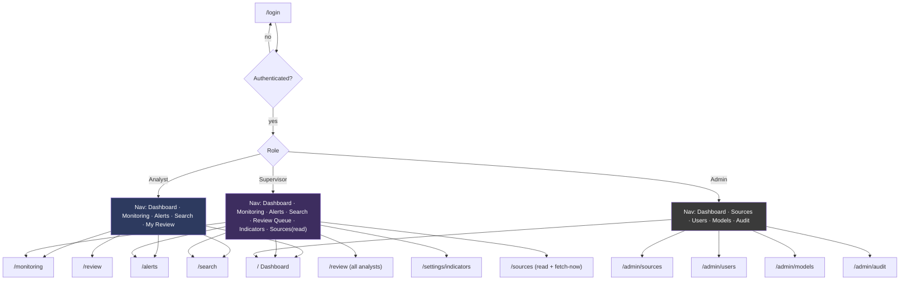
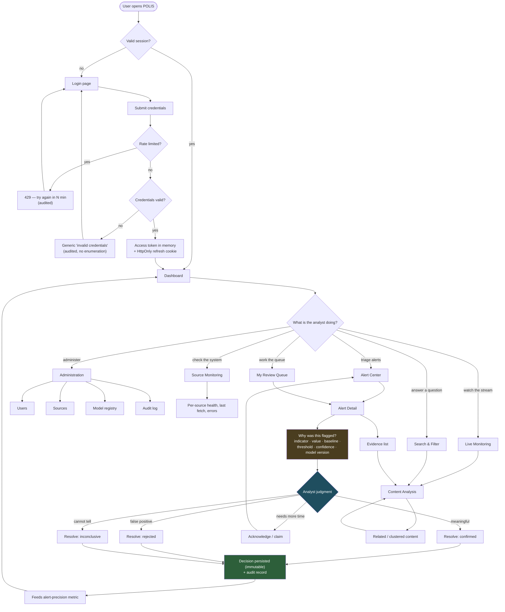
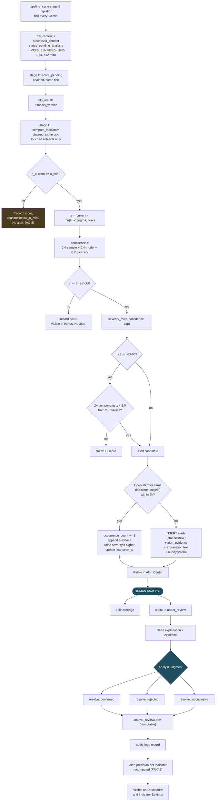
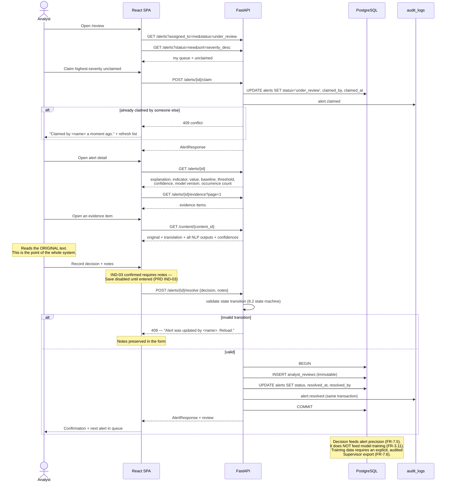
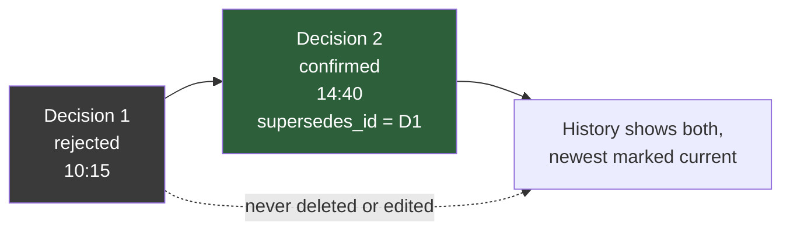
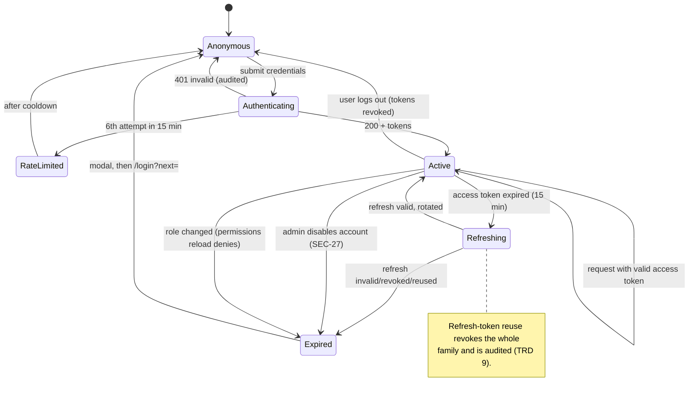
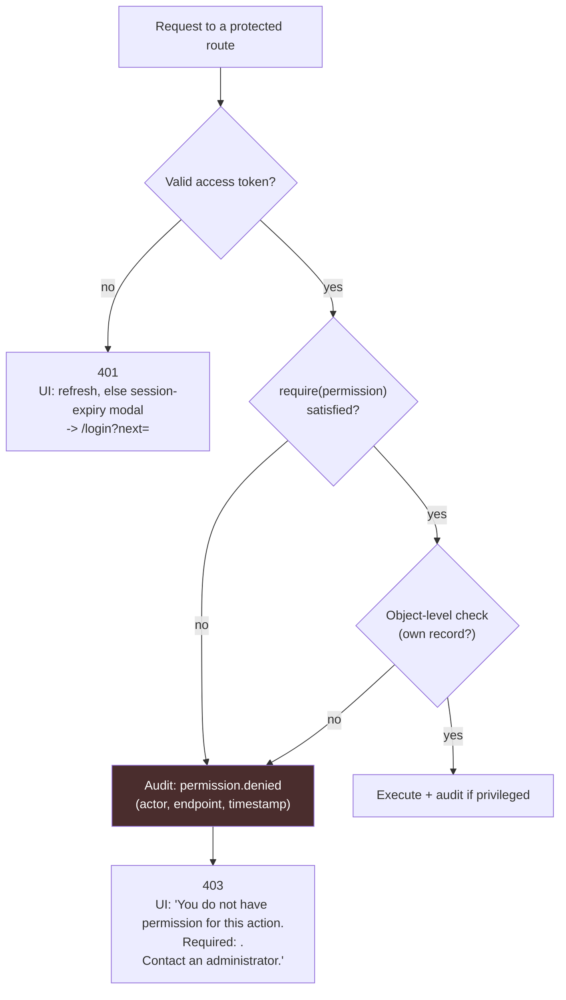
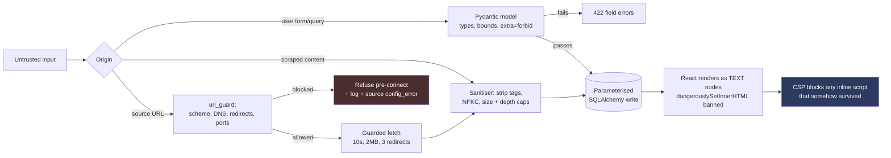
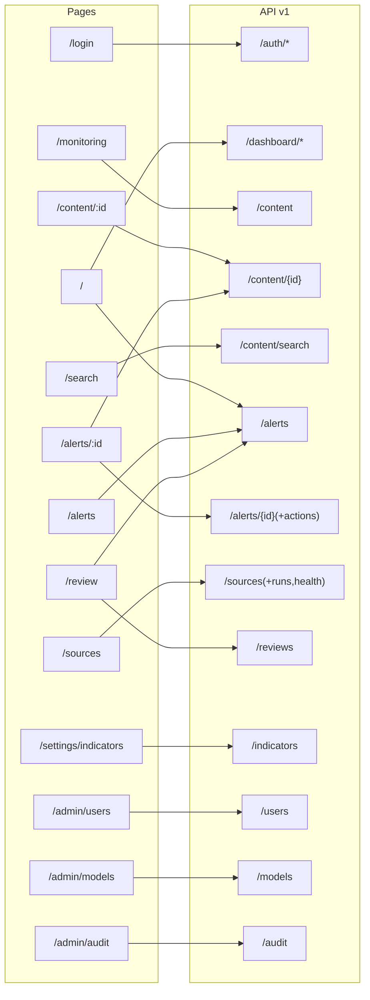

# POLIS — Application Flow / Web Flow Specification

**Political Open Source Language Intelligence System**

---

## 1. Document Control

| Field | Value |
|---|---|
| Document ID | POLIS-FLOW-003 |
| Version | 1.0 |
| Date | 11 August 2026 |
| Status | Draft for Review |
| Derives from | POLIS-PRD-001 v1.0, POLIS-TRD-002 v1.0 |
| Governs | POLIS-UX-004 (visual design implements these flows) |
| Owner | Team D (Frontend) with Team C (Backend) |

### 1.1 Scope

This document specifies **behaviour**: journeys, pages, states, permissions, API interactions, and error paths. It does **not** specify visual styling, colour, typography, or layout — those belong to POLIS-UX-004.

Every page below maps to a route in TRD §13.2 and consumes endpoints defined in TRD §12. A page consuming an endpoint that does not exist, or an endpoint no page consumes, is an inconsistency to be fixed in whichever document is wrong.

Decision labels **[CONFIRMED] / [PROPOSED] / [FUTURE] / [TBD]** carry the meaning defined in PRD §1.2.

---

## 2. User Roles and Permissions

Three roles ⟵ PRD §6, permissions per TRD §9.2.

| Role | Sees | Can change | Cannot |
|---|---|---|---|
| **Analyst** | Dashboard, Monitoring, Content, Alerts, Search, own Review queue | Alert status (acknowledge/claim/resolve), own reviews | Users, sources, thresholds, model activation, audit log |
| **Supervisor** | Everything an Analyst sees, plus all reviews, alert statistics, indicator settings, alert-scoped audit | Everything an Analyst can, plus indicator thresholds, `fetch-now`, review export | Users, source CRUD, model activation, full audit log |
| **Administrator** | Users, sources, model registry, full audit log, source health, dashboards | Users, sources, model activation | **Alert review actions and review decisions** — deliberate separation of duties ⟵ PRD FR-5.7 |

> **Why an Administrator cannot review alerts.** The person who controls thresholds, sources, and model activation should not also be the person recording analytical judgments about the output. Keeping these apart makes the audit trail meaningful. An individual who genuinely needs both is given two accounts. **[CONFIRMED]**

### 2.1 Role-Based Navigation

> **Navigation hiding is presentation only.** ⟵ PRD SEC-7, AC-14. Every action is authorised server-side. A user who types a forbidden URL directly gets a 403 page, not a blank screen — and the denial is audited.

---

## 3. Master Application Flow

**The path through `WHY → DECIDE → SAVE` is the product.** Every other flow exists to make that path fast and well-evidenced ⟵ PRD PRIV-5, PRIV-9.

---

## 4. Page Specifications

Each page is specified with the twelve fields required by the brief.

---

### 4.1 Login — `/login`

| Field | Specification |
|---|---|
| **Purpose** | Authenticate a user and establish a session ⟵ FR-8.1, US-A01 |
| **Entry points** | Direct URL; redirect from any protected route when unauthenticated; redirect after logout; redirect after session expiry (with `?next=`) |
| **User actions** | Enter email + password; submit; toggle password visibility |
| **API calls** | `POST /api/v1/auth/login` |
| **Database** | Reads `users`; writes `refresh_tokens`, `audit_logs` |
| **ML** | None |
| **Success state** | Access token held in memory, refresh cookie set, redirect to `?next=` if present and same-origin, else `/` |
| **Loading state** | Submit button disabled with inline progress; fields remain readable; no full-page spinner |
| **Empty state** | n/a |
| **Error state** | `401` → "Invalid email or password." — identical for unknown user and wrong password ⟵ SEC-3. `429` → "Too many attempts. Try again in N minutes." `500` → "Sign-in is unavailable. Request ID: `<id>`." |
| **Unauthorized state** | n/a (public) |
| **Navigation** | → Dashboard on success; stays on failure |

**Rules:**
- No "forgot password" in MVP — password reset is performed by an Administrator ⟵ scope. **[FUTURE]** self-service reset.
- The `next` parameter is validated as a same-origin relative path before redirect (open-redirect prevention).
- Failed attempts are audited with the account identifier hashed, never the plaintext email ⟵ SEC-20.
- The page footer states: *"POLIS is a university Final Year Project prototype. Not affiliated with the United Nations."* ⟵ PRD PRIV-12.

---

### 4.2 Dashboard — `/`

| Field | Specification |
|---|---|
| **Purpose** | Orient the user in under 30 seconds: what is active, what changed, is the system healthy ⟵ FR-6.1, US-A02 |
| **Entry points** | Post-login; logo/home in nav; breadcrumb root |
| **User actions** | Change time range (24 h / 7 d / 30 d); click an alert → Alert Detail; click a trend point → filtered Monitoring; click a source → Source Monitoring; dismiss nothing (dashboard is read-only) |
| **API calls** | `GET /dashboard/summary`, `GET /dashboard/trends?days=`, `GET /alerts?status=new&size=5` — issued in parallel, rendered independently |
| **Database** | Aggregates over `alerts`, `indicator_scores`, `processed_content`, `ingestion_runs`, `analyst_reviews` |
| **ML** | None directly; displays counts of model outputs |
| **Success state** | Six regions: (1) active alerts by severity, (2) indicator trend chart, (3) topic trend chart, (4) recent flagged content, (5) source activity + health, (6) review backlog and alert precision |
| **Loading state** | Each region loads independently with a skeleton matching its final shape. A slow trend query must not block the alert count. |
| **Empty state** | Per region, explaining cause and next step: "No active alerts in the last 24 hours." / "Baselines are still building — indicators need 7 days of history before they can fire." / "No sources configured yet. An administrator can add one." |
| **Error state** | Per region: inline message + retry button + request ID. One failing region never blanks the page. |
| **Unauthorized state** | Requires `content:read` — all three roles hold it. An unauthenticated user is redirected to login. |
| **Navigation** | → Alert Detail, Monitoring (pre-filtered), Source Monitoring |

**Rules:**
- Every metric is clickable and leads to the filtered list that produced it. A number an analyst cannot drill into is decoration ⟵ PRD NFR-11.1.
- Alert precision (⟵ FR-7.5) is shown on the dashboard, not hidden in a report ⟵ PRD PRIV-6.
- No predictive framing anywhere ⟵ PRD §10.6. Region titles are descriptive: "Indicator activity", not "Risk forecast".
- Auto-refresh every 60 seconds **[PROPOSED]**, pausable, with a visible "last updated" timestamp.

---

### 4.3 Live Monitoring — `/monitoring`

| Field | Specification |
|---|---|
| **Purpose** | Continuous view of newly ingested and classified content ⟵ FR-6.2, US-A03 |
| **Entry points** | Nav; dashboard "recent flagged content"; dashboard trend drill-down (carries filters in the URL) |
| **User actions** | Filter (date, language, source, topic, entity, sentiment, hostility, disinfo label, review status); toggle "canonical only"; sort; paginate; open an item; save a filter set **[FUTURE]** |
| **API calls** | `GET /content?...filters...&page&size` |
| **Database** | `processed_content` ⋈ `raw_content` ⋈ `sources` ⋈ `nlp_results` |
| **ML** | Displays stored classifications; never triggers inference |
| **Success state** | Paginated list. Each row: title/snippet, source + reliability band, language badge, published time, classification badges with confidence, cluster size ("+9 similar"), review status |
| **Loading state** | Skeleton rows preserving row height; filter controls stay interactive |
| **Empty state** | Distinguishes two causes: **no data ingested** ("No content ingested yet — check source health") vs **filters exclude everything** ("No content matches these filters" + a "clear filters" action). Conflating these wastes an analyst's time. |
| **Error state** | Inline banner + retry + request ID; filters preserved |
| **Unauthorized state** | Requires `content:read` |
| **Navigation** | → Content Analysis; → Source Monitoring via source name |

**Rules:**
- Default view shows **canonical items only** ⟵ FR-2.7, with cluster size as a badge. Showing every near-duplicate would flood the feed with wire copy.
- All filter state lives in the URL query string, so a filtered view is shareable and bookmarkable.
- An item still awaiting analysis is shown with an "analysis pending" badge, not hidden ⟵ TRD §5.10.
- Items whose language detection was uncertain carry a visible marker ⟵ FR-2.4.

---

### 4.4 Content Analysis — `/content/:id`

| Field | Specification |
|---|---|
| **Purpose** | Everything POLIS knows about one item, and how it knows it ⟵ FR-6.3, US-A04, US-A05, US-A11, US-A12 |
| **Entry points** | Monitoring row; Search result; Alert evidence list; Related-content link |
| **User actions** | Read original; read translation; open the source URL; expand per-class scores; click an entity → filtered search; click a topic → filtered monitoring; view related cluster members; view contributing indicators; record a content-level review **[PROPOSED]**; copy a permalink |
| **API calls** | `GET /content/{id}` (single round trip ⟵ TRD §12.4), `GET /content/{id}/related` (lazy, on tab open) |
| **Database** | `raw_content`, `processed_content`, `nlp_results`, `entities`, `content_entities`, `topics`, `content_topics`, `sources`, `model_versions`, `indicator_scores` |
| **ML** | Displays stored `score_text` output; a re-score is admin-only and asynchronous |
| **Success state** | Sections: (1) header — title, source + reliability, published/collected time, language, permalink; (2) original text; (3) machine translation, clearly labelled; (4) classifications with per-class scores, confidence, and model version; (5) entities; (6) topics; (7) contributing indicators; (8) related content; (9) analyst assessment |
| **Loading state** | Header and text skeleton first; classification panel loads with the same request; related-content tab is lazy |
| **Empty state** | Per section: "No entities detected." / "This item has not contributed to any indicator." / "No related content found." — never a blank panel |
| **Error state** | Whole-page error if `/content/{id}` fails; section-level error if a lazy tab fails |
| **Unauthorized state** | Requires `content:read`; a content-level review requires `review:create` — the action is disabled with an explanatory tooltip for Administrators |
| **Navigation** | → external source (new tab, `rel="noopener noreferrer nofollow"`, hostname displayed) → Alert Detail (if it is evidence) → filtered Search by entity → related items |

**Rules — explainability** ⟵ PRD NFR-6.1, NFR-6.2, PRIV-9:
- Every classification displays its **confidence** and the **model version** that produced it. The model version links to `/admin/models/{id}` where its evaluation metrics live ⟵ AC-24.
- Confidence below the configured floor (0.55) renders as "low confidence" with the label de-emphasised ⟵ FR-3.12.
- The translation panel is permanently labelled *"Machine translation, unverified. Analysis was performed on the original text."* ⟵ FR-2.9, and this is not dismissible.
- The disinformation label renders as *"Assessed as likely unreliable by model X"*, never *"This is false"* ⟵ PRD §10.6, FR-3.3.
- Ingested text renders as text nodes only ⟵ SEC-13, AC-20.

---

### 4.5 Alert Center — `/alerts`

| Field | Specification |
|---|---|
| **Purpose** | Triage queue — what needs an analyst's attention, ordered ⟵ FR-6.7, US-A09 |
| **Entry points** | Nav; dashboard alert region; direct link from a shared alert |
| **User actions** | Filter (status, severity, indicator, subject, date, assignee); sort (severity, age, occurrence count); bulk acknowledge **[PROPOSED]**; open an alert; claim |
| **API calls** | `GET /alerts?...`, `GET /alerts/stats` |
| **Database** | `alerts` ⋈ `indicator_definitions` ⋈ `users` (claimed_by) ⋈ counts from `alert_evidence` |
| **ML** | None directly |
| **Success state** | List. Each row: severity (icon + text + colour ⟵ UX doc), indicator name, subject, age, occurrence count, evidence count, status, assignee, confidence |
| **Loading state** | Skeleton rows; filters interactive |
| **Empty state** | Two distinct cases: **no alerts exist** ("No alerts have been generated. This may mean activity is within normal ranges, or that indicators are still building their baselines.") vs **filters exclude all** ("No alerts match these filters" + clear) |
| **Error state** | Inline + retry + request ID |
| **Unauthorized state** | Requires `alert:read`; review actions require `alert:review` and are hidden and server-denied for Administrators |
| **Navigation** | → Alert Detail |

**Rules:**
- Default sort: severity descending, then age descending. Oldest unresolved high-severity alert surfaces first.
- Default filter: `status != resolved`. Resolved alerts are reachable but not in the way.
- Occurrence count is prominent ⟵ FR-5.2 — an alert that has recurred 14 times is a different situation from one that fired once.
- Severity is **never conveyed by colour alone** ⟵ PRD NFR-10.1: icon + text label + colour.

---

### 4.6 Alert Detail — `/alerts/:id`

| Field | Specification |
|---|---|
| **Purpose** | Present the alert, its full justification, its evidence, and capture the human decision ⟵ FR-5.5, US-A05, US-A06, US-A07 |
| **Entry points** | Alert Center row; dashboard; review queue; shared permalink |
| **User actions** | Read explanation; expand the computation; page through evidence; open an evidence item; acknowledge; claim; release; resolve (confirmed / rejected / inconclusive) with notes; read decision history |
| **API calls** | `GET /alerts/{id}`, `GET /alerts/{id}/evidence?page`, then one of `POST /alerts/{id}/acknowledge` \| `/claim` \| `/release` \| `/resolve` |
| **Database** | `alerts`, `alert_evidence`, `indicator_scores`, `indicator_definitions`, `analyst_reviews`, `users`, `audit_logs` (write) |
| **ML** | Displays the model version behind the contributing classifications |
| **Success state** | Sections: (1) header — severity, indicator, subject, status, age, occurrences; (2) **why this was flagged**; (3) the computation; (4) evidence; (5) decision panel; (6) decision history |
| **Loading state** | Header and explanation first; evidence list paginated and lazy |
| **Empty state** | Evidence is never empty ⟵ AC-9 — an alert with zero evidence is a defect and is displayed as an explicit error, not a blank list |
| **Error state** | Whole-page on primary failure; inline on an action failure with the decision panel state preserved so notes are not lost |
| **Unauthorized state** | Read requires `alert:read`. Actions require `alert:review`; for an Administrator the panel is replaced by "Alert review is restricted to Analysts and Supervisors." ⟵ FR-5.7 |
| **Navigation** | → Content Analysis for each evidence item; → indicator definition; → model version |

**The "why this was flagged" section — mandatory content** ⟵ PRD FR-5.5, NFR-6.1:

| Element | Example rendering |
|---|---|
| Indicator | Hostile Rhetoric Surge (IND-01) |
| Plain-language statement | The generated explanation from TRD §8.1, including its non-prediction sentence |
| Observed value | 0.289 (11 of 38 items) |
| Baseline | 0.120 (μ over 14 days, σ = 0.050) |
| z-score | 3.4 standard deviations above baseline |
| Threshold | 2.0 (configured; last changed by *Supervisor* on *date*) |
| Sample | 38 items from 6 sources |
| Measurement confidence | 0.78 — *confidence in the measurement, not in any prediction* |
| Model version | `polis-xlmr-v0.3.1` → links to metrics |
| Formula | Expandable, showing the actual expression used ⟵ NFR-6.3 |

**Resolution rules:**
- `confirmed` on an **IND-03** alert requires notes ⟵ PRD IND-03 ("cannot be resolved confirmed without notes"). The Save button stays disabled until notes are entered, with the reason stated.
- Resolution creates an immutable `analyst_reviews` row ⟵ FR-7.3; a correction is a new row with `supersedes_id`, and both remain visible.
- Every action writes an audit record in the same transaction ⟵ TRD §14.8.
- A 409 (someone else changed the status first) shows: "This alert was updated by *name* while you were reviewing. Reload to see the current state." — the notes are preserved.

---

### 4.7 Source Monitoring — `/sources`

| Field | Specification |
|---|---|
| **Purpose** | Is the system actually reading what it claims to read ⟵ FR-6.8, US-D03, US-A13 |
| **Entry points** | Nav (Supervisor/Admin); dashboard source region; source name anywhere |
| **User actions** | Filter (type, health, region, language); open source detail; view recent runs; trigger `fetch-now` (Supervisor/Admin) |
| **API calls** | `GET /sources`, `GET /sources/health`, `GET /sources/{id}`, `GET /sources/{id}/runs`, `POST /sources/{id}/fetch-now` |
| **Database** | `sources`, `ingestion_runs` |
| **ML** | None |
| **Success state** | Table: name, type, language, region, health badge, last successful fetch, items (24 h), consecutive failures, reliability band |
| **Loading state** | Skeleton table |
| **Empty state** | "No sources configured." + (Admin) "Add a source" / (others) "Ask an administrator to configure sources." |
| **Error state** | Inline + retry |
| **Unauthorized state** | Requires `source:read` (all roles). `fetch-now` requires `source:fetch_now` — disabled with a tooltip for Analysts |
| **Navigation** | → Source detail with run history → filtered Monitoring for that source |

**Rules:**
- Health has four states ⟵ FR-1.11: `healthy` (last run succeeded), `degraded` (1–2 consecutive failures), `unhealthy` (≥3), `config_error` (blocked URL / bad credentials — needs a human, not a retry).
- Reliability band ⟵ FR-4.10 renders as three qualitative bands with the reasoning visible on hover, never a numeric score ⟵ PRD PRIV-10.
- `fetch-now` is rate limited to 5/hour per user ⟵ SEC-16 and returns `202` with a run ID; the UI polls that run rather than blocking.

---

### 4.8 Search & Filter — `/search`

| Field | Specification |
|---|---|
| **Purpose** | Answer a specific question against the corpus ⟵ FR-6.4, FR-6.5, US-A08 |
| **Entry points** | Nav; global search box in the header; entity chip on Content Analysis; topic chip |
| **User actions** | Enter a query; apply/remove filters; sort by relevance or date; paginate; open a result; copy a shareable URL |
| **API calls** | `GET /content/search?q=...&filters&page&size` |
| **Database** | PostgreSQL full-text (GIN index) over original and translated text, plus filter joins |
| **ML** | None (lexical search; semantic search is **[FUTURE]**) |
| **Success state** | Result count, results with highlighted matches, active filters shown as removable chips |
| **Loading state** | Skeleton results; the query box stays focused and editable |
| **Empty state** | "No results for *query*." plus concrete next steps: broaden the date range, remove a filter, check spelling, and a note that search covers original and translated text but not images |
| **Error state** | Inline + retry. A `429` shows "Search is rate limited. Try again in N seconds." ⟵ SEC-16 |
| **Unauthorized state** | Requires `content:search` |
| **Navigation** | → Content Analysis |

**Rules:**
- The query is bound as a parameter into `plainto_tsquery` ⟵ SEC-11; operator syntax from user input is never interpreted.
- Minimum query length 2 characters; maximum 200 ⟵ SEC-10.
- All state in the URL — a search is shareable.
- Result snippets are highlighted server-side and rendered as **text with marked ranges**, never as HTML ⟵ SEC-13.

---

### 4.9 Analyst Review Queue — `/review`

| Field | Specification |
|---|---|
| **Purpose** | A focused work queue for reviewing, distinct from browsing ⟵ FR-7.1, US-S01, US-S04 |
| **Entry points** | Nav; dashboard "review backlog"; notification badge |
| **User actions** | View my claimed alerts; view unclaimed by severity; claim next; open; resolve; (Supervisor) view all analysts' decisions, filter by reviewer/decision/date, export |
| **API calls** | `GET /alerts?assigned_to=me&status=under_review`, `GET /alerts?status=new&sort=severity_desc`, `GET /reviews?...` (Supervisor), `POST /reviews/export` (Supervisor) |
| **Database** | `alerts`, `analyst_reviews`, `users` |
| **ML** | None |
| **Success state** | Two panes: "My queue" (claimed) and "Unclaimed" (by severity). Supervisor sees a third: "Team decisions" with per-analyst counts and per-indicator precision |
| **Loading state** | Per-pane skeleton |
| **Empty state** | "Your queue is empty. Claim an alert from the unclaimed list." / "No unclaimed alerts." / (Supervisor) "No decisions recorded in this period." |
| **Error state** | Per-pane inline + retry |
| **Unauthorized state** | Requires `alert:review`. Team pane requires `review:read_all`. Administrator is redirected to `/` with an explanation ⟵ FR-5.7 |
| **Navigation** | → Alert Detail |

**Rules:**
- Claiming is exclusive: a claimed alert disappears from other analysts' unclaimed pane. A claim older than **[PROPOSED]** 4 hours auto-releases so work is not lost to an abandoned session — the auto-release is audited.
- Export ⟵ FR-7.6 requires `review:export`, is audited, and produces a versioned artefact. The dialog states plainly: *"This export may be used to build an evaluation dataset. It will not automatically retrain any model."* ⟵ FR-3.11.

---

### 4.10 Indicator Settings — `/settings/indicators`

| Field | Specification |
|---|---|
| **Purpose** | Make thresholds visible and tunable, and make the formulas legible ⟵ FR-4.7, NFR-6.3, US-S03 |
| **Entry points** | Nav (Supervisor/Admin); "threshold" link on Alert Detail |
| **User actions** | View all six indicators with definition, formula, threshold, `n_min`, max severity, enabled state; edit threshold/`n_min`/enabled (Supervisor/Admin); view recent scores per indicator |
| **API calls** | `GET /indicators`, `GET /indicators/{code}/scores`, `PATCH /indicators/{code}` |
| **Database** | `indicator_definitions`, `indicator_scores`, `audit_logs` (write) |
| **ML** | None |
| **Success state** | One card per indicator: name, purpose, plain-language definition, formula, current threshold, `n_min`, severity cap, false-positive-risk note, 30-day fire count and precision |
| **Loading state** | Card skeletons |
| **Empty state** | Never empty — six definitions are seeded at migration time |
| **Error state** | Inline per card |
| **Unauthorized state** | Read requires `indicator:read` (all roles); edit requires `indicator:update_threshold` — Analysts see read-only fields with an explanatory note |
| **Navigation** | → filtered Alert Center for that indicator |

**Rules:**
- Editing shows a confirmation dialog stating the effect: *"Lowering the threshold from 2.5 to 2.0 will cause this indicator to fire more often. Based on the last 30 days, this would have produced approximately N more alerts."* — computed from stored `indicator_scores`, which is exactly why every computation is persisted, including those that did not fire ⟵ FR-4.3.
- The change is audited with old and new values ⟵ FR-4.8, AC-15.
- Changes apply from the next scheduled computation; historical scores are never recomputed ⟵ TRD §12.6.
- The false-positive-risk text from PRD §10 is displayed **in the product**, not only in the report ⟵ PRD PRIV-6.

---

### 4.11 Administration — `/admin/*`

Four sub-pages, all requiring Administrator-level permissions.

#### 4.11.1 Users — `/admin/users`

| Field | Specification |
|---|---|
| **Purpose** | Manage accounts and roles ⟵ FR-8.4, US-D01 |
| **User actions** | List/filter; create (name, email, role, initial password); change role; disable; reset password |
| **API calls** | `GET /users`, `POST /users`, `PATCH /users/{id}`, `POST /users/{id}/disable` |
| **Database** | `users`, `roles`, `refresh_tokens` (revoke), `audit_logs` |
| **Success state** | Table: name, email, role, status, last login, created |
| **Empty state** | Never — at least the seeded admin exists |
| **Error state** | `409` on duplicate email → inline field error |
| **Unauthorized** | `user:read` / `user:create` / `user:update` / `user:disable` |

Rules: disabling requires typed confirmation of the user's name (destructive-action pattern ⟵ UX doc §13) and immediately revokes all refresh tokens ⟵ SEC-27. A user is never deleted — their reviews and audit records must survive ⟵ FR-8.4. Passwords are never displayed after creation and never appear in any response.

#### 4.11.2 Sources — `/admin/sources`

| Field | Specification |
|---|---|
| **Purpose** | Configure what POLIS reads ⟵ FR-1.x, US-D02 |
| **User actions** | Create (name, type, URL, language, region, poll interval, type-specific config); edit; disable; fetch-now; view run history |
| **API calls** | `POST /sources`, `PATCH /sources/{id}`, `POST /sources/{id}/disable`, `POST /sources/{id}/fetch-now`, `GET /sources/{id}/runs` |
| **Database** | `sources`, `ingestion_runs`, `audit_logs` |
| **Error state** | `422` with a specific message when the URL fails the SSRF guard: "This URL resolves to a private or internal address and cannot be used as a source." ⟵ SEC-12 |
| **Unauthorized** | `source:create` / `source:update` / `source:disable` |

Rules: the URL is validated by `assert_url_allowed` at creation, before it is ever fetched ⟵ TRD §12.3. Credentials (Telegram, Reddit) are **never** entered here — they live in environment configuration ⟵ SEC-17; the form references the required env var name and shows whether it is set, never its value.

#### 4.11.3 Model Registry — `/admin/models`

| Field | Specification |
|---|---|
| **Purpose** | Know which model is running and how good it is ⟵ FR-3.8, US-D04 |
| **User actions** | List versions; view metrics (pooled and **per language** ⟵ NFR-12.2); activate a version |
| **API calls** | `GET /models`, `GET /models/{id}`, `POST /models/{id}/activate` |
| **Database** | `model_versions`, `audit_logs` |
| **Success state** | Table of versions; detail shows accuracy, precision, recall, macro-F1, per-class and per-language breakdowns, confusion matrix, dataset reference, training date |
| **Unauthorized** | `model:read` (all roles — an analyst must be able to reach the metrics behind a label ⟵ AC-24); `model:activate` (Admin only) |

Rules: activation is audited and atomic — exactly one active version, enforced by a partial unique index ⟵ TRD §7.4. The confirmation dialog states: *"New content will be scored with this version. Existing results are retained and remain attributed to the version that produced them."*

#### 4.11.4 Audit Log — `/admin/audit`

| Field | Specification |
|---|---|
| **Purpose** | Answer "who did what, when, and what happened" ⟵ FR-8.5, FR-8.7, US-D05 |
| **User actions** | Filter by actor, action, resource type, result, date; paginate; expand a record |
| **API calls** | `GET /audit` (Admin), `GET /audit/alerts` (Supervisor, alert/review scope only) |
| **Database** | `audit_logs` (read only) |
| **Success state** | Table: timestamp, actor, action, resource, result, request ID; expandable detail with old/new values where applicable |
| **Empty state** | "No audit records match these filters." |
| **Unauthorized** | `audit:read_all` (Admin) or `audit:read_alerts` (Supervisor). Analysts have no access ⟵ FR-8.7 |

Rules: read-only in the UI, and append-only in the database by role permission ⟵ AC-19. There is no delete or edit affordance anywhere, because there is no such capability.

---

## 5. Alert Flow — End to End

**The pipeline terminates at "visible in Alert Center."** No notification, no escalation, no action ⟵ PRD FR-5.10, PRIV-5. Everything downstream of that node is a human doing something.

---

## 6. Analyst Review Flow

### 6.1 Decision Semantics **[CONFIRMED]**

| Decision | Meaning | Not | Effect |
|---|---|---|---|
| `confirmed` | The signal is real and worth attention | Not "a crisis will occur" | Counts toward alert precision numerator |
| `rejected` | False positive — the measurement does not reflect anything meaningful | Not "the content is false" | Counts toward the denominator; drives threshold tuning |
| `inconclusive` | Cannot be assessed from available evidence | Not a deferral | Excluded from precision; tracked separately as an evidence-quality signal |

Precision ⟵ FR-7.5 is `confirmed / (confirmed + rejected)`. `inconclusive` is deliberately excluded — including it would let an analyst improve the apparent precision by declining to judge.

### 6.2 Correcting a Decision ⟵ FR-7.3, AC-13

The correction requires notes explaining the change. Both records persist. Precision uses only the current decision per alert.

---

## 7. Security Flows

### 7.1 Session Lifecycle

### 7.2 Unauthorized Access

The 403 page names the missing permission. Hiding it does not improve security — the check already happened server-side — and it costs the user a support conversation.

### 7.3 Error Handling by Class

| Class | User sees | Logged | Recovery |
|---|---|---|---|
| `400` malformed | "That request could not be processed." | Yes, with request ID | Correct input |
| `401` unauthenticated | Silent refresh attempt → modal if it fails | Yes | Re-login, `?next=` preserved |
| `403` unauthorised | Named permission + who to contact | **Audited** ⟵ FR-8.5 | Request access |
| `404` not found | "This item no longer exists or you cannot access it." | Yes | Back to list |
| `409` conflict | "Updated by *name* while you were working. Reload." | Yes | Reload; form state preserved |
| `422` validation | Field-level messages | No (expected) | Correct the field |
| `429` rate limited | "Too many requests. Try again in N seconds." | **Audited** | Wait |
| `500` server | "Something went wrong. Request ID: `<id>`." | Yes, full detail server-side ⟵ SEC-19 | Retry; quote the ID |
| Network failure | "Cannot reach POLIS. Check your connection." + retry | Client-side | Retry |

Never shown to a user: stack traces, SQL, file paths, dependency versions, internal hostnames ⟵ SEC-19.

### 7.4 Malicious Input Flow

---

## 8. API ↔ Page Mapping

### 8.1 Coverage Check

Every endpoint in TRD §12 has at least one consumer, and every page has its endpoints.

| Endpoint group | Consumed by | Orphan? |
|---|---|---|
| `/auth/*` | Login, api client interceptor, header logout | No |
| `/dashboard/*` | Dashboard | No |
| `/content`, `/content/{id}`, `/content/{id}/related` | Monitoring, Content Analysis, Alert evidence | No |
| `/content/search` | Search, header global search | No |
| `/analysis/{id}`, `/analysis/stats` | Content Analysis (embedded), Dashboard | No |
| `/indicators*` | Indicator Settings, Dashboard trends, Alert Detail | No |
| `/alerts*` | Alert Center, Alert Detail, Dashboard, Review Queue | No |
| `/reviews*` | Review Queue, Alert Detail history, Supervisor export | No |
| `/sources*` | Source Monitoring, Admin Sources, Dashboard | No |
| `/users*` | Admin Users | No |
| `/models*` | Admin Models, model-version links throughout | No |
| `/audit*` | Admin Audit, Supervisor alert audit | No |
| `/health`, `/health/detail` | Uptime pinger; Admin dashboard health region | No |

| Page | Endpoints exist? |
|---|---|
| All 13 pages above | Yes — verified against TRD §12 |

---

## 9. Navigation Rules

| Rule | Specification |
|---|---|
| Deep links | Every list, filter, search, alert, and content item is addressable by URL. Filter state lives in the query string. |
| Back button | Works everywhere; filters and pagination restore from the URL. |
| Breadcrumbs | Present on detail pages: `Alerts / IND-01 · North · border_security`. |
| Unauthorised deep link | 403 page naming the required permission — never a silent redirect that looks like a bug. |
| Missing resource | 404 page with a route back to the parent list. |
| Session expiry mid-action | Modal, then login with `?next=` set to the current path; unsaved form content is preserved in memory and restored after re-authentication **[PROPOSED]**. |
| External links | New tab, `rel="noopener noreferrer nofollow"`, hostname shown adjacent ⟵ TRD §13.5. |
| Logout | Available in the header from every page; revokes the refresh token server-side; clears in-memory state. |

---

## 10. MVP vs Future Flows

### 10.1 MVP Flows **[CONFIRMED]**

| # | Flow |
|---|---|
| 1 | Login → Dashboard |
| 2 | Dashboard → Alert Center → Alert Detail → evidence → resolve |
| 3 | Dashboard → Monitoring → Content Analysis |
| 4 | Search → Content Analysis |
| 5 | Review Queue → claim → Alert Detail → resolve |
| 6 | Source Monitoring → source detail → run history |
| 7 | Indicator Settings → view/edit threshold (Supervisor) |
| 8 | Admin: user CRUD, source CRUD, model activation, audit log |
| 9 | Session: expiry → refresh → re-login |
| 10 | Error: 403 / 404 / 409 / 429 / 500 handling |
| 11 | Supervisor: review export |

### 10.2 Future Flows **[FUTURE]**

| # | Flow | PRD ref |
|---|---|---|
| 1 | Alert → email/webhook delivery | FUT-1 |
| 2 | Alert → PDF report export with evidence appendix | FUT-2 |
| 3 | Dashboard → geographic map → region drill-down | FUT-3 |
| 4 | Field digest view (low bandwidth, mobile) | FUT-4 |
| 5 | Saved searches and personal watchlists | — |
| 6 | Analyst-defined custom indicators | FUT-12 |
| 7 | Self-service password reset | §4.1 |
| 8 | MFA enrolment and challenge | FUT-8 |
| 9 | Supervisor reassign / reopen a resolved alert | US-S05 |
| 10 | Semantic (embedding) search | §4.8 |

---

## 11. Flow Acceptance Criteria

| ID | Criterion | Traces to |
|---|---|---|
| FAC-1 | Every page implements all six states from TRD §13.4 (loading, success, empty, error, unauthorized, session-expired) | TRD §13.4 |
| FAC-2 | Every filter, search, and pagination state is reflected in the URL and survives a reload | §9 |
| FAC-3 | An analyst reaches an alert's original source text in ≤ 3 clicks from the dashboard | PRD NFR-11.1, AC-11 |
| FAC-4 | A forbidden deep link returns a 403 page naming the permission, and the denial appears in the audit log | PRD AC-14, FR-8.5 |
| FAC-5 | Session expiry mid-form preserves entered content and returns the user to the same page after re-authentication | PRD AC-17 |
| FAC-6 | Every alert detail page displays indicator, observed value, baseline, threshold, confidence, sample size, and model version | PRD AC-11, NFR-6.1 |
| FAC-7 | No page displays a model output without its confidence and model version | PRD FR-6.9 |
| FAC-8 | No page uses predictive language about political events | PRD §10.6, FR-4.9 |
| FAC-9 | Administrator cannot reach any alert-review action through the UI or the API | PRD FR-5.7 |
| FAC-10 | Every empty state distinguishes "no data exists" from "filters exclude everything" | §4.3, §4.5, §4.8 |
| FAC-11 | A 409 conflict preserves the user's unsaved input | §4.6 |
| FAC-12 | Every destructive action requires explicit confirmation naming the target | §4.11.1 |
| FAC-13 | The machine-translation disclaimer is present and non-dismissible on every translated text | PRD FR-2.9, AC-23 |
| FAC-14 | Alert evidence is never empty; a zero-evidence alert renders as an explicit error | PRD AC-9 |

---

*End of Document 3 — App Flow. Next: UI/UX Design Specification (POLIS-UX-004), which gives these flows their visual form.*
