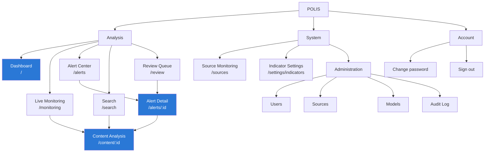
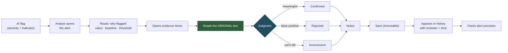

# POLIS — UI/UX Design Specification

**Political Open Source Language Intelligence System**

---

## 1. Document Control

| Field | Value |
|---|---|
| Document ID | POLIS-UX-004 |
| Version | 1.0 |
| Date | 11 August 2026 |
| Status | Draft for Review |
| Derives from | POLIS-PRD-001 v1.0, POLIS-TRD-002 v1.0, POLIS-FLOW-003 v1.0 |
| Owner | Team D (Frontend) |
| Implementable with | React 18 + Vite 5 + TailwindCSS 3 + Recharts 2 ⟵ TRD §13.1 |

### 1.1 Scope

This document specifies the **visual and interaction layer** for the flows defined in POLIS-FLOW-003. Every screen here corresponds to a page in that document; every data element shown corresponds to a field returned by an endpoint in TRD §12. Nothing is designed that the API cannot supply.

---

## 2. Design Principles

POLIS is a serious analytical decision-support tool used by people who are accountable for their judgments. The interface must earn trust by being legible and honest, not by looking impressive.

| # | Principle | In practice | Violation looks like |
|---|---|---|---|
| 1 | **Evidence over assertion** | Every score is one click from the text that produced it | A number with no way to drill into it |
| 2 | **Honest uncertainty** | Confidence and model version shown beside every model output | "Disinformation detected" as a bare statement |
| 3 | **The human decides** | The decision panel is the visual climax of the alert page | An interface that implies the system already concluded |
| 4 | **Low cognitive load** | One primary action per screen; ≤ 6 dashboard regions; progressive disclosure | Twelve widgets competing for attention |
| 5 | **Calm, not alarming** | Restrained colour, no motion for its own sake, red reserved for genuinely high severity | Pulsing red banners, sirens, "THREAT" language |
| 6 | **Speed of comprehension** | Severity readable at a glance by icon + text + colour together | Colour-only encoding |
| 7 | **Consistency** | One component per job, used everywhere | Three different badge styles for the same concept |
| 8 | **Accessible by construction** | WCAG 2.2 AA is the build target, not an audit fix | Keyboard traps, invisible focus, colour-only status |
| 9 | **No theatre** | No maps without data behind them, no radar sweeps, no fake terminals | Decorative "intelligence" aesthetics |

### 2.1 Explicitly Prohibited **[CONFIRMED]** ⟵ PRD §10.6, PRIV-11, PRIV-12

| Prohibited | Why |
|---|---|
| Excessive red as an ambient colour | Desensitises; POLIS is a monitoring tool, not an emergency system |
| Radar sweeps, scanning animations, targeting reticles | Implies capabilities POLIS does not have and a purpose it must not have |
| Military iconography, camouflage, crosshairs, chevrons | POLIS supports civilian political analysis |
| Decorative world maps with no data bound to them | Implies global coverage that does not exist |
| Pulsing, flashing, or auto-playing motion | Accessibility hazard; manufactures urgency the data does not support |
| "AI predicts…", "threat level", "imminent", "forecast" | Prohibited by PRD §10.6 — POLIS does not predict |
| Confidence rendered as a certainty ("94% accurate") | Misrepresents what the number means |
| Dark "command centre" theming as the default | Signals theatre over analysis. Dark mode exists as a user preference, designed properly. |

> **Copy review is a release gate.** Before the demo, every string in the UI is checked against the prohibited-language list. A grep for `predict|forecast|will happen|threat level|imminent|guarantee` across `frontend/src` must return only false positives, and that check runs in CI.

---

## 3. Information Architecture



**Depth is capped at three levels.** Any item an analyst needs during triage is reachable in ≤ 3 clicks from the dashboard ⟵ PRD NFR-11.1, FAC-3.

### 3.1 Global Layout

```
┌────────────────────────────────────────────────────────────────────────────┐
│ POLIS   Dashboard  Monitoring  Alerts  Search  Review │ 🔍 search…  │ AR ▾ │  56px
├────────┬───────────────────────────────────────────────────────────────────┤
│        │                                                                   │
│  Side  │                      Page content                                 │
│  nav   │                      (max-width 1440px, centred)                  │
│ 240px  │                                                                   │
│        │                                                                   │
├────────┴───────────────────────────────────────────────────────────────────┤
│ POLIS — university FYP prototype. Not affiliated with the United Nations.   │  32px
└────────────────────────────────────────────────────────────────────────────┘
```

The footer disclaimer ⟵ PRD PRIV-12 is persistent and not dismissible.

---

## 4. Design System

### 4.1 Typography

One family — the system UI sans. No display face, no serif, anywhere ⟵ dataviz `palette.md`.

```css
--font-sans: system-ui, -apple-system, "Segoe UI", Roboto, sans-serif;
--font-mono: ui-monospace, "Cascadia Code", "Source Code Pro", monospace;
```

| Token | Size / line-height | Weight | Use |
|---|---|---|---|
| `text-display` | 40 / 44 px | 600 | Hero figure on the dashboard only |
| `text-h1` | 28 / 36 px | 600 | Page title |
| `text-h2` | 20 / 28 px | 600 | Section heading, card title |
| `text-h3` | 16 / 24 px | 600 | Sub-section, group label |
| `text-body` | 14 / 22 px | 400 | Default UI text |
| `text-body-strong` | 14 / 22 px | 600 | Emphasis within body |
| `text-content` | 16 / 26 px | 400 | **Ingested article text** — larger and looser than UI text, because this is read continuously |
| `text-small` | 13 / 20 px | 400 | Metadata, timestamps, captions |
| `text-micro` | 11 / 16 px | 600, +0.04em | Badge and chip labels, uppercase |
| `text-mono` | 13 / 20 px | 400 | IDs, request IDs, model versions, formulas |

**Rules**
- Maximum 4 sizes visible on any one screen.
- Article text uses `text-content` at a measure of 68–78 characters — the analyst reads this for minutes, not seconds.
- `font-variant-numeric: tabular-nums` on table columns and axis ticks **only**. Hero and stat-tile figures use proportional figures ⟵ dataviz anti-patterns.
- Never centre body text. Never justify.

### 4.2 Colour System

Colour is defined as tokens on `:root`, redefined for dark mode under both a media query and a `data-theme` scope. Light is the default: POLIS is used in offices, in daylight, alongside documents.

```css
:root {
  color-scheme: light;
  /* Surfaces */
  --surface-page:    #f9f9f7;
  --surface-card:    #fcfcfb;
  --surface-sunken:  #f0efec;
  --surface-hover:   #f2f1ee;
  /* Ink */
  --text-primary:    #0b0b0b;
  --text-secondary:  #52514e;
  --text-muted:      #898781;
  --text-inverse:    #ffffff;
  /* Lines */
  --border:          #e1e0d9;
  --border-strong:   #c3c2b7;
  --focus-ring:      #2a78d6;
  /* Interactive */
  --accent:          #2a78d6;
  --accent-hover:    #256abf;
  --accent-subtle:   #cde2fb;
  /* Chart chrome */
  --chart-surface:   #fcfcfb;
  --chart-grid:      #e1e0d9;
  --chart-axis:      #c3c2b7;
  --chart-label:     #898781;
}

@media (prefers-color-scheme: dark) {
  :root:where(:not([data-theme="light"])) {
    color-scheme: dark;
    --surface-page: #0d0d0d;  --surface-card: #1a1a19;
    --surface-sunken: #141413; --surface-hover: #232322;
    --text-primary: #ffffff;  --text-secondary: #c3c2b7; --text-muted: #898781;
    --border: #2c2c2a;        --border-strong: #383835;
    --accent: #3987e5;        --accent-hover: #5598e7; --accent-subtle: #184f95;
    --chart-surface: #1a1a19; --chart-grid: #2c2c2a;   --chart-axis: #383835;
  }
}
:root[data-theme="dark"] { /* same dark block — toggle must win over OS setting */ }
```

Dark mode is **selected**, not an inverted light mode: each colour is re-stepped for the dark surface and re-validated against it ⟵ dataviz method.

### 4.3 Severity System **[CONFIRMED]**

Six levels ⟵ PRD §10.2. Severity is **status**, not series identity — these tokens are reserved and never used for a chart series ⟵ dataviz non-negotiables.

| Level | Icon | Text label | Light | Dark | Contrast (light / dark) | Alert? |
|---|---|---|---|---|---|---|
| Normal | `○` circle outline | NORMAL | `#898781` | `#898781` | 3.34 / 3.36 | No |
| Informational | `ⓘ` info | INFO | `#2a78d6` | `#3987e5` | 4.18 / 4.53 | No |
| Low | `△` triangle outline | LOW | `#fab219` | `#fab219` | 1.79 / 9.49 | Yes |
| Medium | `◆` diamond | MEDIUM | `#ec835a` | `#ec835a` | 2.57 / 6.60 | Yes |
| High | `▲` triangle filled | HIGH | `#d03b3b` | `#d03b3b` | 4.68 / 3.62 | Yes |
| Critical | `▲` triangle filled, **inverted badge** | CRITICAL | fill `#d03b3b`, text `#ffffff` | fill `#d03b3b`, text `#ffffff` | 4.68 as fill | Yes |

**Never colour alone** ⟵ PRD NFR-10.1, AC-22. Every severity badge carries **icon + uppercase text + colour**, always all three:

```
  ○ NORMAL      ⓘ INFO      △ LOW      ◆ MEDIUM      ▲ HIGH      ▉▲ CRITICAL
```

- **High and Critical share a hue** and are separated by fill weight plus the icon and label. This is deliberate: introducing a seventh, darker red would push the top of the scale into pure alarm, and the label already carries the distinction unambiguously.
- **Low and Medium sit below 3:1 on the light surface by design** — the icon + label pairing is the required mitigation ⟵ dataviz status-palette rule. They are never used as the sole carrier of meaning, and never as a large fill.
- Severity is expressed as a **badge**, never as a whole-row background wash. A row of red rows is unreadable and alarmist.

### 4.4 Confidence Display **[CONFIRMED]** ⟵ PRD FR-6.9, NFR-6.2

Confidence is **not** severity and must never be styled like it.

| Band | Rendering | Label |
|---|---|---|
| ≥ 0.80 | Filled 4-segment meter, `--text-secondary` | `0.88 · high confidence` |
| 0.55–0.79 | 2–3 segments filled | `0.67 · moderate confidence` |
| < 0.55 | 1 segment, label de-emphasised, classification shown in `--text-muted` | `0.41 · low confidence` ⟵ FR-3.12 |

Tooltip on every confidence meter: *"Confidence that the model assigned this label. It is not a probability that the underlying claim is true, and not a prediction about future events."* ⟵ PRD §10.6.

### 4.5 Spacing, Radius, Elevation

4px base scale: `1=4 2=8 3=12 4=16 5=20 6=24 8=32 10=40 12=48 16=64`.

| Token | Value | Use |
|---|---|---|
| `radius-sm` | 4px | Badges, chips, inputs |
| `radius-md` | 6px | Buttons, cards |
| `radius-lg` | 8px | Modals, panels |
| `shadow-sm` | `0 1px 2px rgba(11,11,11,.06)` | Resting card |
| `shadow-md` | `0 2px 8px rgba(11,11,11,.08)` | Dropdown, popover |
| `shadow-lg` | `0 8px 24px rgba(11,11,11,.12)` | Modal |

**Cards are defined by a hairline border, not by shadow.** Shadow indicates layering (something floats above), not grouping. Elevation is used sparingly — a dashboard where every card floats reads as noise.

### 4.6 Layout Grid

| Breakpoint | Width | Columns | Gutter | Sidebar |
|---|---|---|---|---|
| Desktop L | ≥ 1440px | 12 | 24px | 240px fixed |
| Desktop | 1280–1439 | 12 | 24px | 240px fixed |
| Laptop | 1024–1279 | 12 | 20px | 64px icons-only |
| Tablet | 768–1023 | 8 | 16px | Off-canvas drawer |
| Mobile | < 768 | 4 | 16px | Off-canvas; **read-only** ⟵ §14 |

Content max-width 1440px, centred. Article text within Content Analysis is capped at 78 characters regardless of viewport.

---

## 5. Component Inventory

Every component defines all applicable states: default, hover, active, focus-visible, disabled, loading, error.

### 5.1 Buttons

| Variant | Use | Light spec |
|---|---|---|
| Primary | The one main action on a screen | bg `--accent`, text white, `radius-md`, 36px h, 16px pad |
| Secondary | Alternative actions | bg transparent, 1px `--border-strong`, text `--text-primary` |
| Tertiary | Low-emphasis, inline | text `--accent`, no border, underline on hover |
| Destructive | Disable user/source | bg transparent, 1px `#d03b3b`, text `#d03b3b`; **fills only on confirm** |
| Icon | Compact actions | 32×32, 24px icon, accessible name required |

Rules: **one primary button per screen region.** Minimum touch target 44×44px including padding. `focus-visible` = 2px `--focus-ring` offset 2px — never removed. Loading state keeps the label and its width, adding a spinner (no width jump). Disabled buttons always carry a tooltip stating why ⟵ FLOW §4.7.

### 5.2 Inputs, Search, Filters

| Component | Spec |
|---|---|
| Text input | 36px h, 1px `--border`, `radius-sm`, focus → 2px `--accent`; error → 1px `#d03b3b` + message below (never colour alone — an error icon accompanies it) |
| Search | Leading magnifier, clear button when populated, 300ms debounce, `Enter` submits, min 2 / max 200 chars ⟵ FLOW §4.8 |
| Select / combobox | Native-first; custom only where multi-select is needed; full keyboard support |
| Date range | Preset rows (today, 7d, 30d, 90d) with a 16px bold check on the selected row; custom range behind a hairline in the footer ⟵ dataviz `palette.md` |
| Filter chip | Removable, shows `field: value`, `radius-sm`, `text-micro` |
| Filter bar | **One row above everything it scopes** — never inside a chart card ⟵ dataviz anti-patterns. All charts re-render against the same slice. |

### 5.3 Badges and Chips

| Type | Rendering |
|---|---|
| Severity | Icon + uppercase label + colour ⟵ §4.3 |
| Classification | Label + confidence meter, e.g. `Hostile rhetoric · ▮▮▮▯ 0.74` |
| Language | ISO code + full name on hover; `?` marker if `language_uncertain` ⟵ FR-2.4 |
| Source reliability | Three bands — `Established` / `Mixed` / `Limited history` — with reasoning on hover; **never a numeric score** ⟵ PRD PRIV-10 |
| Cluster | `+9 similar` — clickable ⟵ FR-2.7 |
| Status | Alert lifecycle: New / Acknowledged / Under review / Resolved |
| Model version | Monospace, clickable → model metrics ⟵ AC-24 |

### 5.4 Cards, Tables, Navigation, Feedback

| Component | Key rules |
|---|---|
| Card | 1px `--border`, `radius-md`, 20px padding, optional header with title + action |
| Table | 40px rows, sticky header, zebra via `--surface-sunken` at 50%, sortable headers with `aria-sort`, right-aligned numerics with `tabular-nums`, row hover `--surface-hover`, entire row clickable **and** a focusable link in the primary cell |
| Pagination | Page size 25/50/100, "N–M of T", first/prev/next/last, keyboard operable |
| Tabs | Underline indicator 2px `--accent`, arrow-key navigation, `role="tablist"` |
| Modal | Focus trap, `Esc` closes (except destructive-confirm), backdrop click closes non-destructive only, focus returns to the trigger |
| Toast | Top-right, 5s auto-dismiss for success, **manual dismiss for errors**, `aria-live="polite"`, max 3 stacked |
| Tooltip | 300ms delay, keyboard-reachable on focus, never the only source of information ⟵ dataviz anti-patterns |
| Skeleton | Matches final layout dimensions exactly — no layout shift. On **refetch**, hold the previous render at 60% opacity rather than flashing a skeleton ⟵ dataviz anti-patterns |
| Empty state | Icon + heading + one sentence of cause + one action. Distinguishes "no data exists" from "filters exclude everything" ⟵ FAC-10 |

---

## 6. Data Visualization Specification

Charts follow the dataviz method: **form → colour by job → validate → marks → interaction → accessibility**. Colour was chosen last.

### 6.1 Chart Palette **[CONFIRMED — validated]**

Categorical series use the first three slots only. Validator output, run against POLIS's own surfaces:

```
light (surface #fcfcfb), all-pairs:  PASS band · PASS chroma · PASS CVD ΔE 9.2 · PASS normal-vision ΔE 24.0
                                     WARN contrast: #1baf7a at 2.74 → relief rule applies
dark  (surface #1a1a19), all-pairs:  PASS band · PASS chroma · PASS CVD ΔE 9.4 · PASS normal-vision ΔE 20.9
                                     PASS contrast
```

| Slot | Hue | Light | Dark | Used for |
|---|---|---|---|---|
| 1 | blue | `#2a78d6` | `#3987e5` | Default single series; primary category |
| 2 | orange | `#eb6834` | `#d95926` | Second category |
| 3 | aqua | `#1baf7a` | `#199e70` | Third category — **light-mode relief rule: always direct-labelled or table-backed** |
| — | Other | `#c3c2b7` | `#383835` | The folded tail past three categories |

- **Sequential** (magnitude): one hue, blue, light→dark, steps 250→650.
- **Diverging** (polarity, e.g. sentiment): blue ↔ red, neutral **gray** midpoint (`#f0efec` light / `#383835` dark). Never a hue at the midpoint.
- **Status** (severity, health): §4.3 tokens only. Never used as a series colour, and no series colour is used for status ⟵ dataviz non-negotiables.
- **Never cycle or generate a hue past the defined slots.** A fourth category folds into "Other" or the chart becomes small multiples.

### 6.2 Chart Selection — Form Chosen by Job

| Dashboard element | Data's job | Form | Colour job | Why not the obvious choice |
|---|---|---|---|---|
| Active alerts by severity | A handful of headline numbers | **KPI row of stat tiles** (one per severity, value + 24h delta) | Status | Not a pie — a 6-slice pie of close values is unreadable, and severity is status not proportion ⟵ dataviz anti-patterns |
| Indicator activity over time | Compare 6 indicators' trajectories | **Small multiples** — 6 facets, one line each, shared y-scale, blue slot-1 in every facet | Sequential (one hue) | Not a 6-line chart: six lines on one axis is spaghetti, and 6 categorical hues to distinguish them would burn the palette on identity that position already conveys |
| Alert volume over time | Trend of one measure | **Area chart**, single series, blue | Sequential | — |
| Coverage tone over time | Ordered-scale share (negative↔positive) | **Diverging stacked bar**, centred on neutral | Diverging blue↔red, gray midpoint | Not three categorical hues — sentiment is an ordered polarity scale, which is what diverging encodes ⟵ dataviz form table |
| Top topics | Compare magnitude across named categories | **Horizontal bar**, single hue, top 8 + "Other" | Sequential, one colour for all bars | Not a value-ramp across bars — that double-encodes length as hue ⟵ dataviz anti-patterns |
| Source activity (24h) | Magnitude by source | **Horizontal bar**, single hue, top 10 | Sequential | Horizontal because source names are long |
| Ingestion health | State per source | **Status list** with icon + label + colour | Status | Not a chart — it is state, and a table reads faster |
| Alert precision by indicator | 6 values against a target line | **Horizontal bar** with a reference rule at the target | Sequential + one reference line | — |
| Review backlog | A single current value + trend | **Stat tile** with sparkline | Sequential | Not a one-bar bar chart ⟵ dataviz anti-patterns |

### 6.3 Mark and Chrome Specification

| Element | Spec |
|---|---|
| Line | 2px, round cap and join, no shadow |
| Area fill | Series hue at 12% opacity beneath a 2px line |
| Bar | Thin relative to its slot; 4px rounded ends **at the data end only**, square at the baseline |
| Bar gap | 2px **surface-coloured** gap between adjacent bars and between stacked segments — a gap, never a drawn border ⟵ dataviz |
| Point marker | ≥ 8px diameter; 2px surface ring where marks overlap |
| Gridlines | Solid hairline `--chart-grid`, horizontal only. **Never dashed** ⟵ dataviz anti-patterns |
| Axes | Solid hairline `--chart-axis`; labels `--chart-label` at `text-small` with `tabular-nums` |
| Y axis | Starts at zero for bar and area. **Exactly one y-axis — dual-axis charts are prohibited.** Two measures of different scale become two charts or index to a common base ⟵ dataviz non-negotiables |
| Direct labels | Selective — endpoint of a line, the extreme bar, the one series that matters. **Never a value on every point** ⟵ dataviz anti-patterns |
| Legend | Always present for ≥ 2 series; omitted for a single series (the title names it) |
| Label overflow | Rendered inside a mark only when it fits with padding; otherwise moved outside or dropped to the tooltip — never clipped |
| Container height | Sized to include the x-axis label band, so no chart card gets a nested scrollbar |
| Text colour | Values, labels, and legend text use **ink tokens**, never the series colour; the coloured swatch beside them carries identity ⟵ dataviz |

### 6.4 Chart Interaction

| Behaviour | Spec |
|---|---|
| Hover — line/area | Crosshair + tooltip showing all series at that x, with the date header |
| Hover — bar/cell | Per-mark tooltip |
| Hit target | ≥ 24px, includes the 2px gap; dense scatter uses a nearest-point layer |
| Keyboard | Arrow keys traverse data points; focus shows the same tooltip content as hover |
| Click | Navigates to the filtered list behind that data point — every chart element is a link into the data ⟵ FLOW §4.2 |
| Filters | One filter row above all charts, scoping all of them together |
| Refetch | Previous render held at 60% opacity; no skeleton flash, no layout jump |

### 6.5 Chart Accessibility ⟵ PRD NFR-10.2, AC-22

| Requirement | Implementation |
|---|---|
| Table view | Every chart has a "View as table" toggle rendering an accessible `<table>` of the same data. **Mandatory** — it is the WCAG-clean equivalent and the required relief for the light-mode aqua contrast WARN |
| Identity never colour-alone | Legend present for ≥ 2 series; ≤ 4 series also direct-labelled |
| Tooltips enhance, never gate | Every value is reachable via direct label or the table view |
| Chart description | `<figcaption>` states what the chart shows and the period, in words |
| ARIA | `role="img"` with `aria-label` summarising the trend; the table twin carries the detail |
| Texture channel | A user setting, plus automatic under `print` and `forced-colors`, applies the 45°/135° line fill, ordered on value scales. Off by default — never decorative |
| Motion | Transitions ≤ 200ms; all chart animation disabled under `prefers-reduced-motion` |

---

## 7. Wireframes

Layout and hierarchy only. Not pixel-accurate.

### 7.1 Dashboard — `/`

```
┌─ POLIS ──── Dashboard  Monitoring  Alerts  Search  Review ──── 🔍 ──── AR ▾ ─┐
├──────────┬──────────────────────────────────────────────────────────────────┤
│Dashboard │  Dashboard                        [24h ▾]  Updated 14:32  ⟳     │
│Monitoring│  ──────────────────────────────────────────────────────────────  │
│Alerts  ③ │                                                                  │
│Search    │  ┌─ Active alerts ─────────────────────────────────────────────┐ │
│Review  ⑦ │  │ ▉▲ CRITICAL  ▲ HIGH   ◆ MEDIUM   △ LOW    ⓘ INFO           │ │
│──────────│  │      0          3         5         9        14              │ │
│Sources   │  │      —        +1 ↑      −2 ↓      +4 ↑      +2 ↑            │ │
│Indicators│  │ KPI row of stat tiles · value + 24h delta · status colour   │ │
│──────────│  └─────────────────────────────────────────────────────────────┘ │
│Admin     │                                                                  │
│          │  ┌─ Indicator activity (14 days) ──────── [View as table] ─────┐ │
│          │  │  IND-01 Hostile     IND-02 Tone      IND-03 Amplification   │ │
│          │  │  ╱╲__╱╲___╱╲        __╱╲__╱‾╲___     _╱╲______╱╲_           │ │
│          │  │  ─ ─ ─ ─ ─ thr      ─ ─ ─ ─ ─ thr    ─ ─ ─ ─ ─ thr          │ │
│          │  │                                                             │ │
│          │  │  IND-04 Disinfo     IND-05 Attention IND-06 Convergence     │ │
│          │  │  ___╱‾╲____         _╱╲_╱╲__╱╲___    ______╱╲___            │ │
│          │  │  ─ ─ ─ ─ ─ thr      ─ ─ ─ ─ ─ thr    ─ ─ ─ ─ ─ thr          │ │
│          │  │  Small multiples · shared y · one hue · threshold rule      │ │
│          │  └─────────────────────────────────────────────────────────────┘ │
│          │                                                                  │
│          │  ┌─ Coverage tone (14d) ──────┐ ┌─ Top topics (24h) ──────────┐ │
│          │  │ Diverging stacked bar      │ │ ████████████████ border_sec │ │
│          │  │ ◄ negative │ neutral │ pos►│ │ ███████████ elections       │ │
│          │  │ ▓▓▓▓│░░░░│▒▒                │ │ ████████ humanitarian       │ │
│          │  │ ▓▓▓▓▓│░░░│▒▒                │ │ █████ ceasefire             │ │
│          │  │ centred on neutral         │ │ ███ Other                   │ │
│          │  │ [View as table]            │ │ single hue · [table]        │ │
│          │  └────────────────────────────┘ └─────────────────────────────┘ │
│          │                                                                  │
│          │  ┌─ Recent flagged content ───┐ ┌─ System ────────────────────┐ │
│          │  │ ▲ HIGH  Statement on…      │ │ Sources    12 ✓  2 ⚠  1 ✕  │ │
│          │  │   Al Jazeera · ar · 12m    │ │ Last ingest      14:15 ✓    │ │
│          │  │ ◆ MED   Ministry state…    │ │ Pending analysis      34    │ │
│          │  │   Reuters · en · 34m       │ │ Model  polis-xlmr-v0.3.1    │ │
│          │  │ ◆ MED   Local report…      │ │ ─────────────────────────── │ │
│          │  │   Telegram · fr · 51m      │ │ Review backlog    7  ╱‾╲_   │ │
│          │  │ [View all →]               │ │ Alert precision  0.64       │ │
│          │  └────────────────────────────┘ └─────────────────────────────┘ │
├──────────┴──────────────────────────────────────────────────────────────────┤
│ POLIS — university FYP prototype. Not affiliated with the United Nations.    │
└─────────────────────────────────────────────────────────────────────────────┘
```

Notes: alert precision (0.64) is on the dashboard, not buried ⟵ PRD PRIV-6. Every number links to the filtered list behind it. Nothing pulses or flashes.

### 7.2 Alert Detail — `/alerts/:id`

```
┌──────────────────────────────────────────────────────────────────────────────┐
│ Alerts / IND-01 · North · border_security                                    │
│                                                                              │
│ ▲ HIGH   Hostile Rhetoric Surge                        Status: Under review  │
│ North · border_security · opened 2h ago · seen 4 times · claimed by you      │
│                                                                              │
│ ┌─ Why this was flagged ───────────────────────────────────────────────────┐ │
│ │ Hostile Rhetoric Surge for North · border_security measured 0.289 in the │ │
│ │ 24 hours to 2026-08-11 12:00 UTC, against a 14-day baseline of 0.120     │ │
│ │ (σ=0.050). This is 3.4 standard deviations above baseline, exceeding the │ │
│ │ configured threshold of 2.0. Based on 38 items from 6 sources.           │ │
│ │ Measurement confidence: 0.78.                                            │ │
│ │ This is a monitoring signal requiring analyst assessment; it is not a    │ │
│ │ prediction of any future event.                                          │ │
│ │                                                                          │ │
│ │  Observed   0.289 (11 of 38)      Threshold  2.0  (Supervisor, 04 Aug)   │ │
│ │  Baseline   0.120  σ 0.050        Sample     38 items · 6 sources        │ │
│ │  z-score    3.4                   Confidence ▮▮▮▯ 0.78 (measurement)     │ │
│ │  Model      polis-xlmr-v0.3.1 →   [▸ Show formula]                       │ │
│ └──────────────────────────────────────────────────────────────────────────┘ │
│                                                                              │
│ ┌─ Evidence (38 items) ─────────────────────────── [Open all in Monitoring]┐ │
│ │ ▸ "Statement on border incident…"                                        │ │
│ │   Al Jazeera · ar · 2h ago · Established                                 │ │
│ │   Hostile rhetoric ▮▮▮▯ 0.82 · Negative ▮▮▮▮ 0.91          [Open →]     │ │
│ │ ──────────────────────────────────────────────────────────────────────── │ │
│ │ ▸ "Ministry responds to…"                                                │ │
│ │   Reuters · en · 3h ago · Established                                    │ │
│ │   Hostile rhetoric ▮▮▯▯ 0.67 · Negative ▮▮▮▯ 0.78          [Open →]     │ │
│ │ ──────────────────────────────────────────────────────────────────────── │ │
│ │ … 36 more                              [1] 2 3 · 25 per page             │ │
│ └──────────────────────────────────────────────────────────────────────────┘ │
│                                                                              │
│ ┌─ Your assessment ────────────────────────────────────────────────────────┐ │
│ │ POLIS has measured a signal. The judgment is yours.                      │ │
│ │                                                                          │ │
│ │  ( ) Confirmed — the signal reflects something meaningful                │ │
│ │  ( ) Rejected  — false positive, the measurement is not meaningful       │ │
│ │  ( ) Inconclusive — cannot be assessed from available evidence           │ │
│ │                                                                          │ │
│ │  Notes (optional, 0/2000)                                                │ │
│ │  ┌────────────────────────────────────────────────────────────────────┐  │ │
│ │  │                                                                    │  │ │
│ │  └────────────────────────────────────────────────────────────────────┘  │ │
│ │                                       [Release claim]  [Save decision]   │ │
│ └──────────────────────────────────────────────────────────────────────────┘ │
│                                                                              │
│ ┌─ Decision history ───────────────────────────────────────────────────────┐ │
│ │ No decisions recorded yet.                                               │ │
│ └──────────────────────────────────────────────────────────────────────────┘ │
└──────────────────────────────────────────────────────────────────────────────┘
```

The assessment panel is the visual climax ⟵ Principle 3. Its heading states plainly who decides.

### 7.3 Content Analysis — `/content/:id`

```
┌──────────────────────────────────────────────────────────────────────────────┐
│ Monitoring / Statement on border incident                          [Copy 🔗] │
│                                                                              │
│ Al Jazeera  ·  Established  ·  ar Arabic  ·  Published 10:42  ·  Coll 10:47  │
│ Source: aljazeera.net  ↗                                    +9 similar items │
│                                                                              │
│ ┌─ Original (Arabic) ─────────────┐ ┌─ Machine translation (English) ──────┐ │
│ │                                 │ │ ⓘ Machine translation, unverified.    │ │
│ │  [RTL article text at           │ │   Analysis was performed on the      │ │
│ │   text-content, 16/26,          │ │   original text.                     │ │
│ │   measure 68-78ch]              │ │                                      │ │
│ │                                 │ │  [translated text]                   │ │
│ └─────────────────────────────────┘ └──────────────────────────────────────┘ │
│                                                                              │
│ ┌─ Analysis ──────────────────── polis-xlmr-v0.3.1 → metrics ──────────────┐ │
│ │ Coverage tone      Negative          ▮▮▮▮ 0.91   [▸ all classes]         │ │
│ │ Hostility          Hostile rhetoric  ▮▮▮▯ 0.82   [▸ all classes]         │ │
│ │ Reliability signal Uncertain         ▮▮▯▯ 0.51   [▸ all classes]         │ │
│ │                    ⓘ Assessed by model — not a determination of truth    │ │
│ │ Stance             Not applicable      —                                 │ │
│ └──────────────────────────────────────────────────────────────────────────┘ │
│                                                                              │
│ ┌─ Entities ─────────────────────┐ ┌─ Topics ────────────────────────────┐  │
│ │ 🏛 Ministry of Interior  0.93   │ │ border_security            0.81     │  │
│ │ 📍 North district        0.88   │ │ security_incident          0.64     │  │
│ │ 👤 [Named official]      0.79   │ │                                     │  │
│ │ (click → filtered search)      │ │ (click → filtered monitoring)       │  │
│ └────────────────────────────────┘ └─────────────────────────────────────┘  │
│                                                                              │
│ ┌─ Contributing to ───────────────────────────────────────────────────────┐ │
│ │ ▲ HIGH  IND-01 Hostile Rhetoric Surge · North · border_security    [→]  │ │
│ └─────────────────────────────────────────────────────────────────────────┘ │
│                                                                              │
│ ┌─ Related content (9 near-identical) ────────────────────────────────────┐ │
│ │ Reuters · en · 11:03   ·   AP · en · 11:15   ·   Local outlet · ar …    │ │
│ │ ⓘ Near-identical text across sources is common for wire copy.           │ │
│ └─────────────────────────────────────────────────────────────────────────┘ │
└──────────────────────────────────────────────────────────────────────────────┘
```

The translation disclaimer and the reliability-signal caveat are permanent, not dismissible ⟵ FR-2.9, FR-3.3, AC-23.

### 7.4 Source Monitoring — `/sources`

```
┌──────────────────────────────────────────────────────────────────────────────┐
│ Sources                          [Type ▾][Health ▾][Region ▾]   15 sources   │
│                                                                              │
│  ✓ 12 healthy      ⚠ 2 degraded      ✕ 1 unhealthy      ⚙ 0 config error    │
│                                                                              │
│ ┌──────────────────────────────────────────────────────────────────────────┐ │
│ │ Source            Type      Lang Region  Health      Last ok   24h  Rel. │ │
│ ├──────────────────────────────────────────────────────────────────────────┤ │
│ │ Reuters World     RSS       en   Global  ✓ Healthy   14:15     47  Estab │ │
│ │ Al Jazeera AR     RSS       ar   MENA    ✓ Healthy   14:15     31  Estab │ │
│ │ Gov press office  HTML      fr   North   ⚠ Degraded  11:02      3  Estab │ │
│ │   └ 2 consecutive failures · HTTP 503 · next retry 14:30                 │ │
│ │ Local channel     Telegram  ar   North   ✕ Unhealthy 09:41      0  Limit │ │
│ │   └ 4 consecutive failures · channel not found · needs attention         │ │
│ │ r/worldnews       Reddit    en   Global  ✓ Healthy   14:14     22  Mixed │ │
│ └──────────────────────────────────────────────────────────────────────────┘ │
└──────────────────────────────────────────────────────────────────────────────┘
```

Health uses icon + word + colour. A failing source explains itself inline — an analyst should never have to open a log to learn why a source is red.

### 7.5 Analyst Review Queue — `/review`

```
┌──────────────────────────────────────────────────────────────────────────────┐
│ Review queue                                                                 │
│ ┌─ My queue (3) ──────────────────────┐ ┌─ Unclaimed (12) ─────────────────┐ │
│ │ ▲ HIGH  IND-01 · North · border     │ │ ▲ HIGH  IND-06 · South · elect.  │ │
│ │   claimed 1h ago            [Open]  │ │   2h old            [Claim next] │ │
│ │ ◆ MED   IND-02 · South · elections  │ │ ◆ MED   IND-04 · East · human.   │ │
│ │   claimed 20m ago           [Open]  │ │ ◆ MED   IND-01 · North · cease.  │ │
│ │ △ LOW   IND-05 · East · ministry    │ │ △ LOW   … 9 more                 │ │
│ └─────────────────────────────────────┘ └──────────────────────────────────┘ │
│                                                                              │
│ ┌─ Team decisions (Supervisor) ──────────── [Last 30 days ▾] [Export…] ────┐ │
│ │ Analyst      Reviewed  Confirmed  Rejected  Inconcl.  Precision          │ │
│ │ A. Rahman        24        14         8         2       0.64             │ │
│ │ D. Osei          19        11         7         1       0.61             │ │
│ │ ───────────────────────────────────────────────────────────────────────  │ │
│ │ Precision by indicator                       target 0.60                 │ │
│ │ IND-01 ████████████████░░  0.71  │                                       │ │
│ │ IND-02 ██████████████░░░░  0.62  │ ← reference rule at target            │ │
│ │ IND-03 ████████░░░░░░░░░░  0.38  │   below target — see FP guidance      │ │
│ │ IND-04 ██████████░░░░░░░░  0.45  │                                       │ │
│ │ IND-05 ████████████░░░░░░  0.55  │                                       │ │
│ │ IND-06 █████████████████░  0.76  │                                       │ │
│ │ Single hue · one reference line · [View as table]                        │ │
│ └──────────────────────────────────────────────────────────────────────────┘ │
└──────────────────────────────────────────────────────────────────────────────┘
```

Showing IND-03 at 0.38 openly is the design intent ⟵ PRD PRIV-6 — a system that conceals its weak indicator cannot be calibrated.

### 7.6 Indicator Settings — `/settings/indicators`

```
┌──────────────────────────────────────────────────────────────────────────────┐
│ Indicator settings                                     6 indicators · 6 on   │
│ ┌──────────────────────────────────────────────────────────────────────────┐ │
│ │ IND-01  Hostile Rhetoric Surge                        [Enabled ●──]      │ │
│ │ Detects an unusual increase in hostile or threatening language about a   │ │
│ │ subject, relative to that subject's own normal level.                    │ │
│ │                                                                          │ │
│ │ Formula   z = (p_current − μ_baseline) / max(σ_baseline, 0.05)           │ │
│ │           p = hostile items / total items, 24h window vs 14-day baseline │ │
│ │                                                                          │ │
│ │ Threshold  [ 2.0 ]   Min sample  [ 15 ]   Max severity  Critical         │ │
│ │                                                                          │ │
│ │ ⚠ False-positive risk: HIGH. A single quoted hostile statement           │ │
│ │   republished widely inflates the rate; sport and crime reporting use    │ │
│ │   violent vocabulary; model sensitivity varies by language.              │ │
│ │                                                                          │ │
│ │ Last 30 days: fired 23 times · precision 0.71 · last changed 04 Aug by   │ │
│ │ D. Osei (2.5 → 2.0)                                    [Save changes]    │ │
│ └──────────────────────────────────────────────────────────────────────────┘ │
│  … IND-02 … IND-06                                                           │
└──────────────────────────────────────────────────────────────────────────────┘
```

The false-positive-risk text from PRD §10 lives **in the product** ⟵ FLOW §4.10. Saving opens a confirmation stating the projected effect on alert volume.

### 7.7 Administration — `/admin/users`

```
┌──────────────────────────────────────────────────────────────────────────────┐
│ Administration    Users │ Sources │ Models │ Audit log        [+ Add user]   │
│                                          [Role ▾][Status ▾][Search users]    │
│ ┌──────────────────────────────────────────────────────────────────────────┐ │
│ │ Name          Email               Role        Status    Last login       │ │
│ ├──────────────────────────────────────────────────────────────────────────┤ │
│ │ A. Rahman     a.r@…               Analyst     ● Active  Today 09:14  ⋯   │ │
│ │ D. Osei       d.o@…               Supervisor  ● Active  Today 08:02  ⋯   │ │
│ │ P. Nair       p.n@…               Admin       ● Active  Yesterday    ⋯   │ │
│ │ J. Silva      j.s@…               Analyst     ○ Disabled 04 Aug      ⋯   │ │
│ └──────────────────────────────────────────────────────────────────────────┘ │
│                                                                              │
│ ┌─ Disable user ───────────────────────────────────────────────────────────┐ │
│ │ Disabling A. Rahman will immediately end their sessions and prevent      │ │
│ │ sign-in. Their past reviews and audit records are retained.              │ │
│ │ This action is recorded in the audit log.                                │ │
│ │                                                                          │ │
│ │ Type the user's name to confirm:  [                    ]                 │ │
│ │                                             [Cancel]  [Disable user]     │ │
│ └──────────────────────────────────────────────────────────────────────────┘ │
└──────────────────────────────────────────────────────────────────────────────┘
```

---

## 8. Explainable AI Presentation

The interface must answer *"Why did POLIS flag this?"* without the analyst asking ⟵ PRD NFR-6.1, PRIV-9.

| Layer | Where | Content |
|---|---|---|
| 1 — Headline | Alert card | Severity + indicator name + subject |
| 2 — Plain language | Alert detail, top | The generated sentence, including its mandatory non-prediction clause |
| 3 — The numbers | Alert detail | Observed, baseline (μ, σ), z, threshold, sample, source count, measurement confidence |
| 4 — The method | Expandable | The literal formula, plus who last changed the threshold and when |
| 5 — The evidence | Alert detail | Every contributing item, each with its own classifications and confidences |
| 6 — The source text | Content Analysis | The original text — the ground the whole chain rests on |
| 7 — The model | Model version link | Metrics, per-language breakdown, dataset reference, training date |

**Any output an analyst cannot trace to layer 6 is a defect, not a feature.** ⟵ PRD PRIV-9.

### 8.1 Mandatory Copy **[CONFIRMED]**

| Context | Exact text |
|---|---|
| Every alert explanation | "This is a monitoring signal requiring analyst assessment; it is not a prediction of any future event." |
| Confidence tooltip | "Confidence that the model assigned this label. It is not a probability that the underlying claim is true, and not a prediction about future events." |
| Disinformation label | "Assessed as likely unreliable by model *version*. This is a statistical signal, not a determination of truth." |
| Translation panel | "Machine translation, unverified. Analysis was performed on the original text." |
| IND-03 alerts | "Near-identical content spreading across sources is common for wire-service copy. This measurement does not establish coordination or intent." |
| Coverage tone | "Measures the tone of coverage about this subject, not public opinion." |
| Review export dialog | "This export may be used to build an evaluation dataset. It will not automatically retrain any model." |
| Footer, every page | "POLIS is a university Final Year Project prototype. Not affiliated with the United Nations." |

These strings live in one module (`src/lib/copy.ts`), are covered by a test asserting their presence at each usage site, and are not editable through configuration.

---

## 9. Analyst Review Interaction



| Rule | Implementation |
|---|---|
| No default selection | The three options start unselected. A pre-selected default is a nudge toward a judgment POLIS must not make. |
| Notes conditionally required | `confirmed` on IND-03 requires notes ⟵ PRD IND-03. Save stays disabled with the reason shown beside it, never silently. |
| Save is deliberate | One click, no confirmation modal (it is reversible by superseding), but a clear success toast naming what was recorded. |
| Correction is visible | A superseding decision shows both records with the newer marked current ⟵ AC-13. |
| Input never lost | A 409 or a session expiry preserves the notes in memory and restores them ⟵ FAC-11, FAC-5. |
| Keyboard complete | `1`/`2`/`3` select the decision, `Ctrl+Enter` saves, `Esc` releases the claim. Shortcuts are listed in a `?` overlay. |

---

## 10. Interaction States

Every interactive element defines all seven.

| State | Visual | Rule |
|---|---|---|
| Default | Base token | — |
| Hover | `--surface-hover`, or a 10% darker accent | Never a size change (causes layout shift) |
| Active | 15% darker | ≤ 100ms |
| Focus-visible | 2px `--focus-ring`, 2px offset | **Never removed.** Visible on every focusable element including table rows and chart points |
| Disabled | 40% opacity, `cursor: not-allowed` | Always accompanied by a tooltip explaining why |
| Loading | Skeleton matching final dimensions; buttons keep label and width | No layout shift; on refetch hold previous at 60% opacity |
| Error | 1px `#d03b3b` + icon + message below | Never colour alone |

---

## 11. Page State Matrix

Every page implements all six ⟵ TRD §13.4, FAC-1.

| Page | Loading | Empty | Error | Unauthorized |
|---|---|---|---|---|
| Dashboard | Per-region skeletons | Per region, cause-specific ("baselines still building — indicators need 7 days") | Per region, retry + request ID | → login |
| Monitoring | Skeleton rows | "No content ingested" vs "No content matches these filters" + clear | Banner + retry, filters preserved | 403 page naming permission |
| Content Analysis | Header + text skeleton | Per section ("No entities detected") | Full page; sections inline | 403 page |
| Alert Center | Skeleton rows | "No alerts generated — activity may be within normal ranges, or baselines still building" vs filter-empty | Banner + retry | 403 page |
| Alert Detail | Header first, evidence lazy | Evidence never empty — zero evidence renders as an explicit defect message ⟵ FAC-14 | Full page; actions inline, input preserved | Admin sees "Alert review is restricted to Analysts and Supervisors" |
| Sources | Skeleton table | "No sources configured" + role-appropriate next step | Banner + retry | 403 page |
| Search | Skeleton results | "No results for *q*" + 4 concrete suggestions | Banner + retry; 429 shows wait time | 403 page |
| Review Queue | Per-pane skeleton | "Your queue is empty — claim an alert" | Per-pane | Admin → redirect with explanation |
| Indicators | Card skeletons | Never empty (6 seeded) | Per card | Analyst sees read-only + note |
| Admin | Skeleton table | "No records match" | Banner + retry | 403 page |

---

## 12. Accessibility Requirements — WCAG 2.2 AA

| Ref | Requirement | Implementation | Verified by |
|---|---|---|---|
| 1.4.3 | Text contrast ≥ 4.5:1 (3:1 for ≥ 18.66px bold) | All ink tokens verified against their surfaces | axe-core + manual |
| 1.4.1 | Never colour alone | Severity = icon + text + colour; status = icon + word; errors = icon + text | Manual + greyscale screenshot review |
| 1.4.11 | Non-text contrast ≥ 3:1 | Borders, focus rings, chart marks | axe-core |
| 2.1.1 | Full keyboard operation | Every action reachable; chart points arrow-navigable | Manual keyboard-only pass |
| 2.1.2 | No keyboard trap | Modals trap intentionally and release on `Esc` | Manual |
| 2.4.7 | Focus visible | 2px ring, never removed | axe-core + manual |
| 2.4.11 | Focus not obscured | Sticky headers offset scroll-into-view | Manual |
| 2.5.8 | Target ≥ 24×24px | Buttons 44px, chart hit areas ≥ 24px | Manual |
| 1.3.1 | Info and relationships | Semantic HTML; `<table>` for tabular data; `aria-sort`; labelled form fields | axe-core |
| 4.1.3 | Status messages | Toasts `aria-live="polite"`; errors `aria-live="assertive"` | Manual + screen reader |
| 2.3.3 | Reduced motion | All transitions and chart animation disabled under `prefers-reduced-motion` | Manual |
| 1.1.1 | Non-text content | Every chart has `aria-label` + `<figcaption>` + a table twin | Manual |
| 3.3.1 | Error identification | Field-level messages naming the field and the fix | Manual |
| 3.3.7 | Redundant entry | Filters and form state preserved across navigation and session refresh | Manual |

**Screen-reader specifics:** landmark regions (`banner`, `navigation`, `main`, `contentinfo`); a skip-to-content link as the first focusable element; RTL content in `<div dir="rtl" lang="ar">` so Arabic renders and reads correctly; `lang` set per content item so pronunciation is right; alert severity announced as words, never as a colour.

**Acceptance:** zero critical axe-core violations on Dashboard, Alert Detail, Content Analysis, Monitoring, and Review ⟵ PRD AC-22. Full keyboard-only traversal of the primary journey with no mouse.

---

## 13. Security UX Patterns

| Situation | Pattern |
|---|---|
| Sign-in | Single form, no username enumeration in any message, generic failure text ⟵ SEC-3 |
| Rate limited | "Too many sign-in attempts. Try again in 12 minutes." — states the wait, does not reveal whether the account exists |
| Session expiry | Modal: "Your session has expired for security. Sign in to continue." Work in progress is preserved and restored ⟵ AC-17 |
| Session about to expire | At 2 minutes remaining, a non-blocking banner with "Stay signed in" **[PROPOSED]** |
| Permission denied | Full page naming the required permission and who to contact — not a blank redirect ⟵ FLOW §7.2 |
| Destructive action | Modal with the specific consequence, retained-data statement, an audit notice, and typed confirmation of the target's name |
| Sensitive action (model activation, threshold change, export) | Confirmation stating the effect; audit notice shown before confirming |
| Secrets | Never displayed. Credential config shows the env var name and a set/not-set state, never a value ⟵ SEC-17 |
| Error with an ID | Request ID shown in monospace with a copy button; no stack trace, SQL, or path ⟵ SEC-19 |
| External link | New tab, `rel="noopener noreferrer nofollow"`, hostname displayed beside the link so the destination is visible before clicking |

---

## 14. Responsive Behaviour

Desktop-first ⟵ PRD scope. Mobile is secondary.

| Breakpoint | Layout |
|---|---|
| **≥ 1440px** | Full sidebar; dashboard 3-col; Content Analysis original + translation side by side |
| **1280–1439** | Full sidebar; dashboard 2-col; side-by-side text retained |
| **1024–1279** | Sidebar collapses to 64px icons with tooltips; dashboard 2-col; charts full width; small multiples 3×2 |
| **768–1023 (tablet)** | Off-canvas nav; dashboard 1-col; original/translation become tabs; tables reduce to essential columns with the rest in an expandable row; small multiples 2×3 |
| **< 768 (mobile)** | **Read-only.** Dashboard summary, alert list, alert detail, and content detail are viewable; review actions, admin, and settings show "Please use a larger screen to record decisions." |

> **Why mobile is read-only.** Recording an analytical decision on a 375px screen, without the evidence visible alongside the decision panel, invites careless judgments. Restricting it is a deliberate safeguard, not a limitation. **[CONFIRMED]**

Charts below 768px: small multiples stack vertically; horizontal bar charts keep their orientation (labels stay readable); the table view toggle becomes the default affordance.

---

## 15. UX Acceptance Criteria

| ID | Criterion | Verified by |
|---|---|---|
| UXAC-1 | Severity is conveyed by icon + text + colour everywhere; a greyscale screenshot remains fully interpretable | Manual greyscale review |
| UXAC-2 | Every model output displays confidence and model version | Component test + manual |
| UXAC-3 | No UI string uses predictive language; the CI copy-grep passes | CI check |
| UXAC-4 | All eight mandatory copy strings (§8.1) appear at every required site | Unit test |
| UXAC-5 | Every chart has a working "View as table" toggle | Component test |
| UXAC-6 | No chart has two y-axes | Code review |
| UXAC-7 | No chart uses more than three categorical hues; the fourth folds into "Other" | Code review |
| UXAC-8 | Status colours are never used for a chart series, and no series colour is used for status | Code review |
| UXAC-9 | Every page implements all six states | Component tests per page |
| UXAC-10 | Zero critical axe-core violations on the five primary screens | CI axe-core |
| UXAC-11 | The full primary journey (login → dashboard → alert → evidence → resolve) is completable with keyboard only | Manual pass |
| UXAC-12 | Focus is visible on every focusable element, including table rows and chart points | Manual pass |
| UXAC-13 | Dashboard → alert evidence in ≤ 3 clicks | Task walkthrough |
| UXAC-14 | All chart animation and transitions stop under `prefers-reduced-motion` | Manual |
| UXAC-15 | Dark mode is a designed set validated against the dark surface, not an inversion | Design review + validator run |
| UXAC-16 | Every empty state distinguishes "no data" from "filters exclude everything" | Component tests |
| UXAC-17 | Every destructive action requires typed confirmation naming the target | Component tests |
| UXAC-18 | A new analyst completes a review task unaided after a one-page guide (4 of 5 testers) | Usability test, Phase 9 |
| UXAC-19 | No secret value is rendered anywhere in the UI | Code review + grep |
| UXAC-20 | The FYP-prototype disclaimer is present on every page | Layout test |

---

## Appendix A — Tailwind Token Configuration

```js
// tailwind.config.js — tokens only; components compose from these.
export default {
  content: ['./index.html', './src/**/*.{ts,tsx}'],
  theme: {
    extend: {
      colors: {
        surface: { page:'var(--surface-page)', card:'var(--surface-card)',
                   sunken:'var(--surface-sunken)', hover:'var(--surface-hover)' },
        ink:     { primary:'var(--text-primary)', secondary:'var(--text-secondary)',
                   muted:'var(--text-muted)', inverse:'var(--text-inverse)' },
        line:    { DEFAULT:'var(--border)', strong:'var(--border-strong)' },
        accent:  { DEFAULT:'var(--accent)', hover:'var(--accent-hover)',
                   subtle:'var(--accent-subtle)' },
        // Severity — status tokens, reserved. Never used for a chart series.
        sev: { normal:'#898781', info:'var(--accent)', low:'#fab219',
               medium:'#ec835a', high:'#d03b3b', critical:'#d03b3b' },
        // Chart series — slots 1..3 only, then "other". Validated; do not extend.
        series: { 1:'var(--series-1)', 2:'var(--series-2)', 3:'var(--series-3)',
                  other:'var(--border-strong)' },
        chart: { grid:'var(--chart-grid)', axis:'var(--chart-axis)',
                 label:'var(--chart-label)' },
      },
      fontFamily: { sans:['system-ui','-apple-system','Segoe UI','Roboto','sans-serif'],
                    mono:['ui-monospace','Cascadia Code','Source Code Pro','monospace'] },
      fontSize: {
        display:['40px',{lineHeight:'44px',fontWeight:'600'}],
        h1:['28px',{lineHeight:'36px',fontWeight:'600'}],
        h2:['20px',{lineHeight:'28px',fontWeight:'600'}],
        h3:['16px',{lineHeight:'24px',fontWeight:'600'}],
        body:['14px',{lineHeight:'22px'}],
        content:['16px',{lineHeight:'26px'}],
        small:['13px',{lineHeight:'20px'}],
        micro:['11px',{lineHeight:'16px',fontWeight:'600',letterSpacing:'0.04em'}],
      },
      borderRadius: { sm:'4px', md:'6px', lg:'8px' },
    },
  },
};
```

## Appendix B — Chart Component Contract

```tsx
// Every chart in POLIS satisfies this interface. Enforced by code review.
interface PolisChartProps<T> {
  data: T[];
  title: string;              // names the measure and the period
  description: string;        // becomes <figcaption> and aria-label
  tableColumns: Column<T>[];  // MANDATORY — the table twin (UXAC-5)
  onPointClick?: (d: T) => void;  // charts link into the filtered data
  emptyMessage: string;       // cause-specific, never "No data"
  loading?: boolean;          // holds previous render at 60%, no skeleton flash
}
```

---

*End of Document 4 — UI/UX Specification. Next: Backend Schema / Database Design (POLIS-DB-005).*
