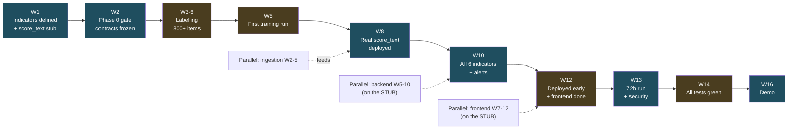
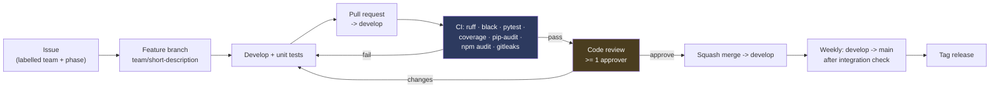

# POLIS — Implementation Plan

**Political Open Source Language Intelligence System**

---

## 1. Document Control

| Field | Value |
|---|---|
| Document ID | POLIS-IMPL-006 |
| Version | 1.0 |
| Date | 11 August 2026 |
| Status | Draft for Review |
| Derives from | POLIS-PRD-001, POLIS-TRD-002, POLIS-FLOW-003, POLIS-UX-004, POLIS-DB-005 |
| Owner | Project Manager role, rotating weekly among the six members |
| Duration | 16 weeks |

> **Change from the earlier planning flowcharts.** The initial phase diagrams laid out 18 weeks across 6 phases. This plan compresses to **16 weeks across 12 phases** with finer granularity. Two structural corrections were made deliberately:
> 1. **Early-warning indicators move from Phase 5 to Phase 0.** They are the specification the classifier is trained against ⟵ PRD §10. Defining them in week 15 would mean the model was trained for the wrong target. This is the single highest-impact change to the original sequence.
> 2. **Dataset labelling starts in Week 2, parallel with ingestion, not after it.** Labelling gates all ML work ⟵ PRD R-2. Serialising it behind the scrapers idles the ML pair for weeks.

---

## 2. Goal

Build a working, secure FYP prototype demonstrating the full chain:

```
Public information → Ingestion → Multilingual NLP → Political signal detection
→ Early-warning indicators → Signal scoring → Dashboard → Alerts → Human analyst review
```

Success is defined by PRD §23 MVP Release Criteria. Nothing beyond that list is built before that list is complete.

---

## 3. Team Structure

> ## ⚠ SUPERSEDED — the project has one developer, not six
>
> This section, §5 and §6 assume six people. The actual team is **one person**, which is a 16× gap in person-weeks. **[DOC-016 Solo Execution Plan](16-SOLO-EXECUTION-PLAN.md) is the plan that is executed.** It cuts scope by ~75% and gives a 15-week schedule that fits ~225 hours.
>
> Nothing below is deleted. It remains the plan this project was *designed* against, and DOC-016 §3.2 records every deferred item and its reason. Read this section as design intent; read DOC-016 as delivery.

| Team | Members | Owns | Primary directories |
|---|---|---|---|
| **A — Data/Ingestion** | 2 (A1, A2) | Source adapters, cleaning, dedup, scheduling, source metadata | `ingestion/` |
| **B — ML/NLP** | 2 (B1, B2) | Datasets, XLM-RoBERTa, evaluation, inference, model versioning, indicator formulas | `ml/`, `alerts/indicators.py` |
| **C — Backend/DB** | 1 (C1) | FastAPI, PostgreSQL, auth, RBAC, APIs, audit, ML integration | `backend/`, `alembic/` |
| **D — Frontend/UI** | 1 (D1) | React, dashboard, charts, alert UI, search, review interface | `frontend/` |

**All six:** integration, testing, security, documentation, deployment, presentation.

Directory ownership prevents merge conflicts ⟵ PRD R-15. A PR touching another team's directory requires that team's review.

### 3.1 Load Balancing

C1 and D1 are single points of failure ⟵ PRD R-16. Mitigations, applied from Week 1:

| Risk | Mitigation |
|---|---|
| C1 unavailable | A1 is designated backend second — pairs with C1 on auth (Week 6) and alerts (Week 10), so backend is never one person's private knowledge |
| D1 unavailable | B2 is designated frontend second — builds the chart components (Week 11) alongside D1 |
| Idle capacity Weeks 2–5 (Team A finishes adapters before ML needs them) | Team A takes dataset labelling and the indicator-formula unit tests |
| Idle capacity Weeks 9–12 (Team B post-training) | Team B takes the signal engine, per-language evaluation, and frontend charts |

---

## 4. Phase Overview

| Phase | Name | Weeks | Lead | Gate to exit |
|---|---|---|---|---|
| 0 | Requirements & architecture | 1–2 | All | Six documents v1.0; three contracts frozen |
| 1 | Repository & environment | 1 | C1 | All 6 members run the stack locally; CI green |
| 2 | Data pipeline | 2–5 | A | Ingest → store → dedupe, ≥ 8 sources, unattended |
| 3 | Dataset & ML | 2–8 | B | Model beats baseline; per-language metrics published |
| 4 | Signal engine | 8–10 | B + C | All 6 indicators computing; PRD worked examples pass |
| 5 | Backend | 5–10 | C | All endpoints, auth, RBAC, audit implemented and tested |
| 6 | Frontend | 7–12 | D | All 13 pages, 6 states each |
| 7 | Integration | 12–13 | All | Full pipeline unattended for 72 h |
| 8 | Security hardening | 13 | C + A | ASVS L1 ≥ 90%; zero secrets; zero high CVEs |
| 9 | Testing | 13–14 | All | Coverage ≥ 70%; all 25 PRD acceptance criteria pass |
| 10 | Deployment | 12, 15 | C + D | Cloud demo live; local demo rehearsed |
| 11 | Documentation & demo | 14–16 | All | All deliverables complete; demo rehearsed twice |

Phases overlap deliberately — six people working strictly sequentially would idle four of them at any moment.

```mermaid
gantt
    title POLIS — 16-week phase overlap
    dateFormat X
    axisFormat W%d
    section Foundations
    P0 Requirements       :0, 2
    P1 Repo & env         :0, 1
    section Build
    P2 Data pipeline      :1, 5
    P3 Dataset & ML       :1, 8
    P5 Backend            :4, 10
    P6 Frontend           :6, 12
    P4 Signal engine      :7, 10
    section Ship
    P10 Deploy (early)    :11, 12
    P7 Integration        :11, 13
    P8 Security           :12, 13
    P9 Testing            :12, 14
    P10 Deploy (final)    :14, 15
    P11 Docs & demo       :13, 16
```



---

## 5. Phase Detail

### Phase 0 — Requirements & Architecture (Weeks 1–2)

| Task | Owner | Deliverable |
|---|---|---|
| 0.1 Finalise PRD | All | POLIS-PRD-001 v1.0 |
| 0.2 Finalise TRD | C1 + B1 | POLIS-TRD-002 v1.0 |
| 0.3 **Define the 6 early-warning indicators** | B1 + B2 + A1 | PRD §10 signed off — **hard gate** |
| 0.4 Define MVP scope and freeze it | All | PRD §14, countersigned by the supervisor |
| 0.5 Define database schema | C1 | POLIS-DB-005 §6 |
| 0.6 Define API contracts | C1 + D1 | TRD §12 |
| 0.7 **Define the ML I/O contract** | B1 + C1 | PRD §9.1 `score_text()` — **hard gate** |
| 0.8 Define security requirements | C1 + A2 | PRD §12, TRD §14 |
| 0.9 Topic taxonomy (12–20 topics) | A1 + B2 | Seeded in migration 0009 ⟵ TBD-2 |
| 0.10 Region taxonomy + source→region map | A1 | ⟵ TBD-3, TBD-14 |
| 0.11 Demo language set | B1 | ⟵ TBD-1, NFR-12.3 |
| 0.12 UI/UX specification | D1 | POLIS-UX-004 v1.0 |
| 0.13 App flow specification | D1 + C1 | POLIS-FLOW-003 v1.0 |

**Exit gate (end of Week 2) — none of the following may slip:**

| # | Condition |
|---|---|
| 1 | All six documents at v1.0 and mutually consistent |
| 2 | The six indicators defined with formula, threshold, `n_min`, severity cap, FP risk, and a worked example each |
| 3 | `score_text()` return schema frozen, with a validated stub merged |
| 4 | Database schema reviewed and agreed |
| 5 | Zero `[TBD]` items due before Week 4 remaining open |

> **Why this is a hard gate.** ⟵ PRD R-1. Every downstream team builds against these contracts. A week spent here saves three weeks of rework in Weeks 8–12, and the failure mode — discovering in Week 15 that the model was trained for the wrong target — is unrecoverable within the schedule.

---

### Phase 1 — Repository & Environment (Week 1)

| Task | Owner | Deliverable |
|---|---|---|
| 1.1 Create GitHub repo, `main` + `develop`, branch protection | C1 | Protected `main`, ≥1 reviewer required |
| 1.2 Repository skeleton per TRD §4.1 with `__init__.py` files | C1 | Merged |
| 1.3 `requirements.txt` (pinned), `requirements-dev.txt` | C1 | Merged |
| 1.4 `.gitignore` — `venv/`, `__pycache__/`, `.env`, `ml/data/`, `ml/artifacts/`, `*.pt`, `*.bin`, `node_modules/`, `*.sql`, `*.dump` | C1 | Merged |
| 1.5 `.env.example` per TRD §10.4 (committed, values empty) | C1 | Merged |
| 1.6 `backend/config.py` — `pydantic-settings`, the only env reader | C1 | Merged |
| 1.7 Frontend scaffold: Vite + React + TS + Tailwind with UX §Appendix A tokens | D1 | `npm run dev` works |
| 1.8 Ruff + Black config in `pyproject.toml`; ESLint + Prettier | C1 + D1 | `ruff check .` clean |
| 1.9 pytest config, `conftest.py`, one passing test per layer | C1 | `pytest` green |
| 1.10 **CI pipeline: lint → test → coverage → `pip-audit` → `npm audit` → `gitleaks`** | C1 | Green on `develop` |
| 1.11 Pre-commit hooks: ruff, black, gitleaks | C1 | Installed by all 6 |
| 1.12 **`ml/predict.py` stub + `ml/schema.py` Pydantic contract** | B1 | Merged — unblocks C1 and D1 |
| 1.13 `ml/schema.py` contract test (stub must validate) | B1 | Test green |
| 1.14 Local setup verified by all 6 members | All | Checklist signed |
| 1.15 README with setup steps and the FYP/non-UN disclaimer | All | Merged |

**Definition of done:** every member has cloned, created a venv, run `pytest`, started the API, started the frontend, and confirmed `python -c "from ml.predict import score_text; print(score_text('test'))"` returns a schema-valid dict.

> **Task 1.12 is the highest-leverage task in the project** ⟵ PRD R-9. It costs one afternoon and unblocks Teams C and D for the six weeks before a real model exists.

---

### Phase 2 — Data Pipeline (Weeks 2–5)

| Task | Owner | Week | Deliverable |
|---|---|---|---|
| 2.1 `SourceAdapter` ABC | A1 | 2 | `ingestion/sources/base.py` |
| 2.2 `url_guard.py` — SSRF defence ⟵ SEC-12 | A2 | 2 | Blocks all 5 test vectors |
| 2.3 `http_client.py` — timeout, size cap, redirect re-validation, UA, per-domain rate limit | A2 | 2 | Unit tested with `respx` |
| 2.4 RSS adapter (`feedparser`) | A1 | 3 | ≥ 5 feeds ingesting |
| 2.5 HTML page adapter (`bs4` + `lxml`) | A1 | 3 | ≥ 2 gov pages |
| 2.6 `cleaners.py` + `sanitize.py` ⟵ SEC-13 | A2 | 3 | XSS payload fixtures render as text |
| 2.7 `language.py` (`lingua`) with confidence + uncertainty flag | A2 | 3 | ≥ 95% accuracy on fixtures ⟵ AC-5 |
| 2.8 `dedupe.py` — SHA-256 + SimHash + clustering | A1 | 4 | ≥ 0.90 F1 on a labelled duplicate set ⟵ SM-19 |
| 2.9 Telegram adapter (Telethon, public channels) | A2 | 4 | ≥ 2 channels |
| 2.10 Reddit adapter (PRAW) | A1 | 4 | ≥ 2 subreddits |
| 2.11 `run_ingest.py` + per-source isolation + `ingestion_runs` logging | A1 | 4 | One source failing does not abort the cycle ⟵ AC-2 |
| 2.12 Retry with backoff, health transitions | A2 | 5 | 3 failures → `unhealthy` ⟵ FR-1.11 |
| 2.13 APScheduler wiring + advisory lock + **chained `pipeline_cycle`** (stages B→C→D→E) | A1 + C1 | 5 | Runs every 10 min unattended; chained, not four timers ⟵ PRD §11.1, TRD §6.2 |
| 2.14 `translate.py` (opus-mt / NLLB), display-only | A2 | 5 | Non-English items translated |
| 2.15 Source register: ≥ 8 sources across ≥ 3 types and ≥ 3 languages | A1 + A2 | 5 | Seeded and verified stable for 7 days ⟵ A-1 |

**Testing:** unit tests per adapter with mocked HTTP; integration test ingest→store→dedupe; SSRF test suite; malicious-content fixtures.

**Definition of done:** 8+ sources ingesting unattended for 72 hours; duplicates clustered not discarded; every fetch logged; one source deliberately broken and the cycle still completes.

**Do not build:** a large-scale real-time firehose. Start with a small number of reliable sources ⟵ PRD C-9.

---

### Phase 3 — Dataset & ML (Weeks 2–8)

| Task | Owner | Week | Deliverable |
|---|---|---|---|
| 3.1 Download and archive LIAR, FakeNewsNet, Kaggle corpora | B1 | 2 | Local copies ⟵ A-2 |
| 3.2 Labelling guideline + inter-annotator pilot (50 items, all 6 members) | B2 | 2 | Agreement ≥ 0.6 Cohen's κ, or the guideline is rewritten |
| 3.3 **Labelling sprint begins** — target 800+ multilingual items | All | 2–6 | ~40 items/person/week |
| 3.4 `ml/datasets.py` — merge, normalise, validate labels | B1 | 4 | Unified dataset |
| 3.5 **Split by `cluster_id`, stratified by label AND language** | B1 | 4 | 70/15/15; leakage test passes |
| 3.6 Baseline: TF-IDF + LogisticRegression | B2 | 4 | Reported metrics — the bar the transformer must clear |
| 3.7 Multi-head XLM-RoBERTa training script | B1 | 5 | Runs on Colab GPU |
| 3.8 First full fine-tune run + checkpointing to Drive | B1 | 5 | Checkpoints every epoch ⟵ R-7 |
| 3.9 `ml/evaluate.py` — accuracy, P, R, macro-F1, confusion matrix, **per class and per language** | B2 | 6 | Metrics JSON matching the DB §5.4 shape |
| 3.10 Error analysis — ≥ 50 misclassified items read by hand | B1 + B2 | 6 | Written findings |
| 3.11 Iterate: class weights, learning rate, epochs | B1 | 6–7 | Improved run |
| 3.12 NER head or spaCy multilingual integration | B2 | 6 | Entities with offsets + confidence |
| 3.13 Topic classification head over the fixed taxonomy | B2 | 7 | Multi-label output |
| 3.14 **Decision: multi-head vs split models** ⟵ TBD-9 | B1 | 7 | Documented either way |
| 3.15 **Decision: does stance survive?** ⟵ TBD-4, FR-3.4 | B1 | 7 | Kept or set to `not_applicable`, documented |
| 3.16 Replace the stub `score_text()` with the real implementation | B1 | 8 | Same contract test passes unchanged |
| 3.17 int8 dynamic quantisation + CPU benchmark | B1 | 8 | ≤ 1.5 s/item ⟵ NFR-1.3 |
| 3.18 Upload weights to Hugging Face Hub; register `model_versions` row | B2 | 8 | Loadable by URI |
| 3.19 Model card: intended use, limitations, per-language performance, bias notes | B2 | 8 | ⟵ PRIV-7 |

**Evaluation targets** ⟵ PRD SM-1…SM-7. **Publish whatever the numbers are.** A model that misses target with a clear-eyed error analysis is a better FYP outcome than an inflated number from a leaky split.

**Definition of done:** the transformer beats the TF-IDF baseline; per-language metrics published; `score_text()` passes the same contract test the stub passed; a `model_versions` row exists with full metrics; the model card documents known limitations.

---

### Phase 4 — Signal Engine (Weeks 8–10)

| Task | Owner | Week | Deliverable |
|---|---|---|---|
| 4.1 `alerts/windows.py` — window and baseline math, σ floor | B2 | 8 | Unit tested |
| 4.2 `mv_subject_daily_stats` materialised view + hourly refresh | C1 | 8 | ⟵ DB §7.2 |
| 4.3 IND-01 Hostile Rhetoric Surge | B2 | 8 | PRD worked example passes exactly |
| 4.4 IND-02 Negative Sentiment Shift | B2 | 9 | Worked example passes |
| 4.5 IND-03 Narrative Amplification | B1 | 9 | Worked example passes |
| 4.6 IND-04 Disinformation Density (capped `high`) | B2 | 9 | Cap enforced by test |
| 4.7 IND-05 Entity Attention Spike (capped `medium`) | B1 | 9 | Cap enforced by test |
| 4.8 IND-06 Multi-Signal Convergence + two-family gate | B1 | 10 | Gate test: one extreme component alone does not fire |
| 4.9 `alerts/severity.py` — z→severity + confidence cap | B2 | 8 | Matches PRD §10.2 table exactly |
| 4.10 Confidence formula (sample × model × diversity) | B2 | 9 | Unit tested |
| 4.11 `alerts/rules.py` — candidate → dedup → alert | C1 | 10 | Race test against `ux_alert_open` |
| 4.12 Explanation generator with mandatory disclaimer sentence | C1 | 10 | `test_explanation_contains_disclaimer` |
| 4.13 Scheduled jobs: `compute_indicators` → `evaluate_alerts`, chained | C1 | 10 | Idempotent under retry |
| 4.14 Syndication collapsing list for IND-03 ⟵ TBD-13 | A1 | 8 | Configured |
| 4.15 Measure real volume vs `n_min`; tune ⟵ TBD-11, PRD A-10 | A1 + B2 | 9 | Documented adjustment |

**Testing per indicator (4 tests each, 24 total):** the PRD worked example; `n_min` suppression; zero-variance baseline; severity cap.

**Definition of done:** all 6 indicators compute on schedule; every PRD worked example reproduces exactly; suppressed computations are recorded with a reason; alerts deduplicate correctly under concurrent runs; every alert carries its explanation and ≥ 1 evidence item.

> **Transparency requirement** ⟵ PRD NFR-6.3. Every indicator's `formula_text` and `false_positive_note` are stored in `indicator_definitions` and displayed in the product, not only in this document.

---

### Phase 5 — Backend (Weeks 5–10)

| Task | Owner | Week | Deliverable |
|---|---|---|---|
| 5.1 Migrations 0001–0004 (identity, ingestion, content, ML) | C1 | 5 | `upgrade`/`downgrade` clean |
| 5.2 SQLAlchemy models + loading strategies (`selectin`, `lazy="raise"`) | C1 | 5 | N+1 guard tests |
| 5.3 App factory, middleware stack, security headers | C1 | 5 | ⟵ TRD §11.2 |
| 5.4 Structured logging + request ID + redaction filter | C1 | 5 | No secret ever logged ⟵ SEC-20 |
| 5.5 Generic error handler | C1 | 5 | No stack trace to client ⟵ SEC-19 |
| 5.6 **Auth: Argon2id, JWT, refresh rotation, reuse detection** | C1 + A1 | 6 | Full §9 flow ⟵ SEC-1–6 |
| 5.7 RBAC dependency + permission seed + `require()` | C1 | 6 | Every protected route carries it |
| 5.8 Audit service — same-transaction writes | C1 | 6 | ⟵ SEC-21 |
| 5.9 Rate limiting (`slowapi`) per §14.7 | C1 | 6 | 429 + `Retry-After` |
| 5.10 `/auth`, `/users` routers | C1 | 6 | Tested per role |
| 5.11 `/sources` router + `fetch-now` + run history | C1 | 7 | URL SSRF-validated at create |
| 5.12 `/content`, `/content/{id}` single round trip, `/related` | C1 | 7 | < 200 ms ⟵ NFR-1.2 |
| 5.13 `/content/search` — `plainto_tsquery`, bound params | C1 | 7 | Injection test passes |
| 5.14 `/analysis` + ML integration (`score_pending` job) | C1 | 8 | Backend imports only `score_text` |
| 5.15 Migrations 0005–0009 (signal, alerts, reviews, audit, seed) | C1 | 8 | Applied |
| 5.16 `/indicators` + threshold PATCH with old/new audit | C1 | 9 | ⟵ AC-15 |
| 5.17 `/alerts` + state machine + transitions | C1 | 10 | Admin denied ⟵ FR-5.7 |
| 5.18 `/reviews` + immutability + supersede + export | C1 | 10 | No PATCH/DELETE exists |
| 5.19 `/models` + activation (atomic, audited) | C1 | 10 | One active enforced |
| 5.20 `/audit` (admin) + `/audit/alerts` (supervisor) | C1 | 10 | Scoped correctly |
| 5.21 `/dashboard/summary`, `/dashboard/trends` | C1 | 10 | < 400 ms |
| 5.22 `/health`, `/health/detail` | C1 | 9 | ⟵ AC-25 |
| 5.23 Retention purge job | C1 | 10 | Content purged, decisions retained |

**Testing:** every endpoint × every role × (happy / unauthorised / invalid). Route-enumeration test asserting no protected route lacks an auth dependency.

**Definition of done:** all endpoints implemented and role-tested; every privileged action audited; API docs disabled outside local; coverage ≥ 70%.

---

### Phase 6 — Frontend (Weeks 7–12)

| Task | Owner | Week | Deliverable |
|---|---|---|---|
| 6.1 Design tokens in Tailwind config ⟵ UX Appendix A | D1 | 7 | Light + dark |
| 6.2 Core components: Button, Input, Card, Table, Badge, Modal, Toast, Skeleton, EmptyState | D1 | 7–8 | All 7 interaction states each |
| 6.3 Severity badge (icon + text + colour) | D1 | 8 | Greyscale-legible ⟵ UXAC-1 |
| 6.4 Confidence meter + tooltip copy | D1 | 8 | ⟵ UX §4.4 |
| 6.5 Axios client + 401 refresh interceptor + queueing | D1 | 8 | ⟵ TRD §13.3 |
| 6.6 Auth context, protected routes, role gating | D1 | 8 | Cosmetic only; server enforces |
| 6.7 Login page + all error states | D1 | 8 | ⟵ FLOW §4.1 |
| 6.8 App shell: nav, header, footer disclaimer | D1 | 9 | Disclaimer on every page |
| 6.9 Live Monitoring feed + filters in URL | D1 | 9 | Two distinct empty states |
| 6.10 Content Analysis page | D1 | 9–10 | All 9 sections; translation disclaimer permanent |
| 6.11 Alert Center + Alert Detail + "why flagged" panel | D1 | 10 | All explainability fields ⟵ AC-11 |
| 6.12 Review panel + decision capture + history | D1 | 10 | No default selection; IND-03 notes gate |
| 6.13 Chart components per UX §6 + table-view twin | B2 + D1 | 11 | Every chart has a table toggle |
| 6.14 Dashboard, 6 regions, independent loading | D1 | 11 | One failing region does not blank the page |
| 6.15 Search page + highlighting as text ranges | D1 | 11 | No HTML injection |
| 6.16 Source Monitoring | D1 | 11 | Inline failure reasons |
| 6.17 Review Queue + claim/release + supervisor pane | D1 | 12 | Precision chart with reference rule |
| 6.18 Indicator Settings + threshold edit + impact preview | D1 | 12 | FP notes displayed |
| 6.19 Admin: users, sources, models, audit | D1 | 12 | Typed destructive confirmations |
| 6.20 Error boundaries, 403/404 pages, session-expiry modal | D1 | 12 | Input preserved ⟵ FAC-5 |
| 6.21 Accessibility pass: keyboard, focus, ARIA, contrast | D1 + B2 | 12 | axe-core zero critical |
| 6.22 Responsive: laptop, tablet, mobile read-only | D1 | 12 | ⟵ UX §14 |
| 6.23 Copy audit against the prohibited-language list | All | 12 | CI grep passes ⟵ UXAC-3 |

**Definition of done:** all 13 pages with all 6 states; zero critical axe-core violations on the 5 primary screens; full keyboard traversal of the primary journey; no chart with two y-axes or more than 3 categorical hues.

---

### Phase 7 — Integration (Weeks 12–13)

| Task | Owner | Deliverable |
|---|---|---|
| 7.1 Wire ingestion → DB → scoring → indicators → alerts → API → UI end to end | All | Working chain |
| 7.2 Real model replaces the stub in the demo environment | B1 + C1 | Live classifications |
| 7.3 Timing verification: measure all three latency stages (feed / classification / alert) against the PRD §11.1 budget, **and verify the ≤100-items-per-cycle precondition (TBD-16)** | A1 + C1 | ⟵ NFR-1.5a/b/c |
| 7.4 **72-hour unattended run** | All | Ingestion log, alert log, zero manual intervention |
| 7.5 Generate ≥ 20 alerts and review them as analysts | All | Precision computed ⟵ SM-8 |
| 7.6 Threshold tuning based on observed precision | B2 + supervisor role | Documented before/after |
| 7.7 Fault injection: kill a source, kill the model, kill the DB | A2 + C1 | Graceful degradation confirmed |
| 7.8 Fix integration defects | All | Issues closed |

**Definition of done:** the full pipeline runs unattended for 72 hours; ≥ 20 alerts generated and reviewed; alert precision measured and reported whatever the value ⟵ PRD PRIV-6; every failure mode in TRD §5.10 verified.

> **Integration starts Week 12, not Week 15** ⟵ PRD R-10. Weekly merges to `develop` from Week 6 mean this phase finds integration bugs, not architecture mistakes.

---

### Phase 8 — Security Hardening (Week 13)

Each task maps to a PRD SEC requirement and a TRD §14.9 test.

| # | Task | Owner | Pass criterion |
|---|---|---|---|
| 8.1 Dependency audit (`pip-audit`, `npm audit --production`) | C1 | Zero high/critical ⟵ SM-22 |
| 8.2 Secret scan over full history (`gitleaks --log-opts="--all"`) | C1 | Zero findings ⟵ SM-21 |
| 8.3 Authentication testing: no token, expired, malformed, tampered | A1 | 401 in all cases |
| 8.4 Authorization matrix: every role × every endpoint | A1 | 403 + audited denial; zero state change ⟵ AC-14 |
| 8.5 IDOR: analyst A modifies analyst B's review | A1 | 403 |
| 8.6 Input validation fuzzing on every endpoint | A2 | 422, never 500 |
| 8.7 Rate-limit testing (login, search, fetch-now) | A2 | 429 + `Retry-After` ⟵ AC-18 |
| 8.8 SQL injection (`sqlmap` + manual payloads) | A2 | No injection, no error leakage |
| 8.9 XSS: script payloads through ingestion to every render surface | A2 | Rendered literally, zero CSP violations ⟵ AC-20 |
| 8.10 SSRF: 5 vectors incl. DNS-rebind and public→internal redirect | A2 | All blocked pre-connect ⟵ AC-3 |
| 8.11 CORS review | C1 | Explicit allowlist, no wildcard |
| 8.12 Error-handling review (fault injection → forced 500) | C1 | No trace/SQL/path in response |
| 8.13 Logging review | C1 | No secrets, no emails, redaction verified |
| 8.14 Audit immutability: `UPDATE`/`DELETE` as `polis_app` | C1 | Denied by the database ⟵ AC-19 |
| 8.15 Session testing: expiry, rotation, reuse, revoke-on-disable | C1 | All per TRD §9.1 |
| 8.16 Security-header inspection | D1 | CSP, HSTS, nosniff, Referrer-Policy present |
| 8.17 **OWASP ASVS L1 checklist walkthrough** | All | ≥ 90% passed; every gap documented ⟵ SM-23 |
| 8.18 Fix findings, re-test | All | Closed or documented with justification |

**Definition of done:** ASVS L1 ≥ 90%; every test in TRD §14.9 passes; zero secrets; zero high/critical CVEs; remaining gaps documented in the security report with rationale.

---

### Phase 9 — Testing (Weeks 13–14)

| Layer | Owner | Scope | Target |
|---|---|---|---|
| 9.1 Unit — backend | C1 | Services, security, validation | ≥ 70% lines |
| 9.2 Unit — ingestion | A1 + A2 | Adapters, cleaners, dedupe, language, URL guard | ≥ 70% |
| 9.3 Unit — indicators | B1 + B2 | 4 tests × 6 indicators | 24 tests, all pass |
| 9.4 Contract — ML | B1 | `score_text` schema, determinism, truncation, empty-input raise | All pass |
| 9.5 Integration | C1 | Ingest → score → indicator → alert, plus 5 failure paths | All pass |
| 9.6 API | C1 + A1 | Every endpoint × every role | 100% endpoint coverage |
| 9.7 Data pipeline | A1 | Dedup F1 ≥ 0.90; language accuracy ≥ 95% | ⟵ SM-19, AC-5 |
| 9.8 Database | C1 | Constraints, cascades, idempotency, migrations up/down | DBAC-1…16 |
| 9.9 Frontend | D1 | Component states, api-client refresh | Key components |
| 9.10 E2E (Playwright) | D1 + B2 | 3 journeys: analyst review, admin config, search→analysis | All pass |
| 9.11 Security | A2 | TRD §14.9 matrix | All pass |
| 9.12 Accessibility | D1 | axe-core + manual keyboard on 5 screens | Zero critical ⟵ AC-22 |
| 9.13 Performance | C1 | NFR-1.1…1.6 with a 50k-item corpus | All targets met or deviation documented |
| 9.14 Usability | All | 5 proxy testers, 1-page guide, review task | 4/5 succeed ⟵ NFR-11.2 |
| 9.15 **PRD §22 acceptance criteria walkthrough** | All | All 25 | All pass |

**Definition of done:** all 25 PRD acceptance criteria pass; coverage ≥ 70%; the E2E suite runs green in CI; performance targets met or the shortfall documented with analysis.

---

### Phase 10 — Deployment (Weeks 12 and 15)

Split deliberately: deploy **early** in Week 12 to discover free-tier problems while there is time, then finalise in Week 15 ⟵ PRD R-8, A-4.

| Task | Owner | Week | Deliverable |
|---|---|---|---|
| 10.1 Supabase project + `polis_owner` / `polis_app` / `polis_readonly` roles | C1 | 12 | Migrations applied |
| 10.2 Render backend deploy, CPU-only torch wheel | C1 | 12 | Reachable |
| 10.3 **Measure actual RAM with quantised model** ⟵ TBD-10 | C1 | 12 | Decision documented: in-cloud inference, or precompute-and-host |
| 10.4 Vercel frontend deploy + env config | D1 | 12 | Reachable |
| 10.5 CORS, CSP, HSTS configured for the deployed origins | C1 + D1 | 12 | Headers verified |
| 10.6 Free uptime pinger on `/health` every 10 min | C1 | 12 | Cold starts reduced |
| 10.7 Cold-start measurement + warm-up procedure | C1 | 12 | In the demo script |
| 10.8 **Local deployment guide verified by all 6** | All | 12 | Checklist signed ⟵ NFR-13.1 |
| 10.9 Presentation environment: local Postgres + curated corpus dump | All | 15 | Restorable in < 5 min |
| 10.10 Backup/restore rehearsal | C1 | 15 | Verified |
| 10.11 Final deploy from `main` | C1 + D1 | 15 | Tagged `v1.0.0` |

**Definition of done:** cloud demo reachable; **local demo rehearsed and primary** ⟵ TRD §10.3; environment configuration documented; no secret in any repository, build log, or frontend bundle.

---

### Phase 11 — Documentation & Demo (Weeks 14–16)

| Task | Owner | Deliverable |
|---|---|---|
| 11.1 Technical documentation (architecture, components, decisions) | C1 + A1 | `docs/technical/` |
| 11.2 User documentation (analyst guide, supervisor guide, admin guide) | D1 | `docs/user/` |
| 11.3 API documentation (OpenAPI export + narrative) | C1 | `docs/api/` |
| 11.4 ML documentation (architecture, training, evaluation, model card, limitations) | B1 + B2 | `docs/ml/` |
| 11.5 Dataset documentation (sources, licences, labelling guideline, agreement, splits) | B2 | `docs/data/` |
| 11.6 Security documentation (ASVS checklist, test results, threat notes, known gaps) | A2 + C1 | `docs/security/` |
| 11.7 Deployment guide (cloud + local) | C1 | `docs/deployment.md` |
| 11.8 **FYP report** | All | Final submission |
| 11.9 Presentation deck | All | Slides |
| 11.10 **Demo script** with warm-up, narration, and fallback | All | Rehearsed twice |
| 11.11 Final consistency pass across **all sixteen documents** (01–15 + consistency report) | All | Zero open `[TBD]` ⟵ PRD §23 #16 |

### 11.1 Documentation Deliverables Register

The project's documentation package grew beyond the original six core documents. Phase 11 owns all of it. **Evidence-required** documents cannot be marked complete from a desk — they require executed work from an earlier phase.

**Core documents (01–06)** — specification-only; complete when internally consistent and signed off.

| Doc | Owner | Purpose | Completion condition | Evidence required? |
|---|---|---|---|---|
| 01 PRD | All | Product source of truth | v1.0, supervisor sign-off, zero overdue TBDs | No |
| 02 TRD | C1 + B1 | Technical architecture | v1.0, contracts frozen (Week 1/3/4) | No |
| 03 App Flow | D1 + C1 | User journeys, page behaviour | v1.0, every page has 6 states specified | No |
| 04 UI/UX Spec | D1 | Design system, wireframes, a11y | v1.0, palette validated | No |
| 05 Backend Schema | C1 | Database design | v1.0, **frozen Week 3** | No |
| 06 Implementation Plan | All | Schedule, risks, DoD | v1.0, this document | No |

**Extended engineering documents (07–15)** — several are reporting shells that stay incomplete until the work they report on has actually run.

| Doc | Owner | Purpose | Completion condition | Evidence required? |
|---|---|---|---|---|
| 07 ML & Dataset Spec | B1 | ML scope, dataset plan, provenance, leakage prevention | Dataset assembled, split verified leak-free, all dataset `[TBD]` closed | **Yes** — Phase 3 (Weeks 2–8) |
| 08 ML Evaluation & Model Card | B2 | Measured model performance | A model exists, evaluation executed, per-language metrics published | **Yes** — Phase 3 + Phase 7 |
| 09 Security & Privacy Report | C1 + A2 | Threat model, ASVS checklist, test results | ASVS L1 ≥ 90% with dated evidence per control | **Yes** — Phase 8 (Week 13) |
| 10 API Documentation | C1 | Endpoint contract | §14 reconciliation run against real FastAPI route decorators | **Yes** — Phase 5 (Weeks 5–10) |
| 11 Deployment & Ops Guide | C1 + D1 | Reproducible deployment | §2.3 and §7 checklists executed by all 6 members | **Yes** — Phase 1 + Phase 10 |
| 12 User Guide | D1 | Role-specific usage | Terminology matches shipped UI; screenshots added | **Partial** — Phase 6 for screenshots |
| 13 Testing & QA Report | All | Test results, release gate | All 25 ACs executed; verdict backed by real runs | **Yes** — Phase 9 (Weeks 13–14) |
| 14 Data Source & Governance | A1 + A2 | Source register, licensing, safeguards | §2 holds real configured sources; GOV-1…8 closed | **Yes** — Phase 2 (Weeks 2–5) |
| 15 Architecture Decisions | C1 + B1 | The *why* behind decisions | Every ADR status matches its source document's status | No — but statuses must be re-audited whenever a TBD closes |

**Supporting**

| File | Owner | Purpose | Completion condition | Evidence required? |
|---|---|---|---|---|
| `README.md` | All | Documentation index | Lists all 15 + status, matches reality | No |
| `DOCUMENT-CONSISTENCY-REPORT.md` | All | Cross-document audit | Re-run at Week 14; verdict backed by executed checks | **Yes** — re-audit after Phase 9 |

> **Rule for Phase 11:** a document whose "Evidence required?" column says **Yes** may not be marked complete before the phase that produces its evidence has run. Marking one complete early — by filling a `NOT RUN` cell with a plausible number — is a project-integrity failure, not a documentation shortcut.

**Demo script structure** (15 minutes):

| Min | Segment | Point made |
|---|---|---|
| 0–1 | Problem: manual monitoring, 8 named consequences | Real, mechanical bottleneck |
| 1–3 | Architecture walkthrough | Zero-budget, defensible choices |
| 3–5 | Sources ingesting live; one source deliberately unhealthy | It runs, and it fails honestly |
| 5–7 | Multilingual item: original, translation, classification, confidence, model version | The multilingual claim is real |
| 7–10 | Alert detail: why flagged, computation, evidence, drill to source text | **Explainability — the core of the pitch** |
| 10–12 | Analyst reviews it; decision recorded; audit log shows it | Human in the loop, by architecture |
| 12–13 | Alert precision on the dashboard, including the weak indicator | Honest about error rate |
| 13–15 | Limitations, ethics, what POLIS explicitly does not do | Ethical seriousness |

> **Show the weak indicator.** IND-04's per-language transfer problem and IND-03's wire-copy false positives are findings, not embarrassments. A team that measured and reported them demonstrates more competence than one that hid them.

---

## 6. 16-Week Schedule

| Wk | Team A (2) | Team B (2) | Team C (1) | Team D (1) | Deliverable | Definition of done |
|---|---|---|---|---|---|---|
| **1** | Source research; adapter ABC | **Indicator definitions**; archive datasets | Repo, CI, config, `.env.example` | Vite scaffold, tokens | Repo live; **stub `score_text` merged** | All 6 run stack locally; CI green |
| **2** | `url_guard`, `http_client` | Indicators signed off; labelling guideline + κ pilot | Schema draft; migrations 0001–0002 | UX spec; component skeletons | **Phase 0 gate** | 6 docs v1.0; 3 contracts frozen; zero overdue TBDs |
| **3** | RSS + HTML adapters; cleaners; language | **Labelling sprint**; taxonomy | Migrations 0003–0004; models | Core components | RSS ingesting | 5+ feeds storing; language ≥ 95% |
| **4** | Dedupe (hash + SimHash); Telegram; Reddit | Dataset merge; cluster-based split; TF-IDF baseline | App factory, middleware, logging | Buttons, badges, severity, confidence | Dedup working; baseline metrics | Dedup F1 ≥ 0.90; baseline reported |
| **5** | Retry, health, scheduler, translation; 8 sources live | Training script; **first fine-tune run** | Auth groundwork; migrations reviewed | Axios client, auth context | Pipeline unattended | 8 sources 72 h; checkpoints saved |
| **6** | Source stability monitoring; labelling | Evaluate v1; error analysis; iterate | **Auth + RBAC + audit + rate limit** (with A1) | Login page; app shell | Auth complete | Every role tested; denials audited |
| **7** | Labelling; ingestion hardening | NER + topics; multi-head decision; stance decision | `/sources`, `/content`, `/search` | Monitoring feed; Content Analysis | Content APIs live | < 200 ms; injection tests pass |
| **8** | Syndication list (TBD-13) | **Real `score_text`**; quantise; HF upload; model card; IND-01 | `/analysis`; scoring job; migrations 0005–0009; materialised view | Alert Center; severity UI | **Model deployed** | Contract test unchanged; ≤ 1.5 s CPU |
| **9** | Volume vs `n_min` tuning | IND-02…IND-05; confidence formula | `/indicators`; `/health` | Content Analysis complete | 5 indicators computing | Worked examples pass exactly |
| **10** | Ingestion docs; fixtures | IND-06 + gate; threshold review | `/alerts`, `/reviews`, `/models`, `/audit`, `/dashboard`; alert rules | Alert Detail; review panel | **All 6 indicators + alerts** | Dedup race-proof; disclaimer test passes |
| **11** | Security fixtures | Charts + table twins (B2 with D1) | Backend polish; performance indexes | Dashboard; search; sources | Dashboard live | Every chart has a table view |
| **12** | Fault injection prep | Per-language eval writeup | **Deploy to Supabase/Render** (10.3 RAM decision) | Review queue; indicators; admin; a11y; deploy Vercel | **Deployed + frontend complete** | Cloud reachable; axe-core clean |
| **13** | **Security testing** (8.3–8.10) | Threshold tuning from real precision | Security fixes; ASVS walkthrough | Error boundaries; responsive; copy audit | **72-h integration run**; security hardened | ASVS ≥ 90%; 20+ alerts reviewed |
| **14** | Ingestion + data tests | ML + indicator tests; ML docs | API + DB + integration tests | Frontend + E2E + a11y tests | **All tests green** | Coverage ≥ 70%; 25 AC pass |
| **15** | Deployment guide | Dataset + model docs | Final deploy; tag v1.0.0; backup rehearsal | User docs; UI polish | **Release candidate** | Local + cloud demos both work |
| **16** | Report + rehearsal | Report + rehearsal | Report + rehearsal | Report + rehearsal | **FYP report, deck, demo** | Demo rehearsed twice, no manual DB intervention |

### 6.1 Critical Path



**The critical path is: indicators → labelling → training → real model → indicators computing → alerts → integration → demo.**

Backend and frontend are **not** on the critical path, because both build against the Week-1 stub. That is the entire purpose of task 1.12.

| Slip | Consequence | Response |
|---|---|---|
| Indicators slip past W2 | Model trains against the wrong target — **unrecoverable** | Freeze whatever exists at end of W2 ⟵ R-1 |
| Labelling slips past W6 | Training compresses; evaluation weakens | Cut to 2 languages; document as a finding ⟵ R-2 |
| Real model slips past W8 | Frontend and backend continue on the stub; demo shows stub scores | Ship with the stub clearly labelled; report the shortfall honestly |
| Alerts slip past W10 | Integration compresses | Cut a frontend admin page, never integration time ⟵ R-10 |
| Deployment slips past W12 | Free-tier surprises hit with no slack | Local-only demo — it was always the primary path anyway |

### 6.2 Weekly Rhythm

| When | Ritual | Duration |
|---|---|---|
| Monday | Standup: last week, this week, blockers | 20 min |
| Wednesday | **Integration merge to `develop`** — everyone, every week from W6 | — |
| Thursday | Demo of anything working, to the team | 20 min |
| Friday | Retro + next-week plan + handover notes ⟵ R-16 | 30 min |
| Continuous | PR review within 24 h; nobody blocked over a weekend | — |

---

## 7. Git Workflow



### 7.1 Rules **[CONFIRMED]**

| Rule | Detail |
|---|---|
| Branch naming | `ingest/rss-parser`, `ml/xlmr-baseline`, `be/alert-routes`, `fe/alert-detail`, `docs/prd-update` |
| No direct pushes to `main` or `develop` | Enforced by branch protection ⟵ SEC-28 |
| At least one reviewer | Cross-team review for anything touching a shared contract |
| CI must pass | Lint, format, tests, coverage, dependency audit, secret scan — all blocking |
| Commit messages | `type(scope): imperative summary` — `feat(ingest): add SimHash near-duplicate clustering` |
| Squash merge to `develop` | Keeps history readable with six contributors |
| Issue per unit of work | Labelled `team-a`…`team-d`, `phase-N`, `security`, `blocked` |
| PR size | Aim ≤ 400 changed lines. A larger PR is not reviewed, it is rubber-stamped. |
| Contract changes | Any change to `score_text()`, the DB schema, or the API contract requires both affected team leads' approval and a document update in the same PR |
| Never commit | `.env`, model weights, datasets, `*.sql` dumps, `node_modules/` |

### 7.2 PR Checklist (template)

```markdown
- [ ] Linked issue
- [ ] Tests added/updated; `pytest` passes locally
- [ ] Ruff + Black clean
- [ ] No secrets, credentials, or personal data in the diff
- [ ] Input validated at every trust boundary this PR touches
- [ ] Errors handled; no stack trace reaches a client
- [ ] Privileged actions audited
- [ ] Docs updated if a contract changed
- [ ] UI: all 6 states implemented; keyboard reachable; no colour-only meaning
- [ ] Charts: table-view twin; ≤ 3 categorical hues; single y-axis
- [ ] No predictive language in any user-facing string
```

---

## 8. Risk Register

Probability and impact: L / M / H.

| ID | Risk | P | I | Mitigation | Contingency | Owner |
|---|---|---|---|---|---|---|
| RI-1 | Source API/format changes mid-project | H | M | Adapter-per-source; ≥ 3 sources per type; health monitoring | Disable the source; pipeline continues | A1 |
| RI-2 | Rate limits throttle ingestion | M | M | Conservative polling; per-domain limiting; backoff | Reduce source count for the demo | A2 |
| RI-3 | Insufficient multilingual labelled data | H | H | Labelling from W2; public datasets as base; measure per-language early | Cut to 2 languages; report as a finding | B2 |
| RI-4 | Classifier underperforms targets | M | H | Baseline first; error analysis; class weights; iterate W6–7 | Publish the honest numbers with analysis — a valid FYP result | B1 |
| RI-5 | High false-positive rate makes alerts useless | M | H | Conservative thresholds; `n_min` gates; MSC two-family gate; precision shown in-product | Raise thresholds pre-demo and present the tuning as method | B2 |
| RI-6 | Model bias across languages | M | H | Per-language evaluation is a requirement, not optional ⟵ SM-6 | Document as a limitation and a finding | B2 |
| RI-7 | Duplicate content inflates indicators | H | M | Cluster-aware counting; `is_canonical` filter in the materialised view | Tighten similarity threshold; manual cluster review | A1 |
| RI-8 | Free-tier RAM insufficient for the model | M | H | Measure in W12, not W16; int8 quantisation | Precompute scores offline; host API + results only ⟵ TBD-10 | C1 |
| RI-9 | Free-tier cold start breaks the live demo | M | M | Uptime pinger; warm-up in the script; **local demo is primary** | Run entirely locally | C1 |
| RI-10 | Colab/Kaggle GPU quota exhausted near a deadline | M | H | Train W5–7; checkpoint every epoch; never train the week before a demo | Smaller model, fewer epochs | B1 |
| RI-11 | C1 (sole backend dev) unavailable | M | H | A1 is backend second; pairs on auth and alerts | A1 takes over; cut a Future-scope item | PM |
| RI-12 | D1 (sole frontend dev) unavailable | M | H | B2 is frontend second; builds charts | B2 takes over; cut an admin page | PM |
| RI-13 | Integration conflicts from parallel work | M | M | Directory ownership; weekly merge from W6; frozen contracts | Pair on the conflicted module for one sprint | PM |
| RI-14 | Security vulnerability found in W13 with no time to fix | M | H | Security in CI from W1 (lint, secret scan, dep audit); auth designed W6 | Document, mitigate, disclose in the report | C1 |
| RI-15 | Scope creep | H | H | §14 MVP list frozen; any addition requires an equal-size removal and a PRD revision | Supervisor arbitrates; default is defer to Future scope | PM |
| RI-16 | ML↔backend contract changes late | M | H | Frozen W1 with a stub; both leads must approve a change | Adapter shim in the backend, not a contract change | B1 + C1 |
| RI-17 | Demo corpus too quiet — no indicator fires | M | H | Measure volume vs `n_min` in W9; pick an active subject | Replay a historical corpus, **clearly labelled as a replay** | A1 |
| RI-18 | Ethical criticism that POLIS resembles surveillance tooling | M | M | PRIV constraints are architectural; prohibited-language list enforced in CI | Point to §10.6, PRIV-11, and the human-in-the-loop architecture | All |
| RI-19 | Free-tier hosting service changes its terms mid-project | L | M | Local deployment documented and verified from W12 | Demo entirely locally | C1 |
| RI-20 | Team member coursework clash in W13–14 (peak load) | H | M | Front-load testing into W12; the Friday handover note makes any task pick-up-able | Redistribute; cut a Future item | PM |

---

## 9. Definition of Done

### 9.1 Feature Level

A feature is complete only when **all eight** hold:

| # | Criterion | Evidence |
|---|---|---|
| 1 | **Implemented** | Code merged to `develop` |
| 2 | **Tested** | Unit + integration tests; coverage not reduced |
| 3 | **Documented** | Docstring, API doc, and user doc if user-facing |
| 4 | **Security reviewed** | PR checklist security items ticked; input validated; privileged actions audited |
| 5 | **Integrated** | Works with the rest of the system on `develop`, not only in isolation |
| 6 | **Code reviewed** | ≥ 1 approver; cross-team if it touches a contract |
| 7 | **Merged** | On `develop`, CI green |
| 8 | **Demonstrable** | Can be shown working in the Thursday demo without setup tricks |

### 9.2 Phase Level

A phase is complete when every task is feature-done, the phase's stated exit gate passes, and any deviation is documented in the PRD or TRD — not left as tribal knowledge.

### 9.3 Project Level

The 16 criteria in PRD §23. All must pass.

---

## 10. Final MVP Demonstration

The demo must show all twelve, in one continuous run:

| # | Capability | Shown by | Traces to |
|---|---|---|---|
| 1 | Public-source ingestion | Source Monitoring: 8+ sources, live counts, one unhealthy with a stated reason | FR-1.x |
| 2 | Multilingual processing | Arabic item: original + translation + language badge | FR-2.3, FR-2.8 |
| 3 | NLP classification | Content Analysis: 4 classifications, per-class scores, confidence, model version | FR-3.x |
| 4 | Political signal detection | Dashboard indicator small multiples with threshold rules | FR-4.x |
| 5 | Early-warning indicator calculation | Alert Detail: observed, baseline, σ, z, threshold, sample, formula | §10, NFR-6.1 |
| 6 | Alert generation | Alert Center: severity, occurrence count, evidence count | FR-5.x |
| 7 | Dashboard visualisation | 6 regions, all clickable through to data, precision visible | FR-6.1 |
| 8 | Analyst review | Claim → read evidence → decide → save → history | FR-7.x |
| 9 | Database persistence | Restart the backend mid-demo; nothing is lost | NFR-2.3 |
| 10 | Authentication + RBAC | Log in as analyst → admin action denied and audited | FR-8.1–8.3, AC-14 |
| 11 | Audit logging | Admin audit log showing the decision and the denial just performed | FR-8.5 |
| 12 | End-to-end operation | 72-hour run log; ingest→visible timing | NFR-1.5 |

### 10.1 Explicitly Not Demonstrated **[CONFIRMED]**

The demo must state plainly that POLIS does **not**:

- predict violence, conflict, protest, or any future event;
- determine whether any claim is true or any source is untrustworthy;
- establish coordination, inauthenticity, or intent behind any posting pattern;
- take, recommend, or trigger any action;
- monitor individuals, private communications, or closed groups;
- operate autonomously in any decision-making capacity.

> Stating these is not a disclaimer bolted on at the end. It is the architecture ⟵ PRD PRIV-5, §10.6. The pipeline terminates at "visible to a human," and there is no code path past that point.

---

## 11. Deliverables Checklist

| # | Deliverable | Owner | Due | Done |
|---|---|---|---|---|
| 1 | PRD v1.0 | All | W2 | ☐ |
| 2 | TRD v1.0 | C1 + B1 | W2 | ☐ |
| 3 | App Flow v1.0 | D1 + C1 | W2 | ☐ |
| 4 | UI/UX Spec v1.0 | D1 | W2 | ☐ |
| 5 | Backend Schema v1.0 | C1 | W2 | ☐ |
| 6 | Implementation Plan v1.0 | All | W2 | ☐ |
| 7 | Source code, tagged `v1.0.0` | All | W15 | ☐ |
| 8 | Test suite ≥ 70% coverage | All | W14 | ☐ |
| 9 | Trained model + model card | B | W8 | ☐ |
| 10 | Evaluation report (per-language) | B | W14 | ☐ |
| 11 | Dataset documentation | B2 | W15 | ☐ |
| 12 | Security report + ASVS checklist | A2 + C1 | W13 | ☐ |
| 13 | API documentation | C1 | W15 | ☐ |
| 14 | User guides (analyst / supervisor / admin) | D1 | W15 | ☐ |
| 15 | Deployment guide (cloud + local) | C1 | W15 | ☐ |
| 16 | Deployed demo + local demo | C1 + D1 | W15 | ☐ |
| 17 | FYP report | All | W16 | ☐ |
| 18 | Presentation deck | All | W16 | ☐ |
| 19 | Demo script, rehearsed twice | All | W16 | ☐ |

---

## 12. Open Items Tracker

Consolidated from all six documents. **PRD §23 requires zero open items at release.**

| ID | Item | Owner | Due | Blocks |
|---|---|---|---|---|
| TBD-1 | Demo language set | B1 | W3 | Dataset split, evaluation |
| TBD-2 | Topic taxonomy (12–20) | A1 + B2 | W3 | Subjects, seed migration |
| TBD-3 / 14 | Region taxonomy + source→region map | A1 | W3 | All indicators |
| TBD-4 | Does stance classification survive data review | B1 | W7 | `score_text` fields |
| TBD-5 | Any viable, compliant X/Twitter access path | A1 | W3 | FR-1.8 only (MVP does not depend on it) |
| TBD-6 / 13 | Syndication source-collapsing list | A1 | W8 | IND-03 accuracy |
| TBD-7 | Final IND-06 component weights | B2 | W11 | IND-06 tuning |
| TBD-8 | Known-events calendar for IND-05 suppression | A1 | W9 | IND-05 false positives |
| TBD-9 | Multi-head vs split models | B1 | W7 | Training plan |
| TBD-10 | Free-tier RAM sufficiency; else precompute | C1 | W12 | Cloud demo path |
| TBD-11 | Final `n_min` values from measured volume | A1 + B2 | W9 | Indicator tuning |
| TBD-12 | JWT HS256 vs RS256 | C1 | W6 | Auth implementation |
| TBD-15 | Enable RLS, or document RBAC-only as the choice | C1 | W10 | Database security posture |

---

## 13. Document Consistency Verification

The six documents form a chain. This table is the check performed in task 11.11.

| Check | Verified how | Status |
|---|---|---|
| Every PRD MVP requirement has a TRD component | PRD §25 traceability matrix | ☐ |
| Every TRD component has a backend module or ML function | TRD §5, §12 | ☐ |
| Every backend feature has an API endpoint | TRD §12 ↔ DB §10 | ☐ |
| Every API endpoint has a frontend consumer, or is documented as non-UI | FLOW §8.1 coverage table | ☐ |
| Every UI feature has an API source | FLOW §8.1, UX §7 wireframes | ☐ |
| Every ML output displayed is stored and exposed | DB §5.4 ↔ TRD §12.5 ↔ UX §7.3 | ☐ |
| Every alert has an indicator and scoring logic | PRD §10 ↔ TRD §8 ↔ DB §5.5 | ☐ |
| Every security requirement has an implementation task | PRD §12 ↔ TRD §14 ↔ this doc Phase 8 | ☐ |
| Every privacy requirement has a mechanism | PRD §13 ↔ DB §12 ↔ UX §8.1 | ☐ |
| Indicator definitions identical across PRD, TRD, DB seed, and UI | PRD §10 ↔ DB §5.5 ↔ DBAC-16 | ☐ |
| `score_text()` schema identical in PRD §9.1, TRD §5.5, DB §9 | Contract test | ☐ |
| Severity mapping identical in PRD §10.2, TRD §5.7, UX §4.3, DB CHECK | Constraint test | ☐ |
| Permission matrix identical in TRD §9.2, FLOW §2, DB seed | Seed test | ☐ |
| Retention policy consistent in PRD PRIV-4, TRD, DB §12 | Review | ☐ |
| Zero open `[TBD]` items | §12 tracker | ☐ |

---

*End of Document 6 — Implementation Plan. End of the POLIS documentation package.*
