# POLIS — ML & Dataset Specification

**Political Open Source Language Intelligence System**

---

## 1. Document Control

| Field | Value |
|---|---|
| Document ID | POLIS-DOC-007 |
| Version | 1.0 |
| Date | 11 August 2026 |
| Status | Draft — **dataset sections are [TBD] pending Phase 3 execution** |
| Owner | Team B (ML/NLP) |
| Derives from | POLIS-PRD-001 §9 (FR-3.x), §10 (indicators), §17 (SM-1…SM-7); POLIS-TRD-002 §5.5, §7; POLIS-DB-005 §5.4, §6 |
| Governs | POLIS-DOC-008 (Evaluation & Model Card) |

### 1.1 Implementation Status

No model has been trained and no dataset has been assembled at the time of writing — the project is at documentation-package stage (post Phase 0, pre Phase 1 execution per POLIS-IMPL-006). Every section below that requires a trained artefact or a finalised dataset is marked **[TBD]** with its owning phase/week from the Implementation Plan. This document specifies **what will be built and how it will be verified**; it does not claim anything has been built yet. Document 8 will record the actual results once Phase 3 executes.

---

## 2. ML Scope **[CONFIRMED]**

Exactly the tasks specified in PRD §9 FR-3.1–FR-3.13. No task is added here that PRD does not already specify.

| Task | PRD ref | Classes / output | MVP or Future |
|---|---|---|---|
| Sentiment | FR-3.1 | negative / neutral / positive | MVP |
| Hostility | FR-3.2 | none / hostile_rhetoric / threatening_language | MVP |
| Probable disinformation | FR-3.3 | likely_reliable / uncertain / likely_unreliable | MVP |
| Political stance | FR-3.4 | supportive / neutral / opposed / not_applicable | MVP, **[PROPOSED]** — descopes to `not_applicable` if data is insufficient by Week 7 ⟵ PRD TBD-4 |
| Named entity recognition | FR-3.6 | PERSON / ORG / GPE·LOC / EVENT with offsets | MVP |
| Topic classification | FR-3.7 | fixed taxonomy, 12–20 topics ⟵ PRD TBD-2 | MVP |
| Language detection | FR-2.3 | ISO 639-1 + confidence | MVP (pre-ML pipeline stage, Team A owns it — TRD §5.3) |
| Machine translation | FR-2.8 | display-only, not classification input | MVP (Team A, `ingestion/translate.py`) |
| Emotion / sarcasm / irony | FR-3.13 | — | **[FUTURE]** — not built, not attempted |
| Cross-source claim matching | PRD FUT-11 | — | **[FUTURE]** |

No task beyond this table is in scope. A model that grows a seventh head not listed here is a scope violation against PRD §14/§15.

---

## 3. ML Architecture ⟵ TRD §6.1, §7

```mermaid
graph LR
    A["Public text<br/>(Team A output)"] --> B["Cleaning<br/>ingestion/cleaners.py"]
    B --> C["Language detection<br/>ingestion/language.py"]
    C --> D["Preprocessing<br/>NFKC normalise, casing/diacritics preserved"]
    D --> E["ml/predict.py :: score_text()"]
    E --> F["XLM-R encoder<br/>shared, fine-tuned"]
    F --> G["6 outputs:<br/>sentiment · hostility · disinfo ·<br/>stance · entities · topics"]
    G --> H["nlp_results, content_entities,<br/>content_topics (DB)"]
    H --> I["alerts/indicators.py<br/>IND-01..06"]
    I --> J["alerts table"]
```

### 3.1 Role of `score_text()` **[CONFIRMED — frozen contract]**

`ml/predict.py::score_text(text: str, lang: str | None = None) -> dict` is the **single** interface between ML and backend, specified in full at PRD §9.1 and TRD §5.5. This document does not restate the schema — it is authoritative in those two places only, and this document must never drift from them.

**Contract obligations, restated as a checklist for the ML team:**

| Obligation | Source |
|---|---|
| Every key in the schema always present; descoped tasks return `label: "not_applicable"`, `confidence: 0.0` | PRD §9.1 |
| Pure function — no DB access, no HTTP, no file writes at call time | TRD §5.5 |
| Deterministic for a fixed `model_version` | TRD §5.5 |
| `model_version` in every return value | PRD FR-3.8 |
| `truncated: true` when input exceeds 512 tokens | PRD FR-2.10 |
| Raises `ValueError` on empty/whitespace input, never returns a partial dict | TRD §5.5 |
| Validated against `ml/schema.py` — **both the Week-1 stub and the real model pass through the same Pydantic model** | TRD §5.5 |

Any change to this contract after Week 4 requires sign-off from both the Team B lead and the Team C lead, plus an update to PRD §9.1, TRD §5.5, and this document in the same PR ⟵ PRD §21.2, Impl §7.1.

---

## 4. Dataset Specification **[TBD — Phase 3, Weeks 2–8]**

No dataset has been assembled yet. This section specifies the *plan*; Document 8 will report the *actuals*. Fields below are filled where PRD/TRD already commit to a specific choice, and marked `[TBD]` where the number does not yet exist.

| Field | Planned value | Status |
|---|---|---|
| Dataset name | `polis-multilingual-v1` (working name) | [PROPOSED] |
| Sources | LIAR, FakeNewsNet, Kaggle fake-news corpus, team-labelled multilingual set | [CONFIRMED] — PRD §5 free-tier stack |
| Purpose | Fine-tune the multi-head XLM-R classifier (sentiment, hostility, disinfo, stance) | [CONFIRMED] |
| Languages | **[TBD]** — Team B fixes by Week 3 ⟵ PRD TBD-1, NFR-12.3. Proposed: English, Arabic, French, + 1 more based on data availability | [PROPOSED] |
| Total records | **[TBD]** — target ≥ 800 team-labelled items (PRD A-5) plus the public corpora's native sizes | [TBD] |
| Label distribution | **[TBD]** — cannot be reported before labelling | [TBD] |
| Train/val/test split | 70/15/15, stratified by label **and** language, split by `cluster_id` not by row | [CONFIRMED] — TRD §7.3 |
| Preprocessing | NFKC normalise, casing/diacritics preserved for model input, folded copy used only for hashing | [CONFIRMED] — TRD §5.3 |
| Deduplication before split | Exact hash + SimHash clustering; split occurs at the cluster level to prevent leakage | [CONFIRMED] — TRD §7.3 |
| Class balancing | Class-weighted loss; no oversampling/SMOTE planned (text-space SMOTE is unreliable) | [PROPOSED] |
| Augmentation | None planned for MVP | [CONFIRMED] — not attempted; back-translation considered only if minority-class recall (SM-5) is unmet | [FUTURE] if needed |
| Known limitations | English-centric source corpora; disinformation label questionable outside the training domain | [CONFIRMED] — see §11 |

No dataset statistic in this table beyond what is stated is invented. Row counts, exact label ratios, and per-language counts are populated in Document 8 once labelling (Weeks 2–6) and the split (Week 4) are complete.

---

## 5. Dataset Provenance

| Dataset | Source | URL | License | Task | Language | Version/Date | Usage |
|---|---|---|---|---|---|---|---|
| LIAR | William Yang Wang, UCSB | github.com/tfs4/liar_dataset (canonical: UCSB) | Research/academic use — **[TBD — verify exact licence terms before use, Week 2]** | Disinformation/truthfulness | English | 2017 release | Base training data, disinfo head |
| FakeNewsNet | Shu et al. | github.com/KaiDMML/FakeNewsNet | Research use, **subject to Twitter/PolitiFact/GossipCop ToS at collection time — [TBD] verify current availability, some components may be link-only and require re-scraping** | Disinformation | English | 2018–2020 collection | Base training data, disinfo head |
| Kaggle fake-news corpus | Kaggle community | kaggle.com (specific dataset **[TBD]** — not yet selected) | Per-dataset Kaggle licence — **[TBD] verify at selection time** | Disinformation | English | [TBD] | Supplementary disinfo data |
| Team-labelled multilingual set | POLIS team, Weeks 2–6 | Internal, `ml/data/` (gitignored) | Original annotation of public content collected under PRD PRIV-1 | Sentiment, hostility, stance | **[TBD]** per §4 | Created 2026 | Primary multilingual signal |
| `xlm-roberta-base` | Facebook AI / Hugging Face | huggingface.co/xlm-roberta-base | MIT | Base encoder, all heads | ~100 languages | Public release | Fine-tuning base |
| `Helsinki-NLP/opus-mt-*` or NLLB-200-distilled-600M | Helsinki-NLP / Meta | huggingface.co | CC-BY-4.0 (opus-mt) / CC-BY-NC (NLLB — **[TBD] verify NLLB licence permits this use before selecting it over opus-mt**) | Display translation only | Multiple pairs | Public release | `ingestion/translate.py`, never a classification input |
| `lingua-language-detector` | pemistahl | github.com/pemistahl/lingua-py | Apache-2.0 | Language detection | 75+ languages | Public release | `ingestion/language.py` |

> **No licence claim above is verified.** Every `[TBD]` in this table is a genuine open item — verifying that LIAR, FakeNewsNet, and the eventual Kaggle selection permit this specific academic use (training + evaluation, non-commercial, published in an FYP report) is a **Week 2 task**, owned by B1, and is added to the Implementation Plan open-items tracker (§14 of this document cross-references POLIS-IMPL-006 §12).

---

## 6. Data Leakage Prevention ⟵ TRD §7.3

| Leakage vector | Prevention |
|---|---|
| Train/test row overlap | Split performed once, persisted, never re-split ad hoc |
| Duplicate/near-duplicate items across splits | **Split by `cluster_id`, not by row.** A near-duplicate item and its wire-copy siblings all land in the same split. This is the single most common evaluation error in this project class, called out explicitly in TRD §7.3, and it is treated as a release-blocking check, not a nicety. |
| Source overlap | Stratification includes source diversity checks — a split where one source dominates train and another dominates test would silently test source-writing-style rather than the label |
| Temporal leakage | Baseline computation (indicator windows) never uses data from a window later than the one being scored. Model train/test split does not need temporal ordering (these are static corpora, not a live stream), but the team-labelled multilingual set is date-stamped so a temporal split could be verified if requested |
| Preprocessing leakage | Cleaning/normalisation functions are stateless per-item — no corpus statistic (e.g. TF-IDF vocabulary, mean/std for scaling) is fit before the split. Where the TF-IDF baseline (§8) requires a fitted vocabulary, it is fit on **train only** |
| Label leakage | No label-derived feature (e.g. a "known false" tag from the source dataset) leaks into the text field. `body` in `raw_content` never carries a label column |
| Evaluation-set isolation | Test set is touched exactly once, at final evaluation (§9 of Document 8). No hyperparameter tuning against test-set performance — validation is used for early stopping and model selection |

**Verification method:** a leakage test asserts `len(set(train.cluster_id) & set(test.cluster_id)) == 0` and the equivalent for train/val — this is listed in TRD §16 as a required unit test and is not optional.

---

## 7. Preprocessing ⟵ TRD §5.3, §7.1

Exactly the pipeline TRD already defines — restated here for the ML team's reference, not redefined:

| Step | Operation | Component |
|---|---|---|
| 1 | HTML/tag stripping, boilerplate removal | `ingestion/cleaners.py` (Team A) |
| 2 | NFKC Unicode normalisation, whitespace collapse | `ingestion/cleaners.py` |
| 3 | Casing and diacritics **preserved** for `cleaned_text` (ML input) | TRD §5.3 — deliberate: lowercasing destroys signal XLM-R's tokenizer uses |
| 4 | `normalized_text` (aggressively folded) computed separately, used only for hashing/dedup, **never** fed to the model | TRD §5.3 |
| 5 | Language detection with confidence; `language_uncertain` flag below 0.60 | `ingestion/language.py` |
| 6 | Truncation at 512 tokens, head-384 + tail-128 strategy | `ml/predict.py`, TRD §7.1 |
| 7 | `truncated` flag recorded when truncation occurs | FR-2.10 |

**Rationale for head+tail truncation** ⟵ TRD §7.1: political articles carry the lede at the start and consequence at the end; pure head-truncation systematically loses the latter. This is a design decision, not a default library behaviour, and must be implemented explicitly in the tokenization step of `score_text()`.

---

## 8. Model Architecture **[TBD — most values pending Phase 3 selection]**

| Field | Planned / [PROPOSED] value | Status |
|---|---|---|
| Base model | `xlm-roberta-base` | [CONFIRMED] — PRD §5, TRD §17 |
| Tokenizer | XLM-R SentencePiece tokenizer (from the base checkpoint) | [CONFIRMED] |
| Architecture | Shared encoder, 4 classification heads (sentiment, hostility, disinfo, stance) + 1 token-level NER head + 1 multi-label topic head | [PROPOSED] — TRD §7.2 |
| Classification heads | Linear layer over pooled `[CLS]` representation per task | [PROPOSED] |
| NER head | Token-level BIO tagging, linear layer over per-token hidden states, or a separate multilingual NER model (spaCy) if joint training underperforms | [PROPOSED] — decision point Week 7, TBD-9 |
| Topic head | Multi-label linear layer with sigmoid, over pooled representation | [PROPOSED] |
| Pooling | `[CLS]` token representation for classification heads | [PROPOSED] |
| Loss functions | Cross-entropy per classification head (class-weighted), CRF or cross-entropy per token for NER, binary cross-entropy for multi-label topics; joint loss as a weighted sum — **exact per-task weights [TBD], tuned in Week 6–7** | [PROPOSED] |
| Sequence length | 512 tokens max, head-384+tail-128 truncation | [CONFIRMED] — TRD §7.1 |
| Dropout | **[TBD]** — standard XLM-R default (0.1) unless tuning shows otherwise | [TBD] |
| Optimizer | AdamW | [PROPOSED] — TRD §7.3 |
| Learning rate | 2e-5 | [PROPOSED] — TRD §7.3, subject to tuning |
| Batch size | 16 (gradient-accumulated to effective 32) | [PROPOSED] — TRD §7.3 |
| Epochs | 3–4, early stop on validation macro-F1 | [PROPOSED] — TRD §7.3 |
| Scheduler | Linear warmup (10% of steps) then linear decay | [PROPOSED] — TRD §7.3 |
| Early stopping | On validation macro-F1, patience **[TBD]** | [TBD] |
| Random seed | **[TBD]** — will be fixed and recorded per run for reproducibility (§9) | [TBD] |
| Weight decay | 0.01 | [PROPOSED] — TRD §7.3 |

**No value in this table marked [TBD] or [PROPOSED] is claimed as final.** Document 8 records what was actually used for the model that shipped, taken from the corresponding `model_versions.metrics` / training config artefact.

### 8.1 Multi-head vs Split Models — Open Decision ⟵ PRD TBD-9

TRD §7.2 chose one shared encoder with 6 heads over 4+ separate models, on inference-cost and training-cost grounds (one forward pass vs four; ~1.1 GB vs ~4.4 GB memory). The stated risk is task interference (negative transfer). **Decision point: Week 7.** If any head's validation performance is unacceptable relative to a single-task control run, that head may be split out into its own smaller model. This document will be updated with the outcome; it is not decided yet.

---

## 9. Training Protocol **[TBD — recorded per actual run in Document 8]**

Reproducibility requirements POLIS commits to, per TRD §7.3:

| Requirement | Commitment |
|---|---|
| Seed | Fixed per training run and recorded in the run's config artefact |
| Hardware | Google Colab or Kaggle free-tier GPU (T4 or equivalent) — exact accelerator recorded per run |
| Software versions | Pinned per TRD §4.2 (`torch==2.4.*`, `transformers==4.44.*`); exact resolved versions captured in `pip freeze` alongside the checkpoint |
| Training command | Recorded verbatim (script + arguments) in the run log |
| Checkpoints | Saved every epoch to Google Drive ⟵ PRD R-7 (Colab session disconnects are a known failure mode) |
| Model artefacts | Final weights uploaded to Hugging Face Hub ⟵ PRD C-8 (GitHub's 100 MB limit) |
| Configuration | Full hyperparameter set (§8) serialised alongside the checkpoint, not just described in prose |

**No training run has occurred yet.** This section is a commitment, not a report. Document 8 §"Reproducibility" is where the actual seed, hardware, dates, and commit hash for the shipped model are recorded.

---

## 10. Model Versioning ⟵ TRD §7.4, PRD FR-3.8, DB §5.4

Every trained artefact becomes a row in `model_versions` (POLIS-DB-005 §6): `version_tag`, `base_model`, `tasks`, `dataset_ref`, `metrics` (JSONB, pooled **and** per-language), `artifact_uri`, `is_active`, `trained_at`.

**Every inference is permanently attributable:** `nlp_results.model_version_id` is `NOT NULL` and `RESTRICT`-protected — a model version that produced live results cannot be deleted (DB §6.1, Principle 2). The `score_text()` return dict's `model_version` field is what gets written to this column; a value here that does not correspond to a row in `model_versions` is a defect, not a valid state.

Re-scoring under a new model **inserts a new `nlp_results` row**; it never overwrites the old one (FR-3.10). Both versions' outputs coexist, which is what makes drift comparison and "why did POLIS flag this differently before/after model update" possible.

Exactly one `model_versions` row may have `is_active = true` at a time, enforced by a partial unique index (DB §6), not by application discipline alone.

---

## 11. Limitations **[CONFIRMED — commitments, not yet measured]**

These are stated as commitments to measure and disclose, consistent with PRD PRIV-7 ("algorithmic bias must be measured, not assumed absent"). Document 8 fills in the measured values; this section states what must be checked and why.

| Limitation | Why it is expected | How it will be measured |
|---|---|---|
| Multilingual performance differential | Training data (LIAR, FakeNewsNet) is English-centric; XLM-R's cross-lingual transfer is strong but not uniform | Per-language macro-F1 reported separately, never pooled-only ⟵ NFR-12.2, SM-6 |
| Domain shift | Public datasets are US political fact-checking; POLIS applies the model to live multilingual political/social text in a different register | Error analysis on held-out live-ingested samples (Document 8 §Error Analysis) |
| Political bias | Any classifier trained on politically-labelled text risks encoding the labelling source's own leanings | Topic taxonomy and source register reviewed for one-sided coverage before the demo ⟵ PRD PRIV-8; stance output framed as topic-relative, not a legitimacy judgment |
| Dataset bias | Fact-checking corpora over-represent certain claim types (US electoral politics) relative to POLIS's SPM-monitoring use case | Documented explicitly; disinformation severity capped at `high` (never `critical`) in the indicator engine specifically because of this ⟵ PRD IND-04 |
| Low-resource language performance | Languages outside XLM-R's better-resourced set may underperform | SM-6 requires worst-language macro-F1 not fall more than 0.15 below pooled — if it does, this is reported as a finding, not concealed |
| Uncertainty representation | A single confidence score is a simplification of true predictive uncertainty | Confidence floor (0.55) triggers "low confidence" UI treatment ⟵ FR-3.12; per-class score distributions stored in full, not just arg-max |
| False positives | Every indicator built on this classifier inherits its false-positive risk | Documented per-indicator in PRD §10, with IND-03 and IND-04 flagged as the highest-risk |
| False negatives | Under-detection of genuine hostile/disinformation content is possible and is not measured by alert precision alone (which only sees what fired) | Manual spot-check of a sample of **non-firing** items is planned for Phase 3 error analysis, not just the fired ones |
| Disinformation classification specifically | The label means "exhibits statistical features associated with unreliable content in the training data" — **it is not a truth determination** | Enforced as mandatory UI copy ⟵ UX §8.1, PRD §10.6; this is an architectural constraint, not a caveat that can be dropped under time pressure |

---

## 12. Traceability

| PRD requirement | TRD component | ML implementation | Database | API | UI | Test |
|---|---|---|---|---|---|---|
| FR-3.1 Sentiment | TRD §7.2 sentiment head | `ml/predict.py` sentiment output | `nlp_results.sentiment_*` | `GET /analysis/{id}` | Content Analysis §4 | `test_predict_schema`, indicator IND-02 tests |
| FR-3.2 Hostility | TRD §7.2 hostility head | `ml/predict.py` hostility output | `nlp_results.hostility_*` | `GET /analysis/{id}` | Content Analysis | IND-01 tests |
| FR-3.3 Disinformation | TRD §7.2 disinfo head | `ml/predict.py` disinfo output | `nlp_results.disinfo_*` | `GET /analysis/{id}` | Content Analysis, disclaimer copy | IND-04 tests |
| FR-3.4 Stance | TRD §7.2 stance head [PROPOSED] | `ml/predict.py` stance output | `nlp_results.stance_*` | `GET /analysis/{id}` | Content Analysis | Contract test only (may be `not_applicable`) |
| FR-3.6 NER | TRD §7.2 NER head | `ml/predict.py` entities list | `entities`, `content_entities` | `GET /content/{id}` | Entity chips | `test_ner_output`, IND-05 tests |
| FR-3.7 Topics | TRD §7.2 topic head | `ml/predict.py` topics list | `topics`, `content_topics` | `GET /content/{id}` | Topic chips, filters | `test_topic_output` |
| FR-3.8 Model versioning | TRD §7.4 | `ml/registry.py` | `model_versions` | `GET /models/{id}` | Model version links | `DBAC-5`, activation tests |
| FR-3.5 Interface contract | TRD §5.5 | `ml/predict.py::score_text` | `ml/schema.py` validates writes | all `/analysis`, `/content` reads | confidence + version badges | `test_score_text_contract` (stub and real) |
| FR-2.3 Language detection | TRD §5.3 | `ingestion/language.py` (Team A) | `processed_content.language_*` | `GET /content` filter | Language badge | `AC-5` |
| FR-2.8 Translation | TRD §5.3 | `ingestion/translate.py` (Team A) | `processed_content.translated_text` | `GET /content/{id}` | Translation panel, disclaimer | `AC-23` |

---

*End of Document 7. Next: POLIS-DOC-008, ML Evaluation Report & Model Card — reports the actuals against this specification.*
