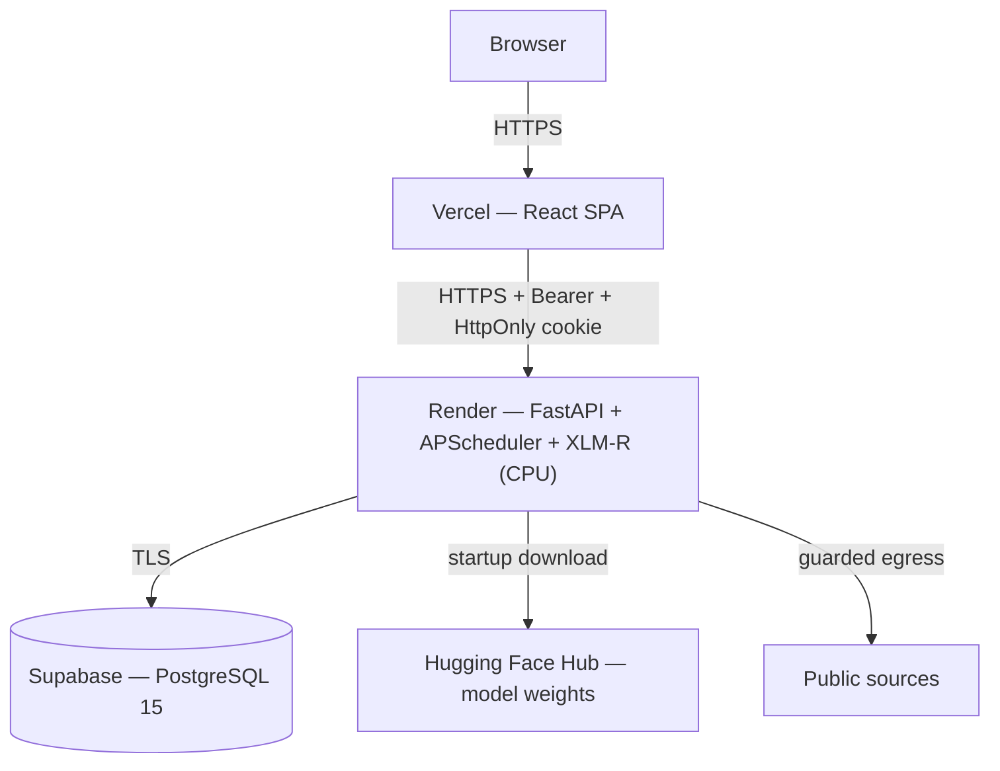

# POLIS — Deployment & Operations Guide

**Political Open Source Language Intelligence System**

---

## 1. Document Control

| Field | Value |
|---|---|
| Document ID | POLIS-DOC-011 |
| Version | 1.0 |
| Date | 11 August 2026 |
| Status | Draft — procedure specified; **not yet executed against a real deployment** |
| Owner | Team C (Backend/DB) + D1 (frontend deploy) |
| Derives from | POLIS-TRD-002 §10 (deployment architecture), §4.2 (technology versions); POLIS-IMPL-006 Phase 1, Phase 10 |

Uses **only** the architecture already specified in the TRD — Supabase, Render, Vercel, local Docker Postgres. No new infrastructure choice is introduced here.

---

## 2. Local Development

### 2.1 Prerequisites

| Requirement | Version | Why |
|---|---|---|
| Python | 3.11+ | TRD §4.2 |
| Node.js | 20 LTS | Vite 5 requirement |
| Docker | Any recent version with Compose v2 | Local PostgreSQL |
| PostgreSQL | 15 (via Docker, or a native install) | DB §1 |
| Git | Any recent version | — |

### 2.2 Setup Sequence

```bash
# 1. Database — local Docker Postgres
docker run -d --name polis-db -e POSTGRES_PASSWORD=devonly \
  -e POSTGRES_DB=polis -p 5432:5432 postgres:15

# 2. Backend
python -m venv venv
source venv/bin/activate            # Windows: venv\Scripts\activate
pip install -r requirements.txt -r requirements-dev.txt
cp .env.example .env                # then fill in local values — see §3
alembic upgrade head
python -m backend.seed --demo       # roles, permissions, demo users, sources, synthetic corpus
uvicorn backend.main:app --reload --port 8000

# 3. Frontend (separate terminal)
cd frontend
npm ci
npm run dev                         # http://localhost:5173

# 4. Optional — run one ingestion cycle immediately without waiting for the scheduler
python -m ingestion.run_ingest --once

# 5. Verify
curl http://localhost:8000/api/v1/health          # {"status":"ok"}
python -c "from ml.predict import score_text; print(score_text('test text'))"
pytest                                              # full test suite
```

**Status: NOT EXECUTED** — this sequence reflects `backend/`, `frontend/`, and `ml/` as specified in TRD §4.1; none of those directories contain code yet (pre-Phase-1). This section is a specification of the setup procedure, to be verified against a real checkout at Implementation Plan Week 1, task 1.14.

### 2.3 Verification Checklist (per team member) ⟵ Implementation Plan §1.14

| Step | Command | Expected |
|---|---|---|
| Clone | `git clone <repo>` | — |
| Venv | `python -m venv venv && pip install -r requirements.txt` | No errors |
| Import check | `python -c "import fastapi, torch, transformers"` | No errors |
| DB up | `docker ps` | `polis-db` running |
| Migrate | `alembic upgrade head` | No errors, tables created |
| API up | `uvicorn backend.main:app --reload` | Serves on :8000 |
| Frontend up | `npm run dev` | Serves on :5173 |
| Stub contract | `python -c "from ml.predict import score_text; score_text('x')"` | Returns a schema-valid dict |
| Tests | `pytest` | All green |

---

## 3. Environment Variables

Sourced verbatim from TRD §10.4 `.env.example` — this table restates it with purpose and secrecy annotations for operational reference. **No value below is a real secret; every example is a placeholder.**

| Variable | Purpose | Required | Example | Secret? |
|---|---|---|---|---|
| `POLIS_ENV` | Environment selector — gates `/api/docs` and debug mode | Yes | `local` | No |
| `POLIS_DEBUG` | Must be `false` outside local ⟵ SEC-19 | Yes | `false` | No |
| `POLIS_LOG_LEVEL` | Log verbosity | Yes | `INFO` | No |
| `DATABASE_URL` | PostgreSQL connection string | Yes | `postgresql+psycopg://polis_app:@localhost:5432/polis` | **Yes** — embeds credentials |
| `JWT_SECRET` | JWT signing key, 32+ random bytes | Yes | `<generate per environment>` | **Yes** |
| `JWT_ISSUER` | JWT `iss` claim | Yes | `polis` | No |
| `JWT_AUDIENCE` | JWT `aud` claim | Yes | `polis-api` | No |
| `ACCESS_TOKEN_MINUTES` | Access token lifetime | Yes | `15` | No |
| `REFRESH_TOKEN_HOURS` | Refresh token lifetime | Yes | `8` | No |
| `CORS_ALLOWED_ORIGINS` | Explicit frontend origin allowlist | Yes | `http://localhost:5173` | No |
| `INGEST_USER_AGENT` | Identifies POLIS to fetched sources | Yes | `POLIS-Academic-Research/1.0 (university FYP; contact: )` | No |
| `INGEST_TIMEOUT_SECONDS` | Per-fetch timeout | Yes | `10` | No |
| `INGEST_MAX_BYTES` | Per-item size cap | Yes | `2097152` | No |
| `INGEST_INTERVAL_MINUTES` | Default source poll interval | Yes | `15` | No |
| `TELEGRAM_API_ID` | Telethon credential | Only if Telegram sources configured | `<from my.telegram.org>` | **Yes** |
| `TELEGRAM_API_HASH` | Telethon credential | Only if Telegram sources configured | `<from my.telegram.org>` | **Yes** |
| `TELEGRAM_SESSION_NAME` | Telethon session identifier | Only if Telegram sources configured | `polis` | No |
| `REDDIT_CLIENT_ID` | PRAW credential | Only if Reddit sources configured | `<from reddit app registration>` | **Yes** |
| `REDDIT_CLIENT_SECRET` | PRAW credential | Only if Reddit sources configured | `<from reddit app registration>` | **Yes** |
| `REDDIT_USER_AGENT` | PRAW user agent string | Only if Reddit sources configured | `polis-fyp/1.0` | No |
| `MODEL_ARTIFACT_URI` | Model weights location | Yes (once a real model exists) | `hf://org/polis-xlmr-v1` | No |
| `MODEL_DEVICE` | Inference device | Yes | `cpu` | No |
| `MODEL_MAX_TOKENS` | Truncation length | Yes | `512` | No |
| `MODEL_BATCH_SIZE` | Inference batch size | Yes | `8` | No |
| `MODEL_CONFIDENCE_FLOOR` | Low-confidence display threshold ⟵ FR-3.12 | Yes | `0.55` | No |
| `RETAIN_RAW_CONTENT_DAYS` | Retention policy ⟵ PRIV-4 | Yes | `180` | No |
| `RETAIN_NLP_RESULTS_DAYS` | Retention policy | Yes | `365` | No |
| `RETAIN_AUDIT_DAYS` | Retention policy | Yes | `365` | No |

**No real secret value appears anywhere in this document, in `.env.example`, in any log, in the frontend bundle, or in this repository's Git history.** ⟵ SEC-17. CI's `gitleaks` scan is the enforcement mechanism, not document discipline alone.

---

## 4. Database Setup

| Operation | Command |
|---|---|
| Create local instance | `docker run -d --name polis-db -e POSTGRES_PASSWORD=devonly -e POSTGRES_DB=polis -p 5432:5432 postgres:15` |
| Apply migrations | `alembic upgrade head` |
| Roll back one migration | `alembic downgrade -1` |
| Seed (minimal) | `python -m backend.seed` — roles, permissions, mappings, 3 demo users, ~20 topics, 6 indicator definitions |
| Seed (demo) | `python -m backend.seed --demo` — the above plus ~500 synthetic items across 4 languages with a **planted, labelled-as-synthetic** spike so every indicator can be demonstrated (DB §14.1) |
| Reset | `docker rm -f polis-db` then repeat "Create local instance" and "Apply migrations" |
| Backup (local) | `pg_dump -Fc polis > polis_backup_$(date +%Y%m%d).dump` — **never committed**, `.gitignore` covers `*.dump`/`*.sql` |
| Restore (local) | `pg_restore -d polis --clean polis_backup_YYYYMMDD.dump` |
| Backup (Supabase) | Automated by the platform — verify retention window in the Supabase project settings |

---

## 5. Local Deployment (Full Stack)

Documented as the **primary** demo path ⟵ TRD §10.3, PRD R-8 — not a fallback.

```bash
docker start polis-db                              # if not already running
source venv/bin/activate
uvicorn backend.main:app --port 8000 &
cd frontend && npm run preview -- --port 5173 &     # or `npm run dev` for a live-reload demo
```

Verify: `curl http://localhost:8000/api/v1/health/detail` (as an authenticated admin) reports DB connectivity, model load state, scheduler status, and last successful ingestion.

---

## 6. Cloud Deployment

Exactly the topology TRD §10.1 specifies — no additional service introduced.



| Component | Host | Configuration |
|---|---|---|
| Frontend | Vercel (free tier) | Static build from `frontend/`, env vars `VITE_API_BASE_URL` set to the Render backend URL |
| Backend | Render (free web service) | `uvicorn backend.main:app`, CPU-only `torch` wheel (not the CUDA build — TRD §4.2), all §3 variables set in the Render dashboard |
| Database | Supabase (free tier) | Migrations applied via `alembic upgrade head` against the Supabase connection string; `polis_owner`/`polis_app`/`polis_readonly` roles created per DB §11.1 |
| Model artefacts | Hugging Face Hub | Downloaded once at Render container startup, cached on the container's disk |
| CORS | Render backend config | `CORS_ALLOWED_ORIGINS` set to the exact Vercel deployment origin — never a wildcard ⟵ SEC-15 |
| HTTPS | Provided by both Vercel and Render | `Strict-Transport-Security` header set by the application ⟵ SEC-22 |
| Health checks | Render's own health check pointed at `GET /api/v1/health` | Public, minimal response — TRD §12.9 |

### 6.1 Cold-Start and Free-Tier Limitations ⟵ TRD §10.1, PRD R-8

| Limitation | Mitigation | Residual risk |
|---|---|---|
| Render free tier sleeps after inactivity; first request after sleep may take 30–60s **plus** model load time | Free uptime pinger hits `/health` every 10 minutes during the demo window; demo script includes an explicit warm-up step before presenting | If the pinger itself is unreachable at demo time, first live query is slow — **local deployment is the primary path specifically to avoid this** |
| Free-tier RAM (~512 MB) may be insufficient for XLM-R-base in float32 (~1.1 GB) | int8 dynamic quantisation (~300 MB target); if still insufficient, scores are precomputed offline and only results + API are hosted in the cloud — **[TBD-10]**, decided empirically at Implementation Plan Week 12, not assumed here | Cloud demo may show precomputed rather than live inference; this is disclosed in the demo narration if it occurs, never presented as live when it is not |
| Scheduler does not run while the instance sleeps | Same uptime-pinger mitigation; gaps are visible in `ingestion_runs` and are an honest, disclosed free-tier limitation, not concealed | Demo timing must account for this — see §7 |
| **A sleeping instance breaks the PRD §11.1 latency budget** — the budget assumes a `pipeline_cycle` tick every 10 minutes, which cannot happen while the container is asleep | The uptime pinger's 10-minute interval is set to match the pipeline tick precisely so the instance stays awake between cycles. **This is a functional requirement of the cloud deployment, not a nicety.** | If the pinger fails, NFR-1.5a/b/c are not met in the cloud environment. The **local deployment has no sleep behaviour and is the environment against which the latency budget is verified** (Implementation Plan 7.3). |

> **Free-tier capability assumption — [PROPOSED], not a permanent fact.** Render's free-tier sleep behaviour, RAM ceiling, and Vercel/Supabase free-tier limits described in this section reflect those providers' terms **as understood at the time of writing (August 2026)**. Free-tier terms change without notice and are outside the project's control. Any of them changing invalidates §6/§6.1 but not the architecture: the local deployment path (§5) has no third-party dependency and is why it, not the cloud, is the designated primary demo environment.

---

## 7. Production/Demo Checklist

Run through in full before any live or recorded demonstration, in order:

| # | Check | How | Pass criterion |
|---|---|---|---|
| 1 | Database healthy | `GET /health/detail` | `db: connected` |
| 2 | Backend healthy | `GET /health` | `{"status":"ok"}` |
| 3 | Frontend reachable | Load the deployed/local URL | Renders without console errors |
| 4 | Model loaded | `GET /health/detail` | `model: loaded`, active `model_version` shown |
| 5 | Scheduler active | `GET /health/detail` | `scheduler: running`, next-run times populated |
| 6 | Ingestion working | Source Monitoring page | ≥ 1 source with a recent successful run |
| 7 | Test accounts available | Attempt login as each of the 3 seeded demo roles | All succeed |
| 8 | Seeded/demo data clearly identified | Check the planted-spike subject | Labelled synthetic in the demo narration — never presented as observed activity ⟵ PRD R-17 |
| 9 | Alerts available | Alert Center | ≥ 1 alert in `new` or `under_review`, with evidence |
| 10 | Audit logs available | `/admin/audit` as Administrator | Recent entries visible |

**Status: NOT EXECUTED** — this checklist cannot be run against a system that does not exist yet. It is the exact procedure to run at Implementation Plan Phase 10/11 (Weeks 12, 15, and immediately before each demo rehearsal).

---

## 8. Disaster Recovery

| Scenario | Recovery procedure |
|---|---|
| Database corruption/loss (Supabase) | Restore from Supabase's automated backup via the platform dashboard; verify migration head matches `alembic_version` after restore |
| Database corruption/loss (local) | `pg_restore -d polis --clean <latest local dump>` (§4); if no dump exists, `alembic upgrade head` + `--demo` reseed reconstructs a working (non-authentic) demo state |
| Model artefact unavailable (HF Hub down/rate-limited) | Backend falls back to the last locally cached weights on the Render disk if present; otherwise `MODEL_ARTIFACT_URI` can point to a local path as a documented override |
| Full environment loss (Render/Vercel/Supabase all unreachable) | **Local deployment is the designated fallback, not an afterthought** — §5 above, rehearsed at Implementation Plan Week 15 specifically so this path is never untested when it matters |
| Presentation-day network failure | Entirely-local demo (§5) has zero external dependency once the model weights are cached on the presenter's machine — cache them the day before, not the morning of |

---

## 9. Troubleshooting

| Symptom | Likely cause | Fix |
|---|---|---|
| Backend won't start | Missing/invalid `.env`, DB unreachable, port in use | Verify `.env` against §3; `docker ps` for the DB container; `lsof -i :8000` |
| Database unavailable | Container stopped, wrong `DATABASE_URL`, network/firewall (cloud) | `docker start polis-db`; check connection string; check Supabase project status |
| Migration failure | Out-of-order migration, manual schema drift, conflicting concurrent migration | `alembic history` to inspect; never hand-edit the schema outside a migration — revert the manual change and write a proper migration |
| Model unavailable | `MODEL_ARTIFACT_URI` unreachable, insufficient RAM, weights not yet trained | Check Hugging Face Hub reachability; check `/health/detail` for an OOM signal; confirm a `model_versions` row with `is_active=true` exists |
| Frontend API failures | Wrong `VITE_API_BASE_URL`, backend down, CORS misconfiguration | Check browser network tab for the actual failing request; verify `CORS_ALLOWED_ORIGINS` includes the frontend's exact origin |
| CORS errors | Origin not in `CORS_ALLOWED_ORIGINS`, or a wildcard was mistakenly used and credentials are also enabled (browsers reject that combination) | Set the exact origin, never `*`, when `allow_credentials=True` ⟵ SEC-15 |
| Scheduler not running | APScheduler failed to start at app startup, advisory lock held by a stale process | Check startup logs; `SELECT pg_advisory_unlock_all()` as a last resort if a crashed process left a lock held (document why before running this in any shared environment) |
| Ingestion source failure | Source format changed, blocked by `robots.txt`/SSRF guard, rate-limited, credentials expired (Telegram/Reddit) | Check `ingestion_runs.error_class`/`error_detail` for that source; Source Monitoring page shows the specific reason inline |
| Authentication failure | Clock skew (JWT `exp`/`iat`), wrong `JWT_SECRET` between restarts, expired session | Verify server clock; confirm `JWT_SECRET` is stable across restarts (regenerating it invalidates every existing session) |

---

*End of Document 11. Execute §2.3 and §7 for real once Implementation Plan Phase 1 and Phase 10 land; record actual outcomes rather than editing this procedure to match assumed success.*
